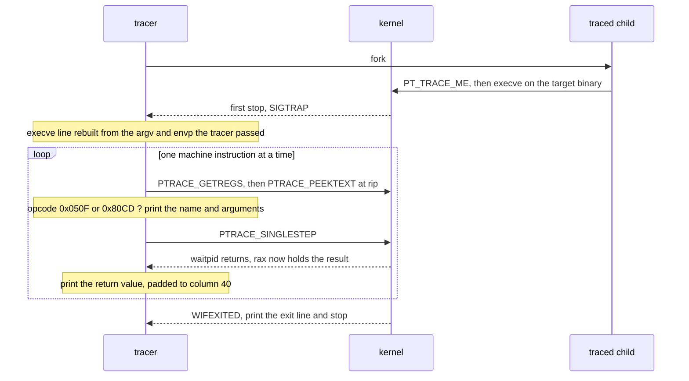
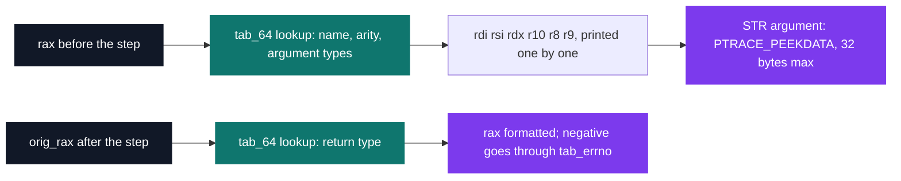

# strace — system call tracing

[](https://antoinepoisson.github.io/Old-School-Projects/projects/psu-strace-2019)

   

[Tek2](../../README.md) / [PSU](../README.md) / **PSU_strace_2019**

*Epitech project · Unix Prog. - Instrumentation (B-PSU-402) · April 2020 · 2 weeks · Grade A*

This tracer prints every request a program makes to the kernel: the call's name, its arguments
decoded according to their real types, and its return value translated into an `errno` constant
when it fails. A program cannot read a file, print text or open a socket without going through the
kernel, so that stream of lines is a full account of what the program actually did.

`PTRACE_SYSCALL` and `PTRACE_SYSEMU` — the two ptrace requests that exist precisely to stop a
process on every system call — are forbidden by the subject. So the tracer finds the syscall
boundaries itself: it advances the traced program **one machine instruction at a time** and reads
the two bytes under `rip` at every step, looking for the opcode that enters the kernel.



**Finding the boundary.** `PTRACE_PEEKTEXT` returns a whole word from the child's text segment.
Truncating it to `unsigned short` keeps exactly the two bytes at `rip`, and little-endian storage
means the `syscall` instruction `0f 05` reads back as `0x050F`, `int 0x80` as `0x80CD`. The two
constants in the loop are the mnemonics with their bytes swapped.

```c
ptrace(PTRACE_GETREGS, pid, 0, &regs);
opcode = ptrace(PTRACE_PEEKTEXT, pid, regs.rip, 0);
if (opcode == 0x80CD || opcode == 0x050F)
    is_extension_loop(&n_display, trace, env, &instruct);
if (ptrace(PTRACE_SINGLESTEP, pid, 0, 0) == -1)
    return (84);
if (waitpid(pid, &wst, 0) && cond_loop(wst, regs, n_display, false))
    break;
if (instruct) {
    ptrace(PTRACE_GETREGS, pid, 0, &regs);
    display_sys_call(regs, &n_display, trace, env);
}
```

**Entry and exit are two different stops.** One trace line is written in two halves: the name and
arguments before the single step, the return value after it. Get that alternation wrong and every
call is printed twice, or every return lands on the wrong line. A toggling static flag in the
printer pairs them, and the two halves do not read the same register.

| Register | Before the step | After the step |
| --- | --- | --- |
| `rax` | syscall number, used as the table index | return value |
| `orig_rax` | not read on this half | the kernel's saved copy of the number |
| `rdi rsi rdx r10 r8 r9` | arguments 1 to 6, in that order | not read on this half |
| `rip` | on the 2-byte syscall instruction | just past it |

That is why the exit half indexes the table with `orig_rax`: by then the kernel has overwritten
`rax` with the result, and only the saved copy still says which call is being closed.



**Decoding what the registers mean.** A register holds 64 bits and nothing else — the tracer has to
be told that argument 2 of `write` is a string and argument 3 a length. Hand-written tables supply
that: 334 entries for the x86-64 call numbers and 382 for the 32-bit ones, each giving a name, an
argument count, and the type of every argument and of the return.

A `STR` argument is a pointer into *another process's* address space, so the printer walks it with
`PTRACE_PEEKDATA` one byte at a time, up to 32 characters followed by `...`, escaping control bytes
as `\n`, `\t` or `\003` on the way out. Outside detailed mode the same argument stays a bare
address.

*Detailed mode, `./strace -s /bin/echo hello` — abridged; the return column starts at 40:*

```text
execve("/bin/echo", ["/bin/echo", "hello"], 0x7ffd4b2a1d18 /* 24 vars */) = 0
brk(NULL)                               = 0x557a1c4e2000
access("/etc/ld.so.preload", 4)         = -1 ENOENT (No such file or directory)
fstat(1, 0x7ffd4b2a1c30)                = 0
write(1, "hello\n", 6)                  = 6
exit_group(0)                           = ?
+++ exited with 0 +++
```

*Default mode is hexadecimal, as the subject requires — the same `write`, undecoded:*

```text
write(0x1, 0x7ffd4b2a1bf0, 0x6)         = 0x6
```

`exit_group` prints `= ?` because there is no exit stop to read: the child is gone before the second
half of the line can be written, and the printer falls back to the unknown-return path. Negative
returns go through a 129-entry `errno` table that supplies both the constant and its message.
`execve` is special-cased entirely — the tracer never observes its entry, since the call it would
have watched is the one that replaced the child's whole memory image, so that first line is
reconstructed from the argv and envp the tracer passed itself.

**Where the ABI split stops.** `int 0x80` is recognised in the instruction stream and the 32-bit
table is written, but every trace still decodes through the 64-bit one. Finishing the job — a
listed bonus, not a base requirement — takes more than that table: the 32-bit ABI numbers its calls
differently *and* passes arguments in `ebx`, `ecx`, `edx`, `esi`, `edi`, `ebp`, so recognising the
opcode is the easy half.

## Technical stack

C · Makefile, gcc, gdb, Git.

443 lines of C across 6 source files drive the tracing loop, the PATH lookup and the typed printer;
845 table rows — 334 x86-64 calls, 382 32-bit calls, 129 `errno` codes — fill a further 890-line
header. The subject allowed libc, libelf and libm; the Makefile still links `-lm`, but no symbol
from libelf or libm is called.

## Build & run

```bash
make
./strace -s /bin/ls -l          # detailed mode: decimal ints, dereferenced strings
./strace /bin/ls                # default mode: everything in hexadecimal
```

| Flag | Effect |
| --- | --- |
| *(none)* | arguments and return values printed in hexadecimal |
| `-s` | detailed mode: integers in decimal, string pointers dereferenced |
| `-p <pid>` | the pid is checked against `/proc`, but attaching to a live process is unimplemented: the child exits at once and nothing is traced |
| `-h`, `--help` | prints `USAGE: ./strace [-s] [-p <pid>\|<command>]` |

The target is resolved through `PATH` before launching, so `./strace ls` works the same as
`./strace /bin/ls`; a name that resolves nowhere exits 84 with
`strace: Can't stat 'nope': No such file or directory`.

---

[Tek2](../../README.md) / [PSU](../README.md) · [⌂ All projects](../../../README.md)
