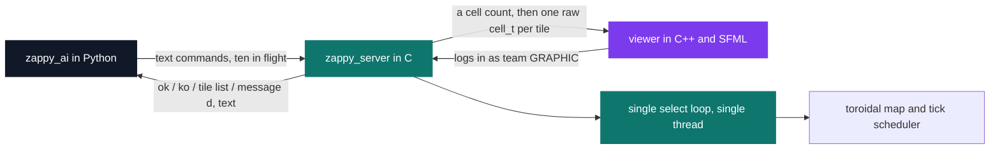
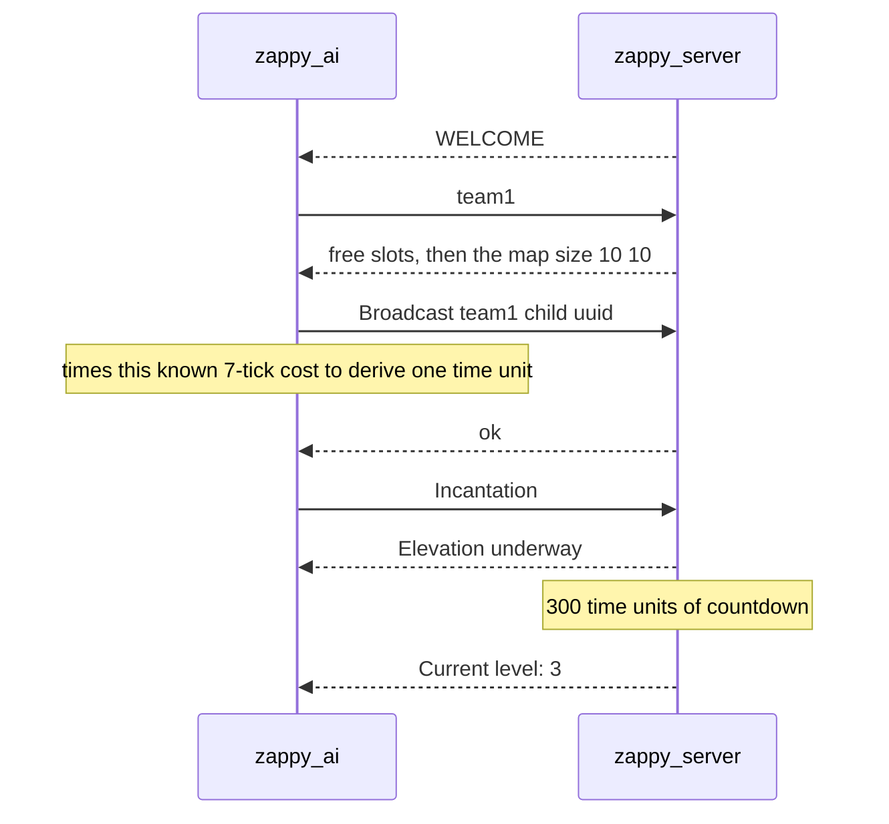
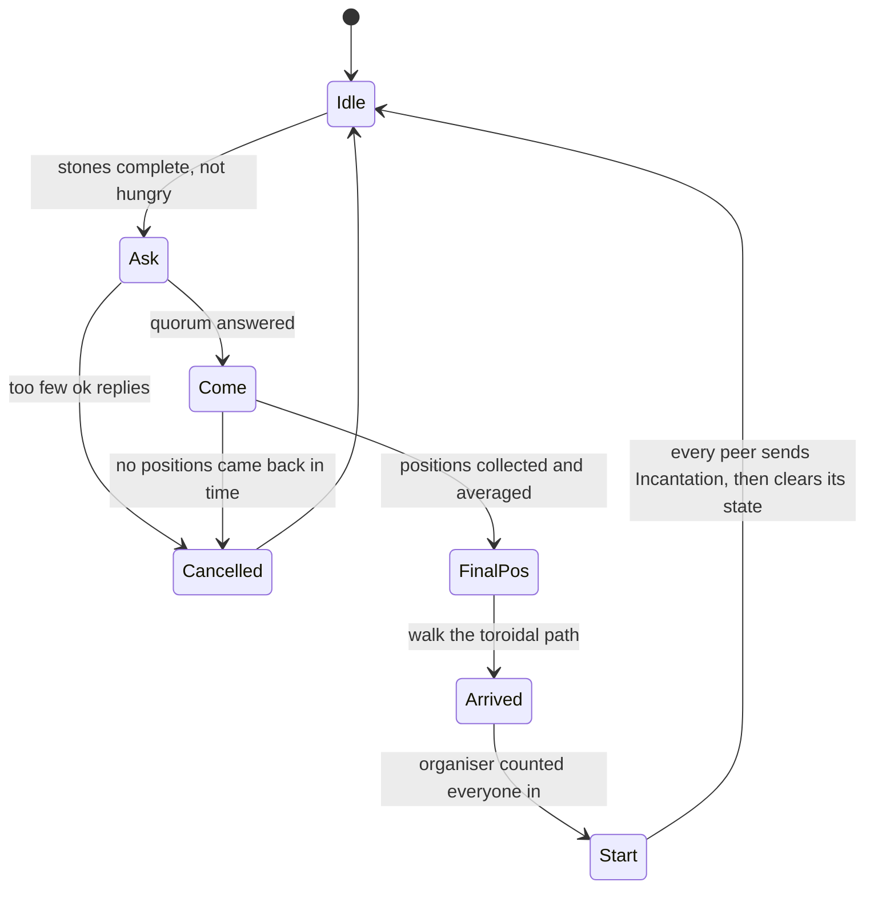

# Zappy

[](https://antoinepoisson.github.io/Old-School-Projects/projects/yep-zappy-2019)

    

[Tek2](../../README.md) / [PSU](../README.md) / **PSU_zappy_2019**

*Team project · Year-End Project — Zappy (B-YEP-410) · May–July 2020 · 3 weeks · Team of 4 · Grade C*

> Three binaries, three languages, one text protocol — and the players are blind.

An AI in this game never sees the world. It gets a widening cone of tiles in front of it, a single
digit from 1 to 8 when a teammate shouts, and nothing else. A team wins when six of its players
reach level 8, and every elevation on the way needs a fixed count of bodies standing on one tile at
the same instant.

The server is the referee for all of that: one C process, one thread, one `select()` loop serving
every AI and every viewer, driving a discrete clock that no client is ever allowed to read.

About 5,800 lines across the three programs — 3,030 in the C server (45 files), 1,526 in the Python
AI, 1,248 across the C++/SFML viewer — plus 639 lines of C++ in four side programs and a small
Angular site that nobody asked for.



**The server owns time.** A command is not run when it arrives. It is parsed, charged to the
player's tick counter, and executed only once that counter has fallen back to zero — so a client
that spams `Forward` still advances one tile per 7 time units, never faster.

| Command | Cost | Reply |
| --- | --- | --- |
| `Forward` / `Right` / `Left` | 7 | `ok` |
| `Look` | 7 | `[tile, tile, ...]` |
| `Inventory` | 1 | `[food n, linemate n, ...]` |
| `Broadcast <text>` | 7 | `ok` |
| `Connect_nbr` | 0 | free slots |
| `Fork` | 42 | `ok` |
| `Eject` | 7 | `ok` / `ko` |
| `Take` / `Set <object>` | 7 | `ok` / `ko` |
| `Incantation` | 300 | `Elevation underway` then `Current level: k` |

Both ends police the same ten-line window: the server stops appending to a client's buffer once it
holds more than ten unread lines, and the Python `Interpreter` stops at ten outstanding sends,
queueing the rest. Get that cap wrong on either side and replies drift out of step with requests.



That acknowledgement is deliberate. `Elevation underway` leaves the moment the command is dequeued,
but the requirements are only checked 300 ticks later — a teammate who wanders off mid-ritual turns
the whole thing into a `ko`.

**The elevation ladder** is what forces cooperation: from level 4 on, a player is useless alone.

| Level | Players on the tile | Stones spent |
| --- | --- | --- |
| 1 → 2 | 1 | 1 linemate |
| 2 → 3 | 2 | 1 linemate, 1 deraumere, 1 sibur |
| 3 → 4 | 2 | 2 linemate, 1 sibur, 2 phiras |
| 4 → 5 | 4 | 1 linemate, 1 deraumere, 2 sibur, 1 phiras |
| 5 → 6 | 4 | 1 linemate, 2 deraumere, 1 sibur, 3 mendiane |
| 6 → 7 | 6 | 1 linemate, 2 deraumere, 3 sibur, 1 phiras |
| 7 → 8 | 6 | 2 of each other stone, plus 1 thystame |

That last column is where this server parts company with the classic rules: it bills the ritual to
the caster's own inventory rather than to the tile, and counts heads on the tile without checking
their level or their team. The AI is built to match — nothing in it ever calls `Set` to drop a
stone.

Worth an audit note on the world's economy: no tile is seeded with thystame at map creation, since
the draw for it is written `rand() % 1` and is always zero. All of it therefore comes from the
periodic regeneration, which fires every nine time units, adds exactly one item and picks thystame
in 10% of draws. The last elevation is gated on the rarest thing there is.

**The channel between AIs is deliberately poor.** A `Broadcast` reaches every other connected
client, but the receiver is told only a direction, 1 to 8, relative to where it is facing. The
server folds both positions onto the shortest toroidal path first, then quantises the angle into
eight sectors:

```c
while (abs(pos_rx[0] - pos_tx[0]) > size[0] / 2)
    broadcast_algorithm_shift(&(pos_rx[0]), &(pos_tx[0]), size[0]);
while (abs(pos_rx[1] - pos_tx[1]) > size[1] / 2)
    broadcast_algorithm_shift(&(pos_rx[1]), &(pos_tx[1]), size[1]);
degrees = (atan2(pos_rx[0] - pos_tx[0], pos_rx[1] - pos_tx[1])
    * 180 / M_PI) + 180.f;
formatted_dir = ((int)degrees + 360 - 45 / 2) % 360;
formatted_dir = formatted_dir / 45 + 2;
```

The AI builds a real application protocol out of that one digit. Every line opens with the team
name, carries a fresh UUID per attempt, and names a state. Peers answer `ok`, then `pos` with their
coordinates; the organiser averages those into a `finalpos` rendezvous and counts `arrived` before
broadcasting `start`.



Two details make the AI side interesting. It never learns the server's `-f`, so it times a 7-tick
`Broadcast` against the wall clock to derive one time unit. And a freshly forked agent, not knowing
which way it faces, recovers its orientation from the sector its parent's answer arrives in.

**`Fork` is the mechanic that pays off.** The egg is created the instant the command is dequeued,
42 ticks before its own `ok`: a socket-less `client_t` in the same linked list as real players,
600 ticks on its counter. When a new TCP connection later announces the team name, the server hands
that socket to the waiting egg and blanks the connection's own record — a player inherits a body
already standing in the world.

The viewer took the opposite trade. The server writes it a cell count and then one raw `cell_t` per
tile, so the C++ side is a templated read of `sizeof(cell_t)` bytes straight into the struct — a
trivial renderer, at the price of a binary coupling and 71,204 bytes per cell, pushed for the whole
map on every loop iteration.

## Build & run

```bash
make    # builds zappy_server, the SFML viewer, and the zappy_ai wrapper script
./zappy_server -p 4201 -x 10 -y 10 -n team1 team2 -c 2 -f 30
./zappy_ai -p 4201 -n team1 -h localhost      # one process per AI player
./zappy_ai -p 4201 -n GRAPHIC -h localhost    # same wrapper, runs the viewer
```

`-x` and `-y` are refused outside 10 to 30; `-c` sets each team's starting slots and every accepted
`Fork` adds one more. `zappy_ai` is a generated shell script over `python3 client/main.py`, and
`GRAPHIC` as the team name makes it run the compiled `graphic` binary instead. One food buys 126
time units of life, laying an egg costs 42 and hatching takes 600.

## Beyond the baseline

- `bonus/website` — an Angular 8 page for the game: wallpaper, logo, taglines and a video embed,
  served by `npm start` on port 5626, carrying Angular's generated Karma configuration.
- `bonus/broadcast_viewer` — a scratch pad for the direction algorithm: two random points on a
  10 × 10 grid, drawn before and after the toroidal fold, with the `atan2` angle printed.
- `bonus/ticks` — the server's busy-wait `clock()` cadence lifted out into 44 lines, so the drift
  correction can be watched on its own.
- `bonus/functionnal_test.sh` — seven lines that bring up a server and one AI for each of two teams.
- `bonus/graphic_interface` — a second, 304-line SFML front end; it links `SFML/Audio` and ships
  `hover.ogg`, though the two lines that would play it are commented out.

## Technical stack

C (server), C++ with SFML (graphical client), Python (AI), TypeScript/Angular (bonus site) ·
Makefile, libuuid, Criterion, npm, Git.

## Verification

Four Criterion tests drive `server_start` under `--coverage`, all four asserting the 84 exit code:
they pin down the argument checker's rejection paths rather than a running game. A Criterion test
on the C++ side checks the `cell_t` to `Cell` conversion, and `bonus/functionnal_test.sh` brings up
a server and two teams end to end.

## Original documentation

The [upstream README](./README.upstream.md) keeps the full command tables and the viewer's
texture-registration notes.

---

[Tek2](../../README.md) / [PSU](../README.md) · [⌂ All projects](../../../README.md)
