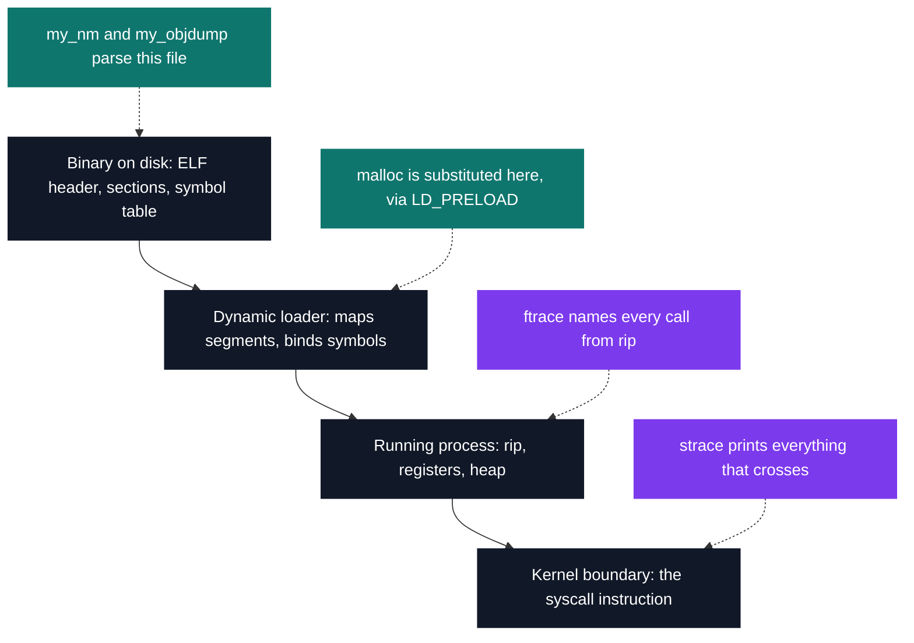

# PSU — memory, instrumentation & Zappy

[Tek2](../README.md) / **PSU**

Four tools that take a running program apart, and a three-language game whose players cannot see.
`strace` has `PTRACE_SYSCALL` forbidden by the subject, and a call inside a program raises no event
for `ftrace` to catch at all, so both advance their target one machine instruction at a time and read
the opcode under `rip` themselves. The allocator gets no escape either — no `mmap`, no `dlsym`, `sbrk`
and nothing else, with `/bin/ls` running on top of it.

| Project | What it is | Size | Grade |
| --- | --- | --- | --- |
| [malloc](PSU_malloc_2019) | `malloc`, `free`, `calloc`, `realloc` in 231 lines, loaded under real binaries with `LD_PRELOAD` | 2 weeks | A |
| [my_nm & my_objdump](PSU_nmobjdump_2019) | An ELF parser behind two binutils clones, diffed against the originals character for character | 2 weeks | A |
| [strace](PSU_strace_2019) | Syscall tracer, 334 x86-64 calls and 129 `errno` values decoded by hand-written table | 2 weeks | A |
| [ftrace](PSU_ftrace_2019) | The call tree rebuilt from `rip` and the ELF symbol table, returns caught by opcode | 2 weeks | A |
| [Zappy](PSU_zappy_2019) | C server, Python AI and SFML viewer for a world of blind agents, ~5,800 lines | 3 weeks · team of 4 | C |

The first four sit at four different depths of the same running process:

Zappy sits somewhere else entirely: three binaries in three languages agreeing on one text protocol,
a server that owns the clock and charges 300 time units for an incantation, and an AI that has to
organise a six-player ritual through a channel carrying one digit from 1 to 8.

<pre>
PSU/
├── <a href="PSU_malloc_2019">PSU_malloc_2019/</a>     malloc — an allocator loadable in place of the system's via LD_PRELOAD
├── <a href="PSU_nmobjdump_2019">PSU_nmobjdump_2019/</a>  my_nm & my_objdump — reading a binary's ELF structure by hand
├── <a href="PSU_strace_2019">PSU_strace_2019/</a>     strace — every system call spotted in the instruction stream
├── <a href="PSU_ftrace_2019">PSU_ftrace_2019/</a>     ftrace — a program's own function calls, named from its symbol table
└── <a href="PSU_zappy_2019">PSU_zappy_2019/</a>      Zappy — a persistent world of AI tribes, server + AI + GUI, team of 4
</pre>

---

[Tek2](../README.md)
