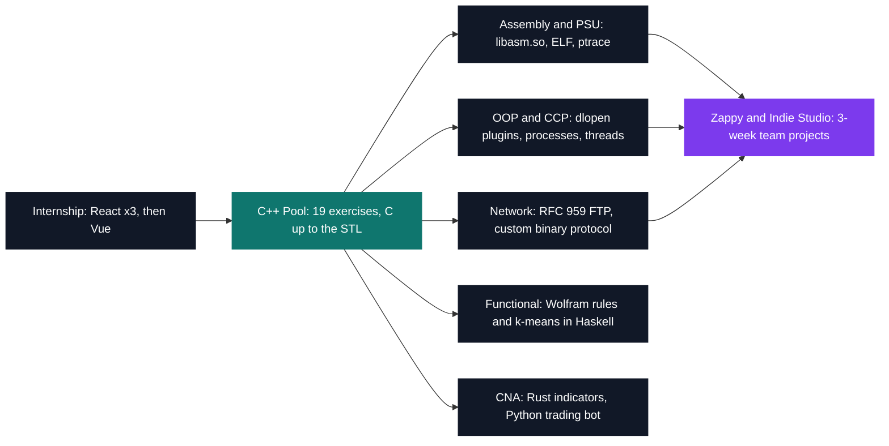

# Tek2 — 2019-2020

[All projects](../README.md) / **Tek2**

Forty projects between August 2019 and July 2020, most of the year spent rebuilding the tools the
first year had been using: `malloc` on `sbrk` alone, `nm` and `objdump` on raw ELF bytes, `strace`
decoding 385 system calls out of the registers, twelve libc functions in x86-64 assembly.
The hardest one is Zappy — three binaries in three languages, a server that owns the clock, and AI
clients that never see more than the cone of tiles in front of them.

| Module | What it is | Projects | Size | Grades |
| --- | --- | --- | --- | --- |
| [Internship](Internship) | React three times, then the same app in Vue, markup held fixed | 4 | 2 weeks each | — |
| [CPPool](CPPool) | C refresher through classes, inheritance, templates and the STL | 19 | 16 × 1 day + 3 afternoons | B |
| [PSU](PSU) | Allocator, ELF readers, two `ptrace` tracers, then Zappy | 5 | 4 × 2 weeks + 3 weeks | A ×4 · C |
| [JAM](JAM) | Hackathon: web, Android and API over NASA's photo feed | 1 | 1 weekend · team | D |
| [Assembly](Assembly) | Twelve libc functions written in x86-64 nasm | 1 | 2 weeks | A |
| [Network](Network) | RFC 959 FTP server, then a Teams clone on a homemade protocol | 2 | 2 weeks each | A ×2 |
| [Functional](Functional) | Cellular automaton and k-means quantisation, both in Haskell | 2 | 2 weeks each | A ×2 |
| [OOP](OOP) | Plugin arcade, concurrent pizzeria, circuit simulator, 3D Bomberman | 4 | 3 × 2 weeks + 3 weeks | A ×2 · B ×2 |
| [CNA](CNA) | Sliding trend indicators in Rust, trading bot in Python | 2 | 2 weeks each | C ×2 |

<pre>
Tek2/
├── <a href="Internship">Internship/</a>                         front-end exploration · 4 projects
│   ├── <a href="Internship/React-Carnet-Book">React-Carnet-Book/</a>                contact-book interface in React
│   ├── <a href="Internship/React-Gallery-Site">React-Gallery-Site/</a>               responsive media gallery in React
│   ├── <a href="Internship/React-Admin-Side">React-Admin-Side/</a>                 data-driven administration UI
│   └── <a href="Internship/Vue-To-do">Vue-To-do/</a>                         the same product thinking in Vue
├── <a href="CPPool">CPPool/</a>                             intensive C++ seminar · 19 projects
│   ├── <a href="CPPool/cpp_d01_2019">cpp_d01_2019/</a>                       C systems refresher                            · B
│   ├── <a href="CPPool/cpp_d02m_2019">cpp_d02m_2019/</a>                      pointers and memory                            · B
│   ├── <a href="CPPool/cpp_d02a_2019">cpp_d02a_2019/</a>                      C data structures                              · B
│   ├── <a href="CPPool/cpp_d03_2019">cpp_d03_2019/</a>                       string library in C                            · B
│   ├── <a href="CPPool/cpp_d06_2019">cpp_d06_2019/</a>                       first C++ classes                              · B
│   ├── <a href="CPPool/cpp_d07m_2019">cpp_d07m_2019/</a>                      encapsulation and ownership                    · B
│   ├── <a href="CPPool/cpp_d07a_2019">cpp_d07a_2019/</a>                      object composition                             · B
│   ├── <a href="CPPool/cpp_d08_2019">cpp_d08_2019/</a>                       canonical form and operators                   · B
│   ├── <a href="CPPool/cpp_d09_2019">cpp_d09_2019/</a>                       inheritance                                    · B
│   ├── <a href="CPPool/cpp_d10_2019">cpp_d10_2019/</a>                       abstract classes                               · B
│   ├── <a href="CPPool/cpp_d13_2019">cpp_d13_2019/</a>                       polymorphism and interfaces                    · B
│   ├── <a href="CPPool/cpp_d14m_2019">cpp_d14m_2019/</a>                      safe and explicit casting                      · B
│   ├── <a href="CPPool/cpp_d14a_2019">cpp_d14a_2019/</a>                      exception design                               · B
│   ├── <a href="CPPool/cpp_d15_2019">cpp_d15_2019/</a>                       templates                                      · B
│   ├── <a href="CPPool/cpp_d16_2019">cpp_d16_2019/</a>                       standard library containers                    · B
│   ├── <a href="CPPool/cpp_d17_2019">cpp_d17_2019/</a>                       generic algorithms                             · B
│   ├── <a href="CPPool/cpp_rush1_2019">cpp_rush1_2019/</a>                     object-oriented design in pure C                · B
│   ├── <a href="CPPool/cpp_rush2_2019">cpp_rush2_2019/</a>                     XML-backed toy factory                          · B
│   └── <a href="CPPool/cpp_rush3_2019">cpp_rush3_2019/</a>                     dual-renderer system monitor                    · B
├── <a href="PSU">PSU/</a>                                low-level Unix engineering · 5 projects
│   ├── <a href="PSU/PSU_malloc_2019">PSU_malloc_2019/</a>                    memory allocator                               · A
│   ├── <a href="PSU/PSU_nmobjdump_2019">PSU_nmobjdump_2019/</a>                 ELF parsing and binary inspection               · A
│   ├── <a href="PSU/PSU_strace_2019">PSU_strace_2019/</a>                    system-call tracing                            · A
│   ├── <a href="PSU/PSU_ftrace_2019">PSU_ftrace_2019/</a>                    function-call tracing                          · A
│   └── <a href="PSU/PSU_zappy_2019">PSU_zappy_2019/</a>                     distributed autonomous world                   · C
├── <a href="JAM">JAM/</a>                                product delivery under pressure · 1 project
│   └── <a href="JAM/JAM_space_2019">JAM_space_2019/</a>                     web, mobile and API built in one weekend        · D
├── <a href="Assembly">Assembly/</a>                           x86-64 systems programming · 1 project
│   └── <a href="Assembly/ASM_minilibc_2019">ASM_minilibc_2019/</a>                 libc functions rewritten in assembly           · A
├── <a href="Network">Network/</a>                            sockets and protocol design · 2 projects
│   ├── <a href="Network/NWP_myftp_2019">NWP_myftp_2019/</a>                    RFC-compliant FTP server                        · A
│   └── <a href="Network/NWP_myteams_2019">NWP_myteams_2019/</a>                  collaborative messaging platform               · A
├── <a href="Functional">Functional/</a>                         functional programming · 2 projects
│   ├── <a href="Functional/FUN_wolfram_2019">FUN_wolfram_2019/</a>                  streaming cellular automaton in Haskell        · A
│   └── <a href="Functional/FUN_imageCompressor_2019">FUN_imageCompressor_2019/</a>          k-means image quantisation in Haskell          · A
├── <a href="OOP">OOP/</a>                                architecture, concurrency and games · 4 projects
│   ├── <a href="OOP/OOP_arcade_2019">OOP_arcade_2019/</a>                    hot-loaded games and renderers                  · B
│   ├── <a href="OOP/CCP_plazza_2019">CCP_plazza_2019/</a>                    multi-process concurrent simulation             · A
│   ├── <a href="OOP/OOP_nanotekspice_2019">OOP_nanotekspice_2019/</a>             digital circuit simulator                       · B
│   └── <a href="OOP/OOP_indie_studio_2019">OOP_indie_studio_2019/</a>              complete 3D Bomberman                           · A
└── <a href="CNA">CNA/</a>                                numerical analysis and trading · 2 projects
    ├── <a href="CNA/CNA_trade_2019">CNA_trade_2019/</a>                     cryptocurrency trading bot                     · C
    └── <a href="CNA/CNA_groundhog_2019">CNA_groundhog_2019/</a>                 online trend-break detection                    · C
</pre>

- **[Internship/](Internship)** — three React apps of growing scope against a public API, then the
  same product logic redone in Vue with Vuex and Vuetify, as self-study during the internship.
- **[CPPool/](CPPool)** — sixteen exercises from a hand-packed BMP header to wrappers over `std::`
  algorithms, plus three afternoon rushes done in pairs.
- **[PSU/](PSU)** — `malloc` rebuilt on `sbrk` alone, `nm` and `objdump` on the ELF format, then
  `strace` and `ftrace` on `ptrace`, closing on Zappy.
- **[JAM/](JAM)** — one weekend on NASA's APOD API: a React gallery, an Ionic 4 Android build and a
  Node/Express backend, in parallel.
- **[Assembly/](Assembly)** — twelve libc functions in x86-64 nasm, shipped as a `libasm.so` any C
  program links against without noticing.
- **[Network/](Network)** — an FTP server real clients connect to, then a Slack-style client and
  server sharing a homemade protocol and a teams/channels/threads hierarchy.
- **[Functional/](Functional)** — Wolfram rules 30, 90 and 110, and k-means colour quantisation,
  both in Haskell.
- **[OOP/](OOP)** — games and renderers swapped mid-play through `dlopen`, a pizzeria of processes
  and threads, a logic-circuit simulator, and the year-end 3D Bomberman.
- **[CNA/](CNA)** — three sliding indicators over a live temperature stream in Rust, and a
  Bollinger-band crypto bot in Python.

---

[← Tek1](../Tek1/README.md) · [⌂ All projects](../README.md) · [Tek3 →](../Tek3/README.md)
