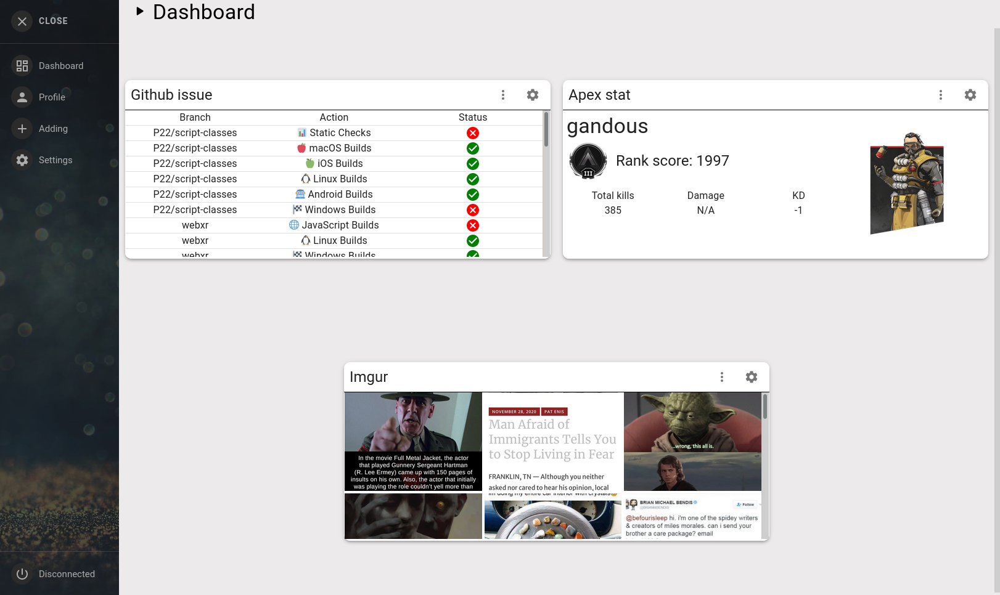
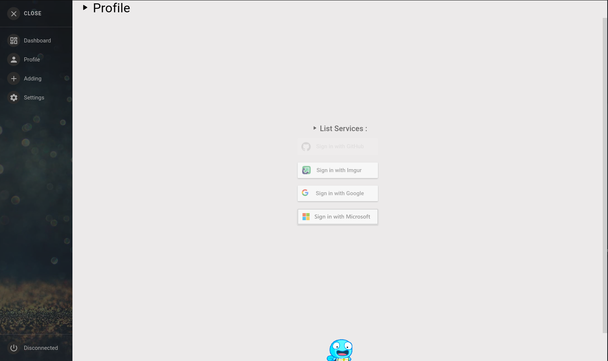
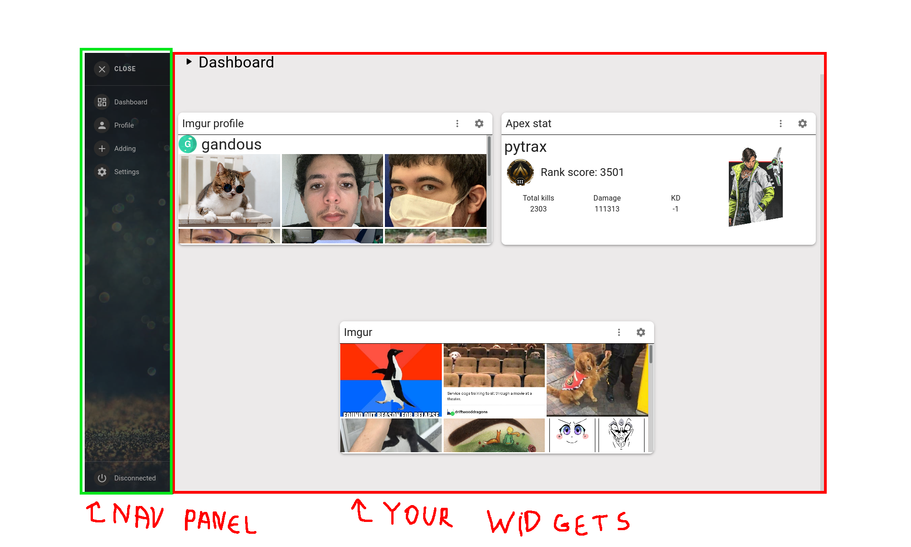
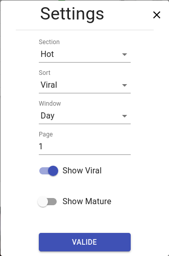
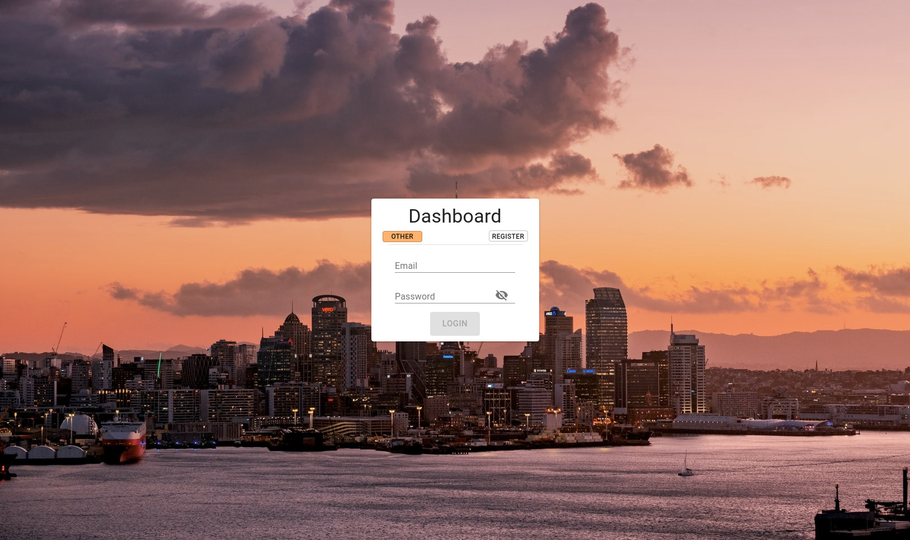
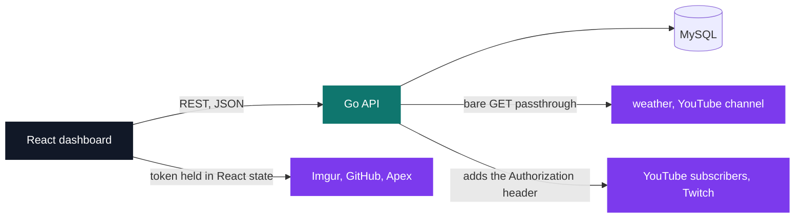
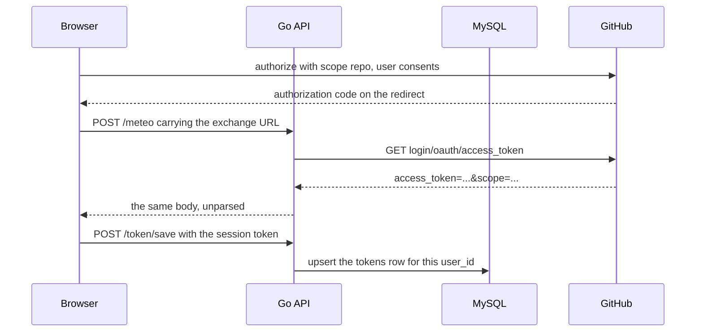
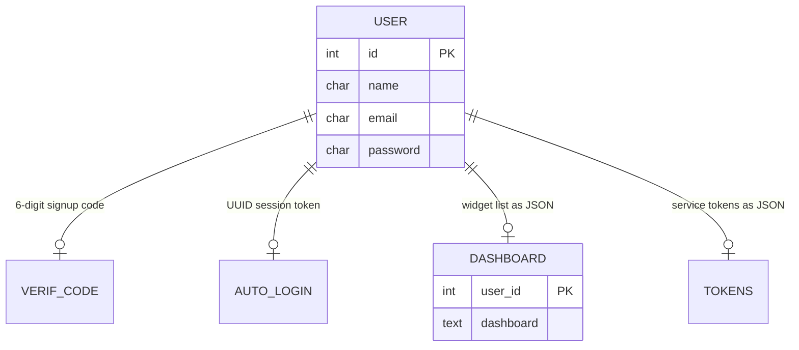

# Dashboard

[](https://antoinepoisson.github.io/Old-School-Projects/projects/dev-dashboard-2020)

    

[Tek3](../../README.md) / [AppDev](../README.md) / **DEV_dashboard**

*Team project · AppDev - Dashboard (B-DEV-500) · September–November 2020 · 2 weeks · Grade A*

A Netvibes-style dashboard: register, confirm by email, connect your GitHub, Imgur, Twitch and
Google accounts, then compose a grid out of ten widgets drawn from six services. Go serves the API,
React draws the grid, MySQL holds both, and one `docker-compose up --build` starts all four containers.

What shapes the design is `/about.json`: a machine-readable description of every service, widget and
parameter the server offers, in a format the subject imposes so that **any team's frontend can drive
any team's backend**. The catalogue page is assembled from whatever JSON the server returns at boot,
down to which cards to grey out because the user has not linked that account yet.

<p align="center">
  
  
</p>

<details>
<summary><strong>More screens — the annotated user guide, a widget settings modal, the login page</strong></summary>







</details>

**The contract.** `about.json` is read from disk on every call, `current_time` stamped at request
time and the host field filled from `r.RemoteAddr`. Two routes serve the same file: `/about.json`
returns it bare, as the subject requires, while `/about/get` wraps it in the API's
`{status, result}` envelope for the app itself. One service out of six, params abridged:

```json
{
  "name": "Github",
  "need_token": "Github",
  "size": 4,
  "widgets": [
    {
      "name": "Issue",
      "description": "Give the a list of all the issue",
      "need_service": "Github",
      "params": [{ "name": "repo", "type": "string" }, { "name": "size", "type": "int" }]
    }
  ]
}
```

Six services ship ten widgets; four of them need the user's own account first, and `need_token` says so.

| Service (`name`) | Widgets | `need_token` |
| --- | --- | --- |
| `Imgur` | Gallery, Profile, Post Image | `Imgur` |
| `Github` | Issue, Action | `Github` |
| `Youtube` | Channel, Subscriber | `Google` |
| `Twitch` | Search Streammer | `Twitch` |
| `Meteo` | Meteo | — |
| `Apex` | Apex | — |

The `params` block is not documentation — it is the shape of the object the frontend stores. Adding
the weather widget writes `{city, title, type, description, size}` into the layout, `type` picking the
React component back and `size: 6` becoming a half-width span of Material-UI's 12-column grid.

The cards, their labels and their spans all come from that JSON. What does not is the modal behind
each `+`: a switch over ten hard-coded `"Service-Widget"` strings. A service this frontend has never
met still gets a card drawn for it, and its button opens nothing — the discovery is real, the
configuration is not.



**Delegated authentication.** Four platforms hand back a token the app keeps: Imgur and Twitch
through the implicit flow, Google through its JS SDK, GitHub through the authorization-code flow.
Only GitHub needs the server: `github.com/login/oauth/access_token` sends no CORS headers, so the
browser posts the whole exchange URL to the generic relay and lets Go fetch it.



The server stores, it does not shield. `/token/save` upserts a JSON map of per-service tokens into a
row keyed by user id, and `/token/get` hands the whole map back at boot — because Imgur, GitHub and
Apex are called straight from the browser, and only Twitch and YouTube go through Go.

**Audit note.** The GitHub client secret rides in that relayed URL, so it lands in the frontend
bundle; the value is scrubbed in this repo. The fix is one route: run the exchange in Go with the
secret in `setting.json`, already gitignored, already holding the SMTP credentials. `POST /about/save`
is the other flag — it rewrites the catalogue file with no session token attached.

Account creation is the classic three-step: bcrypt the password, mail a six-digit code through
`net/smtp`, issue the UUID v4 session token only once the code comes back. Every query is
parameterised.



Two of the five tables are deliberately schema-less: a whole dashboard is one `text` column of
serialised JSON, upserted with `ON DUPLICATE KEY UPDATE`. A new widget type needs no migration. On
the client a single 60-second interval re-keys the grid, so every widget refetches together.

Fourteen routes are registered — the thirteen below plus an empty `POST /` — each bound to its verb
**and** `OPTIONS`, so preflight never 405s:

| Area | Endpoints |
| --- | --- |
| Account | `POST /register`, `POST /login`, `POST /check-code` |
| Layout | `POST /dashboard/get`, `POST /dashboard/save` |
| Tokens | `POST /token/get`, `POST /token/save` |
| Contract | `GET /about.json`, `GET /about/get`, `POST /about/save` |
| Relays | `POST /meteo`, `POST /ytb`, `POST /twitch/tricks` |

**The cost of a stringly-typed contract.** A peer server may spell a service any way it likes, so the
gate that greys a card is a string switch over six spellings — `Imgur`, `GitHub`, `Github`, `Twitch`,
`Youtube`, `Google` — for four services, unknown names falling through to *allowed*.

Two names slip past it anyway. The Go struct tag for the per-widget gate reads `need_server` while
the file on disk says `need_service`, so that field is dropped in transit and every widget-level lock
stays open; and the top-level key ships as `customer` where the subject spells it `client`. A typed
schema catches both at compile time.

## Beyond the baseline

- Ten widgets across six services. The subject sizes the bar by team — at least `1 + X` services and
  `3 * X` widgets for X students — and the uniform split, one container plus one body plus one
  settings modal per widget, makes the next one mechanical: 11 widget components, 10 bodies, 24 modals.
- A contenteditable editor for `about.json` on the Settings page: it fetches the live contract,
  refuses to send anything `JSON.parse` rejects, and writes the file back through `/about/save`.
- Server-side email through `net/smtp` for the confirmation code, config kept outside the repo.
- An illustrated user guide (`doc-img/user.md`) and an endpoint reference (`doc-img/tek-doc.md`)
  committed alongside the code.

## Technical stack

Go, JavaScript, SQL, HTML, CSS · React, Material-UI · Docker, docker-compose, MySQL, npm, Git.
925 lines of Go across 20 files, 5 631 lines of JavaScript across 82 files, four containers.

## Build & run

```bash
docker-compose up --build
```

Four containers come up: React on `http://localhost:3000`, the Go API on `http://localhost:8080`,
MySQL published on `6033` with `mysql-dump/schema.sql` mounted at the init hook, phpMyAdmin on
`http://localhost:8082`. The dump only runs against a fresh `dbdata` volume.

The React container bind-mounts `front/` and polls for changes, so edits reload in place. The Go
image is a two-stage build that ships a compiled binary, so backend edits need a rebuild — and it
copies `back/setting.json`, which is gitignored, so a fresh clone writes its own SMTP block first.

## Original documentation

The [upstream README](./README.upstream.md) contains the initial service setup notes.

---

[Tek3](../../README.md) / [AppDev](../README.md) · [⌂ All projects](../../../README.md)
