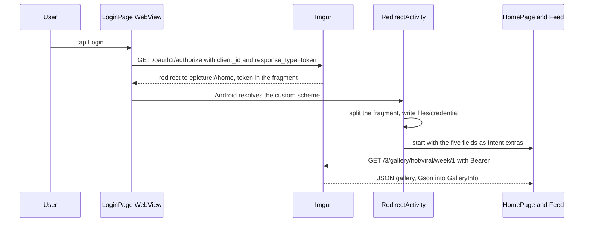
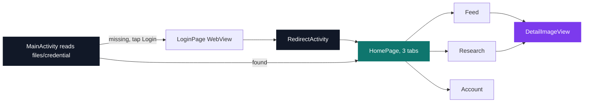
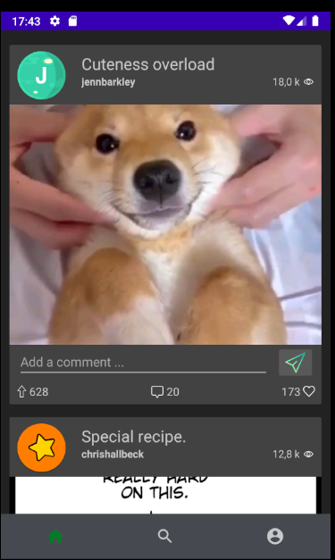
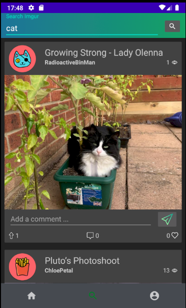
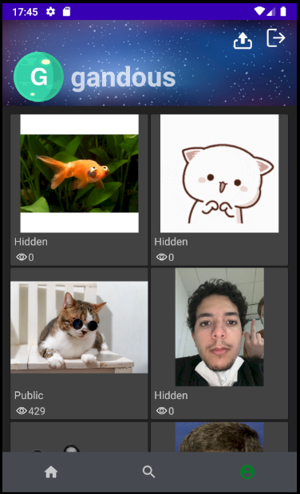
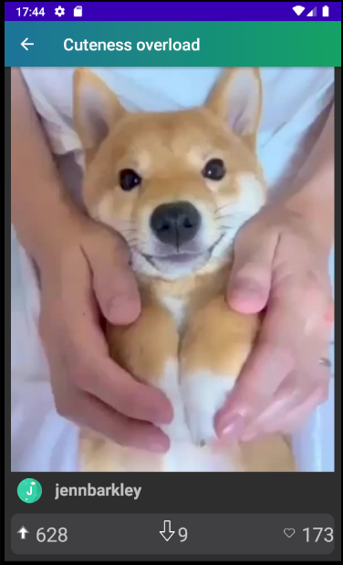

# Epicture

[](https://antoinepoisson.github.io/Old-School-Projects/projects/dev-epicture-2020)

   

[Tek3](../../README.md) / [AppDev](../README.md) / **DEV_epicture**

*Epitech project · AppDev - Epicture (B-DEV-501) · November–December 2020 · 2 weeks · Grade A*

Epicture browses Imgur from an Android phone: a hot/viral feed with an inline comment box on every
row, keyword search, a profile that uploads straight from the device gallery, and favourite and
vote buttons on any post. Ten Imgur endpoints sit behind eight Retrofit interfaces, and one screen
has no desktop equivalent at all.

That screen is the login. Imgur hands the access token to a **browser**, not to the app, so the
credential has to leave the process and find its way back: Epicture opens Imgur's authorize page in
a `WebView`, declares `epicture://home` as a deep link in the manifest, and lets Android route the
redirect back into the application as an `Intent`.



The flow is OAuth2 **implicit**: `response_type=token` puts the token in the URL *fragment*, which
a browser never sends to a server. `RedirectActivity` cuts that fragment on `&`, keeps the
right-hand side of each pair by position, and writes the five values one per line.

*`files/credential`, written by `RedirectActivity` with `Context.MODE_PRIVATE`:*

```text
<access_token>
<expires_in>
<refresh_token>
<account_username>
<account_id>
```

`MainActivity` is the launcher and checks for that file: if it exists, it starts `HomePage`
immediately instead of waiting for the Login button. `LoginPage` calls
`CookieManager.removeAllCookies()` before loading the authorize URL — a `WebView` shares its cookie
jar with the whole app, so without that wipe a second account would silently inherit the first
one's Imgur session.

Imgur accepts two different `Authorization` headers and the app uses both. Public reads travel
under the application's `Client-ID`; anything attached to the signed-in user carries the `Bearer`
token that came out of the redirect.

| `Authorization` header | Calls that use it |
| --- | --- |
| `Bearer <token>` | feed, album refresh, own images, upload, favourite, vote, post comment |
| `Client-ID <app id>` | search, comment list, album tags, profile header |

The profile header is the odd one out: name, avatar and cover come from `/3/account/{username}` with
`gandous` written in as a literal, so the name in the third screenshot is that constant rather than
the signed-in account — while the grid underneath it is a genuine `Bearer` read of `me/images`.

`HomePage` builds its three fragments once and hands them to `FragNavController` as root fragments;
`switchTab` detaches them instead of destroying them. The instances survive, so `Feed.onCreate` —
and the gallery request it fires — runs once for the life of the screen, not once per visit to the
home tab.



<p align="center">
  
  
  
</p>

Lists are `RecyclerView` grids — one column for the feed and the search, two for the profile — with
Glide handling the fetch, the downsampling and the disk cache. Rows are recycled, so roughly a
screenful of bitmaps is alive at a time instead of a whole gallery page. The profile cells label
themselves from a single rule: fifty views or fewer and the cell reads `Hidden` with a count of
`0`, above that it reads `Public` and shows the real figure.

Each row's placeholder is a Lottie animation, and `AnimationContainer` implements Glide's
`RequestListener` with `onResourceReady` and `onLoadFailed` doing exactly the same two calls:
`pauseAnimation()` then `visibility = GONE`. A dead Imgur link therefore stops the spinner instead
of leaving it turning under a blank cell forever.

Counts are compressed to SI units before they reach a one-line label — the `18,0 k` in the first
screenshot is this function, formatted under a French locale:

```kotlin
private fun getFormatedNbr(number: Int): String {
    if (number < 1000)
        return number.toString()
    val exp = (kotlin.math.ln(number.toDouble()) / kotlin.math.ln(1000.0)).toInt()
    return String.format("%.1f %c", number / Math.pow(1000.0, exp.toDouble()), "kMGTPE"[exp - 1])
}
```

| Screen | What it does | Imgur endpoints |
| --- | --- | --- |
| Feed | hot/viral gallery, inline comment box per row | `/3/gallery/{section}/{sort}/{window}/{page}`, `/3/gallery/{gallery_hash}/comment` |
| Research | keyword search across the gallery | `/3/gallery/search` |
| Account | header, own images, upload, logout | `/3/account/{username}`, `/3/account/me/images`, `/3/image` |
| Detail | full post, tags, comments, favourite, up/down vote | `/3/gallery/album/{album}`, `/3/gallery/{post_id}/comments/`, `/3/album/{album}/favorite`, `/3/gallery/{gallery_hash}/vote/{vote}` |

**Size.** 22 Kotlin files, 1,509 lines, 15 layouts, 5 activities, 4 Lottie animations wired from
`res/raw`, `minSdk 22` against `compileSdk 28`. Returning to the feed from a post refetches that
one album and calls `notifyItemChanged(selected)`, not `notifyDataSetChanged()` — a new vote
appears without reloading the page or losing the scroll.

**Token at rest.** Logging out is not a flag flip: `clearCacheFolder()` walks `filesDir` and
`cacheDir` recursively and takes the credential file with them. The token itself sits in plaintext
inside the app sandbox — beyond the reach of other apps, within reach of a rooted device, and
`EncryptedSharedPreferences` over the Android Keystore is where that line sits today.

**The redirect.** A custom scheme is claimed first-come-first-served on Android, so any app
declaring `epicture://` can be offered the same redirect. Verified App Links, and the
authorization-code flow with PKCE that has since replaced implicit for mobile clients, close
exactly that gap.

<details>
<summary>Detail view</summary>

<p align="center">
  
</p>

</details>

## Beyond the baseline

- Four Lottie animations wired from JSON in `res/raw` — loading, search, favourite, vote — plus a
  full-screen feed loader streamed from a LottieFiles URL, instead of static spinners.
- `AnimationContainer`, a reusable Glide listener that retires whichever animation it was handed,
  on success and on failure alike.
- Separate technical and user documentation under `doc/`.

## Technical stack

Kotlin · Android SDK 28 (min 22) · Retrofit 2.1 + Gson converter · Glide 4.11 · Lottie 3.4 ·
FragNav 3.2 · recyclerview-animators 4 · Gradle, Android Studio, Git.

## Build & run

```bash
./gradlew assembleDebug
```

Produces a debug APK for API 22 and above. The Imgur client id is a literal in five source files —
the authorize URL in `LoginPage` and the four `Client-ID` call sites; point them at your own
registered Imgur application to build against a different account.

## Original documentation

The [upstream README](./README.upstream.md) preserves the original Android project notes, next to
the [technical](./doc/doc.md) and [user](./doc/user_doc.md) documentation. The module's statement
was later renamed Redditech and re-pointed at the Reddit API — this is the Imgur original, as the
endpoints show.

---

[Tek3](../../README.md) / [AppDev](../README.md) · [⌂ All projects](../../../README.md)
