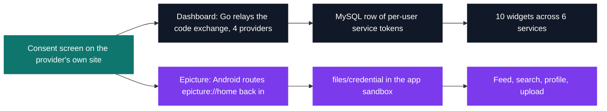

# AppDev — web & mobile applications

[Tek3](../README.md) / **AppDev**

Two applications built back to back in autumn 2020, both spending their hardest code on credentials
for accounts they do not own. Dashboard has to publish `/about.json`, a machine-readable catalogue
of its six services, so that any other team's frontend can drive its backend. Epicture has to catch
Imgur's access token as Android hands it back to the process through an `epicture://home` deep link.

| Project | What it is | Size | Grade |
| --- | --- | --- | --- |
| [Dashboard](DEV_dashboard) | Go + React widget board, six services behind one self-describing API | 2 weeks · team | A |
| [Epicture](DEV_epicture) | Native Kotlin Imgur client, token delivered by a custom URL scheme | 2 weeks | A |

Same problem, two answers. Dashboard runs the code-for-token exchange inside Go because GitHub's
token endpoint sends no CORS headers, so a browser cannot finish it. Epicture takes the implicit
flow, where the token arrives in a URL fragment a browser never forwards to any server.

<pre>
AppDev/
├── <a href="DEV_dashboard">DEV_dashboard/</a> Dashboard — widgets for Twitch, GitHub, Imgur, weather, deployed in one command  · A
└── <a href="DEV_epicture">DEV_epicture/</a>  Epicture — a native Android/Kotlin client for browsing and publishing on Imgur  · A
</pre>

---

[Tek3](../README.md)
