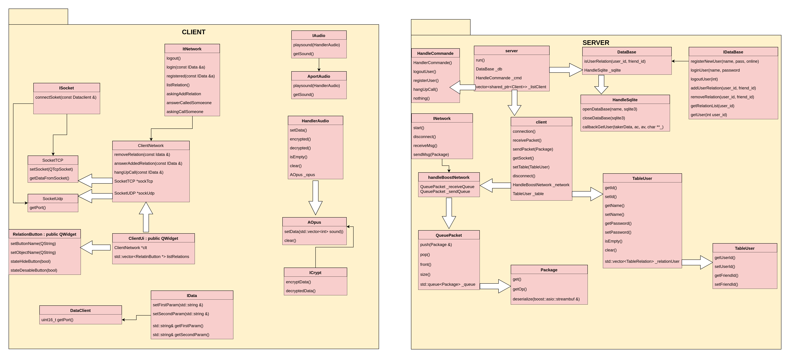
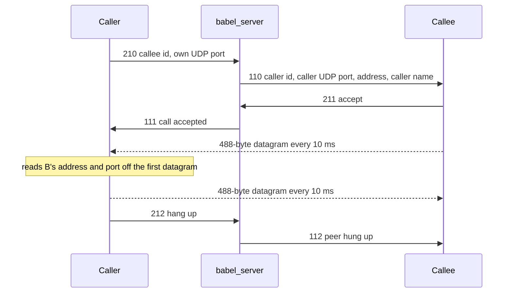
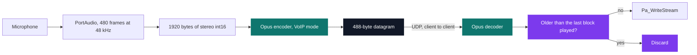

# Babel — voice over IP

[](https://antoinepoisson.github.io/Old-School-Projects/projects/cpp-babel-2020)

    

[Tek3](../../README.md) / [CPP](../README.md) / **CPP_babel**

*Team project · Advanced C++ (B-CPP-500) · October–November 2020 · 2 weeks · Grade B*

Babel is a simplified Skype that works end to end: register an account, add a contact, ring them,
and talk. Behind the second half of that sentence sits a hard deadline — every 10 milliseconds the
sound card hands the client 480 stereo frames and restarts the clock. Capture, compress, send,
receive, decompress and play all have to fit inside that window, on a network that promises
neither order of arrival nor arrival at all.

One rule shapes every decision below. **Voice prefers loss to delay.** A frame that shows up
300 ms late is useless — the conversation has already moved past it — and it is worse than a
frame that never shows up, because waiting for it stalls everything queued behind it. So nothing
in the media path is allowed to retransmit, to reorder, or to buffer "just to be safe".



**Two planes, two transports.** Everything about *being* in a call — registering, adding a
contact, ringing, hanging up — goes to the server over TCP (RFC 793). Those messages are rare,
they must all arrive, and they must arrive in order, so TCP's guarantees are worth their cost.

The audio never touches the server. The subject required client-to-client voice, and the rule
above asks for the same thing: datagrams go straight between the two clients over UDP (RFC 768).
The handshake is asymmetric — the callee is told where to send, and the caller learns the peer's
address and port from the source of the first datagram that lands on its socket.



**The pipeline.** PortAudio opens one duplex stream at 48 kHz, stereo, 16-bit, with a 480-frame
buffer. Capture spins on `Pa_GetStreamReadAvailable` until 480 frames are queued and only then
reads, so the sound card — not a wall clock — sets the pace: the Qt timer that drives the send
loop is started at interval `0` and simply runs whenever the device has another block ready.

Those 480 frames are 1,920 bytes of raw PCM. Opus, created in `OPUS_APPLICATION_VOIP` mode,
compresses them into a 960-byte scratch buffer; the head of that buffer is copied into a fixed
480-byte slot, and the block leaves as one datagram — one packet per block, no length field to
parse, nothing to reassemble. It is the same 488 bytes whether the frame is speech or silence.

```cpp
typedef struct dataUdp_s {
    long time;
    unsigned char audio[SIZE_MAX_AUDIO];
} dataUdp_t;
```

| Field | Bytes | What it carries |
| --- | --- | --- |
| `time` | 8 | `std::time(nullptr)` sampled when the block was captured |
| `audio` | 480 | `SIZE_MAX_AUDIO`: one Opus frame for 10 ms of stereo |
| — | **488** | total on the wire, every packet, always |



**The receiver is where the rule becomes code.** There is no reordering buffer. Each datagram
carries the capture timestamp, the receiver remembers the newest one it has played, and anything
older is decoded and then thrown away rather than held back and replayed in sequence:

```cpp
void babel::ClientUi::readUdp()
{
    HandlerAudio coder;
    dataUdp_t test = clt->sockUdp->receivAudio();
    std::vector<unsigned char> dataChar(test.audio, test.audio + SIZE_MAX_AUDIO);
    HandlerAudio a(coder.decrypted(dataChar));
    static long time = 0;

    if (time <= test.time) {
        aze->playSound(a);
        time = test.time;
    }
}
```

That is a late-packet discard, not a jitter buffer: zero added latency, paid for with the
reordered frame. Audit finding worth carrying forward — the stamp is `std::time(nullptr)`, seconds
against frames that last 10 ms, so the filter only fires on packets a full second stale. The
policy is right and the clock is the wrong one; a monotonic sequence number would let those same
three lines discard per frame.

**Signalling framing.** Every TCP message is one fixed-size POD struct of 135,752 bytes, written
with `memcpy` and read with an `async_read` of exactly that length. That deletes a whole bug class
— "is a full message buffered yet?" becomes one comparison, and TCP short reads stop mattering.

The bill is 135,752 bytes to say *hello*, because the record reserves room for 512 contacts up
front: 135,168 of those bytes are the contact array. Fine for login and hang-up, less so for the
contact list, which the client re-requests on a 2-second timer and pays for in both directions —
about 136 kB/s on an idle session, nearly three times what the voice stream costs at 48.8 kB/s.

| Area | Client → server | Server → client |
| --- | --- | --- |
| Accounts | `230` register, `231` login, `232` logout | `130` register result, `131` login result, `132` session closed |
| Contacts | `220` ask, `221` accept, `222` remove, `223` list | `120` incoming request, `100` contact list |
| Calls | `210` call, `211` accept, `212` hang up | `110` incoming call, `111` accepted, `112` peer hung up |

The server is a single-threaded Boost.Asio loop: `run_one()` drives the async accept and the
per-client reads, each client owns a send and a receive `std::queue<Package>`, and an unknown
opcode falls through to a no-op handler instead of desynchronising the stream. Accounts and the
contact graph live in two SQLite tables — `Users(id, name, password, online)` and
`RelationUsers(user_id, friend_id)`.

One more audit finding: the UDP socket binds `QHostAddress::LocalHost`, and the address the server
hands the callee is read from the callee's own socket rather than the caller's. Both are invisible
on a single machine, where every address is already `127.0.0.1` — which is how the project was
exercised. The commented-out `QNetworkInterface::allAddresses()` scan just above that bind marks
where the LAN version was meant to start.

## Build & run

```bash
./install.sh   # relinks the Conan ALSA package against the system libraries
./build.sh     # conan install + cmake + make -j4 → babel_server, babel_client
```

The server takes an address and a port and validates both before binding. The client takes no
arguments: the form asks for the server's address and port, then for the local UDP port it binds
for incoming audio — that bind has to happen before login, or the client refuses to send
credentials. Filtered down to the command trace, a whole call reads like this on the server; the
raw log interleaves a framed dump of every packet read and every SQL statement run.

```console
[Status]: Server run on 127.0.0.1@4201
[User]: New Connection
[Cmd]: loginUser.
[Cmd]: sendListRelation.
[Cmd]: askingCallSomeone.
[Cmd]: hangUpCall.
[Client]: Disconnected.
```

Two compile-time switches make the pipeline bisectable: `ENABLE_OPUS` swaps the codec for a raw
`memcpy`, and `ONLY_AUDIO` drops the network and loops capture → encode → decode → playback on
one machine. Between them, a codec bug is told from a socket bug without a second computer.

## Beyond the baseline

- CircleCI rebuilt client and server on every push, on a `conanio/gcc6` image, and pinged a
  Discord webhook only when the build broke.
- `install.sh`, `build.sh` and `clear.sh` absorb the Conan bootstrap, including the ALSA symlink
  dance that PortAudio needs on the school machines.
- Seven exception classes split by subsystem: `ErrorAOpus`, `ErrorPortAudio` and `CantUsePA`
  against `ErrorSql` and `FataleErrorSql` keep an audio failure distinguishable from a database
  one at the catch site, and `HandleCtrlC` / `QuitServer` turn shutdown into ordinary unwinding.
- Eight interface headers of pure virtuals (`IAudio`, `ICrypt`, `IDataBase`, `ISocket`, `IData`,
  `IException`, an `INetwork` per side) keep codec, transport and store swappable — which is
  exactly what the subject asked abstractions to prove.

## Technical stack

About 4,600 lines of hand-written C++17 across 63 files, the two Qt-generated UI headers aside.
Boost.Asio for the server, Qt5 for the client and its TCP/UDP sockets, PortAudio for capture and
playback, Opus for compression, SQLite for the directory. CMake with Conan for the dependency set,
CircleCI on every push.

## Original documentation

The [upstream README](./README.upstream.md) keeps the team's own usage text and protocol notes as
they were written at the time.

---

[Tek3](../../README.md) / [CPP](../README.md) — advanced C++ & networking · [⌂ All projects](../../../README.md)
