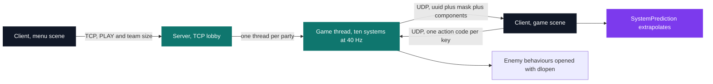
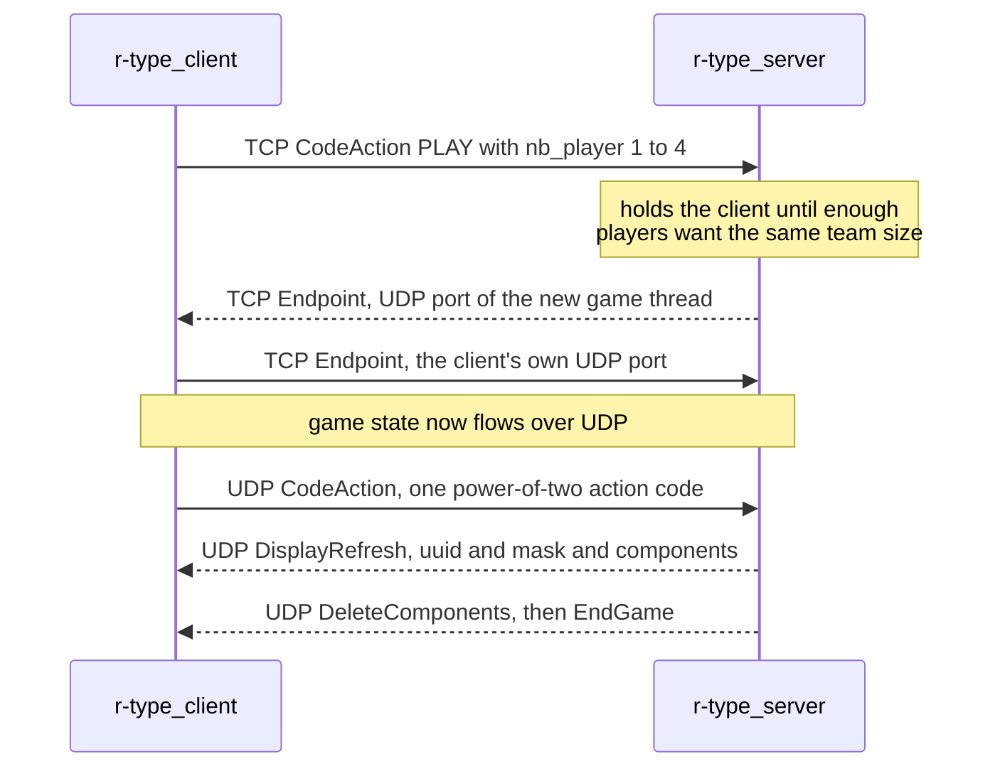

# R-Type — multiplayer game engine

[](https://antoinepoisson.github.io/Old-School-Projects/projects/cpp-rtype-2020)

    

[Tek3](../../README.md) / [CPP](../README.md) / **CPP_rtype**

*Team project · Advanced C++ (B-CPP-501) · autumn–winter 2020–2021 · 3 weeks · Grade B*

A four-player networked shoot-'em-up running on an entity-component engine written from nothing:
112 C++ files, 8,749 lines, an authoritative multi-threaded server, an SFML client, and a binary
protocol written up as an RFC-style memo in `doc/protocol.txt`, dated a month ahead of the code.

The subject makes that ordering mandatory — *"before you begin work on your game, it is important
that you start by creating a prototype game engine"* — and it is the whole exercise. Every decision
has to stay valid for a game nobody has drawn yet, which is a different discipline from building a
game and factoring out the reusable parts afterwards.

R-Type itself is a known quantity, so the grade rides on what sits underneath it: how an entity is
represented, how two processes agree on what exists, and how much of the world the client is allowed
to guess at between packets.



**One integer per entity.** Instead of a class hierarchy, every component type owns one bit in
`common/includes/RType.hpp`. An entity is a UUID string plus a `std::bitset<50>` signature; 49 of
those bits map to a real component type, and 48 of them are named in `doc/list_components.md`.

| Bit | Component | Carried by |
| --- | --- | --- |
| 0 | `Position` | everything that moves |
| 5 | `Speed` | bullets |
| 11 | `Life` | players and mobs |
| 16 | `StartCriteria` | bullets, precomputed trigonometry |
| 30 | `Type` | anything the client has to draw |
| 40 | `ItsPlayer` | players only |

Asking "is this entity a player" is then one AND and one comparison, not a chain of dynamic casts —
this is the whole of `GameEngine::checkIfEntityIs`, minus its `try`/`catch`:

```cpp
rtype::entity::ComponentManager &handler = rtype::singleton::ECManager::get();
Signature typeSig(type);
Signature entSig = handler._eMan.getSignature(entityId);

auto res = typeSig & entSig;
if (res.to_ullong() == typeSig.to_ullong())
    return true;
return false;
```

**Audit finding.** Bit 33 is written `8589934952`, which is `1 << 33` plus 360, so that mask also
lights bits 3, 5, 6 and 8 — the one entry in the enum that is not a power of two. It stays inert:
no client system selects on those four bits, since the renderer walks `DisplayOrder` components,
prediction filters on `NextPosition` and `Destination`, and audio on `Sound` and `Music`. A
hand-typed table of powers of two has no compiler checking it.

**The signature is also the wire format.** The same bitmask doubles as the field descriptor of the
UDP packet: it names which components follow, and `message` holds them packed back to back.

```c
struct DisplayRefreshMssg {
    int           type;          /* 1 = DISPLAY_REFRESH                         */
    char          uuiid[37];     /* the entity UUID, identical on both machines */
    std::time_t   timestamp;
    unsigned long mask_bitset;   /* which components follow, ECS bit for bit    */
    char          message[2000]; /* those components, packed back to back       */
};
```

Because the server hands the client its own UUID and the client re-creates the entity under that
exact string, both sides name the same thing the same way. There is no translation table between a
server-side id and a client-side handle.

**Two transports, two jobs.** The subject mandates UDP for everything in-game and tolerates a second
TCP connection only where it can be justified. TCP therefore carries joining, matchmaking and the
endpoint swap; UDP carries game state, where a dropped position costs less than the latency a
retransmit would add.



The memo adds that the client drops TCP once the match starts. The code does not: `SystemPlayerAlive`
polls that socket every tick for a `QUIT`, and the closing `EndGame` goes out on both transports. It
costs one open socket per player, and buys a reliable path for the two events that must not be lost.

**Bullets are described, not streamed.** Players and mobs are re-sent every tick with three
components each. A bullet is sent once, with seven — its start time, its speed and the precomputed
sine and cosine of its path — and `SystemPrediction` re-derives its position from elapsed time on
every frame.

| Entity | Components on the wire | Cadence |
| --- | --- | --- |
| Player | `Position`, `Life`, `Type` | every tick |
| Mob | `Position`, `Life`, `Type` | every tick |
| Bullet | `Position`, `Type`, `Destination`, `StartingTime`, `Speed`, `Surface`, `StartCriteria` | once, then extrapolated |

A bullet is not a special case in the protocol. It is an entity whose component set happens to make
it predictable — which is the engine-first design paying for itself.

**Enemy behaviour is a plugin.** `SystemLoadMethodeMob` scans `./server/lib/` for names matching
`lib\S+.so`, `dlopen`s each one and pulls a `create` symbol returning an `ILibMob` with two methods,
`createEntity` and `handlerIAMob`. The build ships one such library, `PlaneMob`; a second, `OtherMob`,
is written but its `add_library` line is still commented out.

**One thread per party.** The TCP lobby buckets waiting clients by requested team size and spawns a
`boost::thread` per match. Each match runs ten systems in a fixed order, the last of which spin-waits
on `clock()` for `CLOCKS_PER_SEC / TIMERGAME` to hold the tick at 40 Hz. The entity store behind them
is a process-wide singleton — which is why the help text promises several games *in a row*, and why a
comment in `runnerParty` asks whether sharing that manager across threads is a problem.

## Build & run

`./build.sh` wraps the original Conan/CMake toolchain; its explicit form adapts more easily to a
newer local installation:

```bash
mkdir build && cd build
conan install .. && cmake .. -G "Unix Makefiles" && cmake --build .
```

That produces `r-type_server` and `r-type_client`, the two binary names the subject imposes. The
server takes an address and a port and outlives any single match — start it once, then point clients
at it:

```bash
./r-type_server 127.0.0.1 4201
./r-type_client 127.0.0.1 4201     # one per player
```

A `Dockerfile` replays the same Conan/CMake build inside the Epitech test image, and GitHub Actions
built both binaries and ran the test suite on every push — with a Discord notification, so a broken
build reached the team before standup did.

## Beyond the baseline

The subject asked for an authoritative multi-threaded server, a graphical client, and an engine whose
rendering, networking and game-logic layers stay decoupled. A few things went further than that
baseline:

- **Client-side prediction** wasn't required — the subject would have accepted a client that only
  rendered whatever the server last said. Adding it was a bet that a shoot-'em-up lives or dies on
  how it feels to move.
- **CI on every push**, building both binaries and running the GoogleTest suite over the ECS, the
  network layer and the systems, from its own Conan/CMake configuration.
- **Written architecture docs** in `doc/` — server and common UML, a client specification, a numbered
  component table and the protocol memo — the kind a four-person team needs to stay out of each
  other's classes.

This is where "an entity-component architecture" stops being a phrase from a lecture and becomes the
reason four people can work on one game at once.

## Technical stack

C++17, built with CMake and Conan · SFML for rendering, Boost.Asio for TCP and UDP, Boost.Uuid for
entity identity · containerised with Docker · tested with GoogleTest, verified in GitHub Actions.

## Verification

16 GoogleTest cases across three files: 7 on entity creation, signatures and the component-manager
singleton, 5 on the TCP and UDP readers and the message queues, 4 on `SystemPrediction`'s bullet
trajectories, one per diagonal, the last of them also covering a purely vertical shot. `run_tests.sh`
builds them through their own Conan/CMake setup and runs `gcovr`.

## Original documentation

The [upstream README](./README.upstream.md) keeps the exact CLI usage for both binaries.

---

[Tek3](../../README.md) / [CPP](../README.md) — advanced C++ & networking · [⌂ All projects](../../../README.md)
