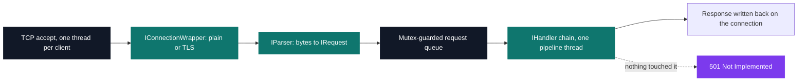
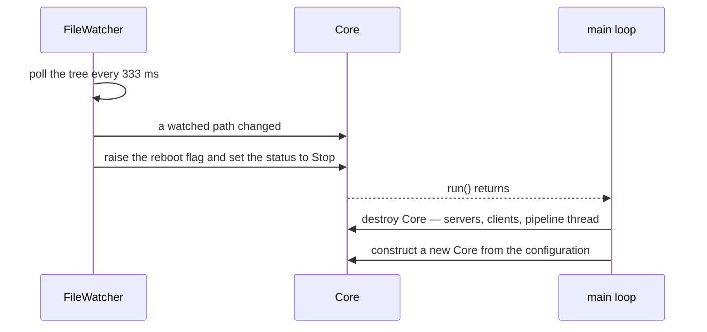

# Zia — modular HTTP server

[](https://antoinepoisson.github.io/Old-School-Projects/projects/cpp-zia-2020)

    

[Tek3](../../README.md) / [CPP](../README.md) / **CPP_zia**

*Team project · Advanced C++ (B-CPP-510) · December 2020 – January 2021 · 3 weeks · Grade A*

> An HTTP/HTTPS server whose core knows nothing. Every feature it has arrives as a `.so` named in a
> JSON file.

The module interface was not ours to design. The subject put the whole city-wide class on one shared
API and held an election; after it, a module written by any group had to load and run inside any
other group's server, with the interface frozen — "whether it is good or bad", in the subject's words.

That is where the difficulty sits: the core has to publish its hook points *before* it knows what
will hook into them, and can never widen the interface later to make its own life easier. Apache
solved that with its module API; here it had to be solved in three weeks, by a class.

So `zia` itself does very little: accept a TCP connection, push the bytes through a chain of shared
libraries, write back whatever they produced. About 7,000 lines of C++ across 84 source files, and
eleven `.so` — no request handling of its own is linked into the binary.



If the chain ends and no handler ever wrote to the response object, the answer is **501 Not
Implemented**, not 404. That is the "the core does nothing" claim made literal: an unhandled request
is not a missing file, it is a missing module. The 404s come from the handlers themselves, when the
file one of them was asked for turns out not to be there.

**How a `.so` announces itself.** There is no manifest and no registration call. `ManagerSharedObject`
`dlopen`s the library and probes it for four known factory symbols in order — `createConnectionWrapper`,
`createHandler`, `createLogger`, `createParser`. The first one that resolves decides what kind of
module this is. A stranger's library is classified by what it exports, nothing else.

| Module | Kind | Role |
| --- | --- | --- |
| `ConnectionWrapper` | `IConnectionWrapper` | Plain socket or OpenSSL TLS, chosen per server |
| `Parser` | `IParser` | Request line, headers, `Content-Length` and chunked bodies |
| `HtmlHandler` | `IHandler` | `.html`, `.css`, `.js`, each with its own `Content-Type` |
| `PngHandler` | `IHandler` | `.png`, `.jpg`, `.gif` read in one block, all labelled `image/png` |
| `PhpCgi` | `IHandler` | `php-cgi` forked and spoken to over CGI/1.1 |
| `FileExplorer` | `IHandler` | Directory index rendered as an HTML table |
| `PostRequestHandler` | `IHandler` | `POST` writes the request body to disk |
| `DeleteRequestHandler` | `IHandler` | `DELETE` removes the target file |
| `HeadRequestHandler` | `IHandler` | `HEAD` empties the body, keeping its length in a header |
| `Handler` | `IHandler` | Empty skeleton: the minimum a module must export |
| `Logger` | `ILogger` | Same, for the logging interface |

The last two return `nullptr` on purpose. They are the reference implementations another group copies
to start a module — the core's own logging goes through a built-in `Zia::Logger` instead.

One configuration file can describe several servers at once, each with its own port and `secure`
flag, so the same binary listens in plaintext and over TLS side by side:

```jsonc
{
  "servers": [
    { "ip": "127.0.0.1", "port": 4241, "log": "./resources/log/Core.log", "secure": false },
    { "ip": "127.0.0.1", "port": 4243, "log": "./resources/log/Core.log", "secure": true }
  ],
  "connection_wrapper": { "path": "./build/modules/lib/libModuleConnectionWrapper", "conf": "..." },
  "parser":             { "path": "./build/modules/lib/libModuleParser",            "conf": "..." },
  "handlers": [ { "path": "./build/modules/lib/libModulePhpCgi", "conf": "..." } ]
}
```

The shipped `config.json` lists seven handlers in that array; the chain runs them in file order, and
the first one to call `abortPipeline` is the last one consulted.

**The escape hatch.** The elected `IResponse` can set a header and read one back by name, but it has
no way to *enumerate* headers — and the core needs all of them to serialise the response. The
interface could not change, so a key no real header can collide with was reserved (the UUID
`89618aca-7d32-11eb-9439-0242ac130002`) and the core asks for it:

```cpp
const std::string *Zia::Response::getHeader(const std::string &key) const
{
    if (key == BYPASS_API_LIMITATION) {
        if (_header.empty())
            return nullptr;
        std::string res;
        for (auto header : _header) {
            res += header.first + ": " + header.second + "\r\n";
        }
        return new std::string(res);
    }
```

An audit finding worth stating plainly: that `new` is never freed, one small leak per response. The
interface returns a bare `const std::string*` with no ownership convention, so a synthesised value has
nowhere to live — the leak is the shape of the API showing through, and the fix belongs there.

**Reloading while the server is up.** A `FileWatcher` thread walks the tree from the working directory
every 333 ms and compares write timestamps against a watch list built at startup: the config file plus
every `.so` path the config mentions, *including the ones that failed to load*. Drop a missing module
into place and the next `Core` opens it.



A reload is a full `Core` teardown rather than a surgical swap, and nothing ever calls `dlclose`: the
handles opened at startup stay mapped for the life of the process. That is what keeps the teardown
safe, because every handler, parser and connection object was allocated by code inside a `.so`, and a
virtual call into an unmapped library is not a crash anyone enjoys reading a core dump for.

Serialising the chain on one thread pays off here too. The pipeline rebuilds its handler list only
when the reload flag is set, at the top of its loop, so a reload can never swap the chain out from
under a handler that is mid-request.

**One thread per client** costs a thread per connection, so the accept path caps concurrency at six,
compiled in as `PROTECTION_DDOS`. The plain socket is put in non-blocking mode, which turns that
thread into a poll loop over `parse()`; the TLS wrapper clears `O_NONBLOCK` on the descriptor for the
handshake and leaves it clear, so the same loop blocks inside `SSL_read`.

Either way the loop checks a clock at the top of every pass: a client gets 5 seconds to send its
first request, answered with a 408 when it does not, then 2 seconds between keep-alive requests
before the socket is closed.

## Build & run

```bash
./run.sh                       # self-signed cert if missing, builds core + modules, starts zia
./build/bin/zia ./config.json  # or run it directly against a config
```

With no argument the server loads `./config.json`; a path it cannot read, or one with no `.json`
anywhere in its name, exits with code 84. Every file-serving handler reads its own document root from
its module config, and all of them ship pointing at `./resources/pages`, where `.htaccess` lists the
paths that must answer 403.

A broken configuration degrades instead of dying. A server entry with an invalid IP or port is
reported and skipped while the others start; a `connection_wrapper` or `parser` pointing at a
missing `.so` falls back to the default library path, and only a missing default aborts the run.

## Beyond the baseline

- The subject made exactly two modules mandatory: the secure connection and the PHP CGI gateway.
  Nine more ship beside them, including dedicated `HEAD`, `POST` and `DELETE` handlers and a
  directory browser.
- A Docker image, a `run.sh` that covers build, rebuild, clean, tests and Docker, and a Doxygen
  configuration make the project easier to hand over; `docs/api.md` writes up the four interfaces.
- 41 HTTP status codes in the response table, and a parser that rejects at the protocol level:
  400 for malformed syntax, 501 for a method outside `GET`/`HEAD`/`POST`/`DELETE`, 505 for a
  version other than HTTP/1.1, 411 for a `POST` with neither `Content-Length` nor `Transfer-Encoding`.

## Technical stack

C++17 build (C++11 was the subject's floor) · Boost.Asio, OpenSSL, nlohmann_json · CMake and Conan,
Docker, Doxygen · `dlopen`/`dlsym`/`dlclose` behind one loader class, Windows branches stubbed
alongside.

## Verification

The check that matters is byte-level, because the server's contract is bytes on a socket. Run from
the repository root, `tests/client.sh 127.0.0.1 4241` feeds `tests/request.txt` — the literal text
`GET / HTTP/1.1\r\n\r\n`, whose escapes `echo -ne` expands into real CRLFs — through `nc` and prints
the raw reply. `tests/exampleOtherRequest.txt` holds four further request shapes.

A `zia_tests` CMake target links GoogleTest and `--coverage` over the same sources, and
`./run.sh tests` builds it and then runs `gcovr`. What that target contains is the harness:
`tests/Main.cpp` calls `InitGoogleTest` and `RUN_ALL_TESTS` over an empty registry.

## Original documentation

The [upstream README](./README.upstream.md) contains the full configuration reference, and
[`docs/api.md`](./docs/api.md) documents the four module interfaces as they were proposed.

---

[Tek3](../../README.md) / [CPP](../README.md) — advanced C++ & networking · [⌂ All projects](../../../README.md)
