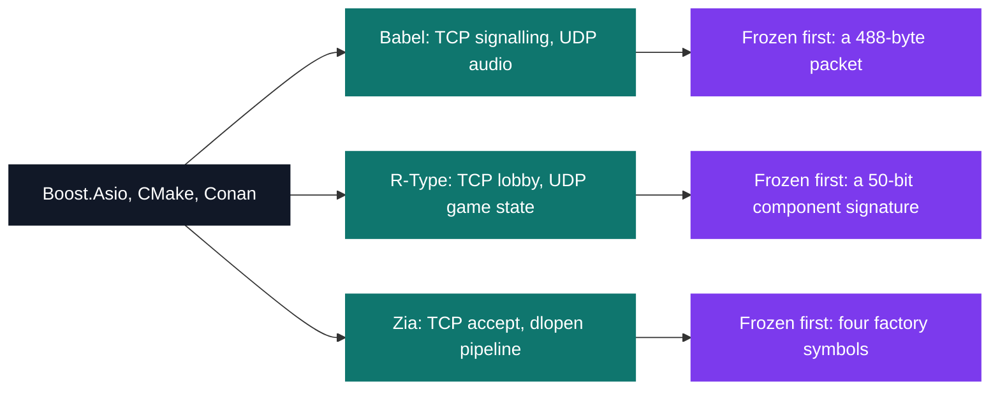

# CPP — advanced C++ & networking

[Tek3](../README.md) / **CPP**

Three team projects in C++17, each of which had to fix its contract before knowing what would run
on it. Babel gets 10 milliseconds to capture, compress, send, decode and play one block of voice.
Zia's module interface was frozen by a city-wide vote, so any group's `.so` had to load inside any
other group's server — and R-Type's engine was written by four people before any of them had agreed
what the game would look like.

| Project | What it is | Module | Size | Grade |
| --- | --- | --- | --- | --- |
| [Babel](CPP_babel) | Voice over IP: one 488-byte Opus datagram every 10 ms, client to client | B-CPP-500 | 2 weeks · team | B |
| [R-Type](CPP_rtype) | An entity-component engine, 8,749 lines, with a 4-player shoot-'em-up on top | B-CPP-501 | 3 weeks · team | B |
| [Zia](CPP_zia) | HTTP/HTTPS server whose binary holds no behaviour: eleven `.so` do the work | B-CPP-510 | 3 weeks · team | A |

October 2020 to January 2021, semester 5. Same toolchain across all three — CMake with Conan,
Boost.Asio underneath the network — and a different thing to freeze before the first feature.

Each one ships the specification next to the code — a written protocol spec for Babel,
`doc/protocol.txt` for R-Type, `docs/api.md` for Zia — because on a four-person team the document
is what the other three build against.
Each project page also keeps the audit findings that survived a re-read: Babel timestamps its
audio in whole seconds, R-Type has one hand-typed bit mask that is off by 360, Zia leaks a string
per response through a hole in the voted API.

<pre>
CPP/
├── <a href="CPP_babel">CPP_babel/</a>   Babel — voice over IP: capturing, compressing and replaying voice in real time      · B
├── <a href="CPP_rtype">CPP_rtype/</a>   R-Type — networked multiplayer shoot-'em-up, engine written from scratch            · B
└── <a href="CPP_zia">CPP_zia/</a>     Zia — HTTP/HTTPS server whose every feature is a hot-reloaded module                 · A
</pre>

---

[Tek3](../README.md)
