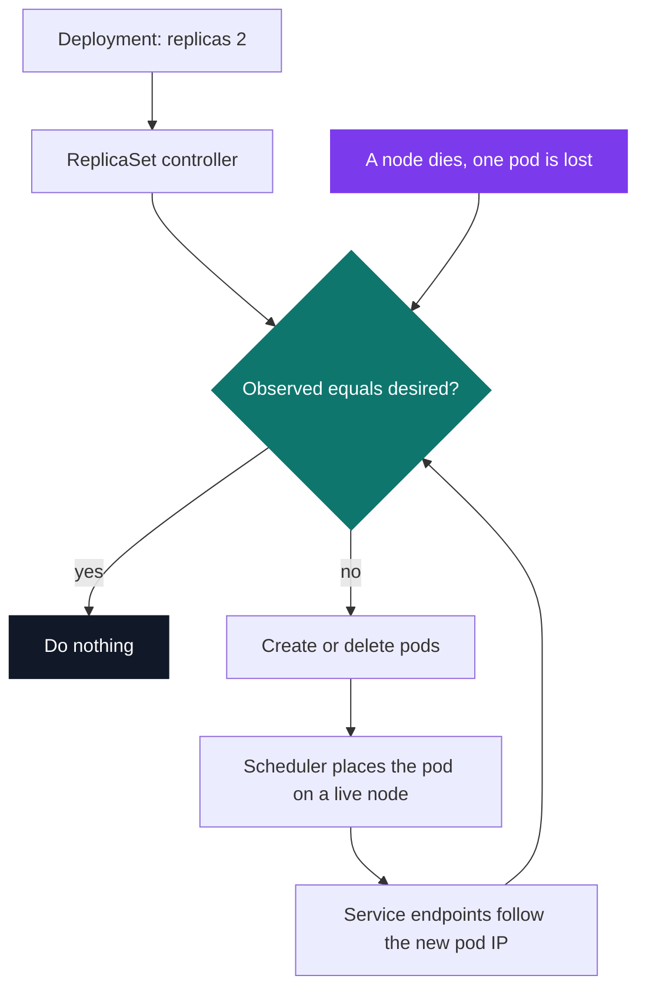

# Bernstein — Kubernetes orchestration

[](https://antoinepoisson.github.io/Old-School-Projects/projects/dop-bernstein-2020)

   

[Tek3](../../README.md) / [DevOps](../README.md) / **DOP_bernstein**

*Epitech project · DevOps (B-DOP-500) · December 2020 – January 2021 · 2 weeks · Grade A*

> The same voting application as Popeye, rewritten as a target state instead of a startup sequence.

`docker-compose up` knows how to start five containers. It does not know what to do when the
machine one of them runs on disappears.

This project restates that same application — Flask poll front, Redis queue, Java worker,
PostgreSQL, Node.js results front — as **19 manifests, 21 API objects, 475 lines of YAML**, and
hands the job of reaching that state to the cluster instead of to a shell. The subject gave the
nineteen filenames and a bullet list per component — image, namespace, replica count, memory limit,
ports, variables — and left the wiring between them entirely open.

The shift is not syntax. Compose's `restart: on-failure` restarts a process on the host it was
already on. A Deployment gives a controller a number and lets it compare what is running against
what was asked for, forever. Delete a pod by hand and a replacement appears without a command.

**Two hostnames, one port.** Traefik runs as the ingress controller behind NodePort 30021, reads
the `Host` header and routes `poll.dop.io` and `result.dop.io` to two different services; its own
dashboard answers on 30042. Behind each service the pod IPs change freely; the service name does not.

```mermaid
flowchart LR
    U["Browser"] --> T["Traefik ingress<br/>NodePort 30021"]
    T -->|"Host poll.dop.io"| SP["Service poll"]
    T -->|"Host result.dop.io"| SR["Service result"]
    SP --> PP["poll pods x2"]
    SR --> PR["result pods x2"]
    PP -->|"REDIS_HOST redis"| RD["Service redis-service"]
    RD --> WK["worker pod"]
    WK -->|"POSTGRES_HOST postgres"| SG["Service postgres-service"]
    PR -->|"POSTGRES_HOST postgres"| SG
    SG --> PG["postgres pod"]
    PG --- PV["PersistentVolume 4Gi<br/>hostPath, ReadWriteOnce"]

    classDef core fill:#0F766E,stroke:#0F766E,color:#ffffff;
    classDef alt fill:#111827,stroke:#111827,color:#ffffff;
    classDef accent fill:#7C3AED,stroke:#7C3AED,color:#ffffff;
    class T core
    class U alt
    class PG,PV accent
```



That is the declared target state. Nine pods sit across six deployments, plus one cAdvisor pod on
every node, and what each component asks for is itself a design statement: the two stateless fronts
run two replicas, the two data stores run exactly one. The audit table further down marks where the
declared wiring misses by a name or a port.

| Component | Objects declared | Desired state |
| --- | --- | --- |
| `poll` | Deployment, Service, Ingress | 2 replicas, 128M limit, `poll.dop.io` |
| `result` | Deployment, Service, Ingress | 2 replicas, 128M limit, `result.dop.io` |
| `worker` | Deployment | 1 replica, 256M limit, no service — nothing calls it |
| `redis` | Deployment, Service, ConfigMap | 1 replica, port 6379 |
| `postgres` | Deployment, Service, ConfigMap, Secret, PV + PVC | 1 replica, 4Gi volume |
| `traefik` | Deployment, Service, ClusterRole + Binding | 2 replicas, NodePort 30021 / 30042 |
| `cadvisor` | DaemonSet | one pod per node, `kube-system` |

The subject slipped one requirement into a single sentence: replicated services must run on
different nodes. `poll`, `result` and `traefik` each answer with a `requiredDuringScheduling`
`podAntiAffinity` block — the right mechanism, aimed one notch off: the selector matches another
component (`app in (redis)` under `poll`) rather than the deployment's own replicas, and the
`topologyKey` reads `poll.dop.io:30021` where the field wants a node label like `kubernetes.io/hostname`.

PostgreSQL is pinned to one replica. Its volume is a 4Gi `PersistentVolume` with `ReadWriteOnce`
backed by a `hostPath`, which a single node may mount for writing at a time. The pod is disposable
and the claim is not — but only while the replacement lands on the node that actually holds
`/var/lib/postgresql/data`.

**What the control loop actually does.** This is the part the YAML buys. Nobody watches the
cluster; a controller watches the API server and acts on the gap between observed and desired.



**Traefik has to be told what it may read.** The ingress controller is not privileged
infrastructure — it is a pod like any other, and routing means querying the cluster's own API for
Ingress and Service objects. A pod's service account is granted nothing by default, so the routing
only works once a `ClusterRole` spells out exactly what it may see.

| API group | Resources | Verbs |
| --- | --- | --- |
| `""` (core) | `services`, `endpoints`, `secrets` | `get`, `list`, `watch` |
| `extensions` | `ingresses` | `get`, `list`, `watch` |
| `extensions` | `ingresses/status` | `update` |

Three rules, no `cluster-admin` shortcut. They name `extensions`, the API group Traefik 1.7 watches,
while the two Ingress objects are written against `networking.k8s.io/v1` — the same resource served
under two API versions. With the RBAC objects declared as `rbac.authorization.k8s.io/v1beta1` on top,
the set only lines up on a cluster around 1.19 to 1.21.

The Compose version of this application carried `POSTGRES_PASSWORD: password` in the file everybody
reads. Here the configuration splits in two — a `ConfigMap` for host, port and database name, a
`Secret` for the credentials — and both are injected with `envFrom`, so the pod spec never names a
single value.

**Monitoring inverts the container contract.** cAdvisor exists to see the host, so it mounts `/`,
`/sys`, `/var/run`, `/var/lib/docker` and `/dev/disk` read-only. A toleration for the control-plane
taint lets it land on the master node too, and a `DaemonSet` — not a Deployment with a replica
count — is what guarantees exactly one copy per node, including nodes joined later.

The top of the pod spec in `cadvisor.daemonset.yaml`:

```yaml
      tolerations:
      - key: node-role.kubernetes.io/master
        effect: NoSchedule
      containers:
      - name: cadvisor
        image: google/cadvisor:latest
        ports:
          - containerPort: 8080
        volumeMounts:
        - name: rootfs
          mountPath: /rootfs
          readOnly: true
```

**An audit note.** Kubernetes wires objects by label and by name, and both mismatch quietly. Reading
the manifests back today, the interesting thing is that almost none of these produce an error
message — they produce an empty list somewhere and a page that never loads.

| Where | Written | What it had to match |
| --- | --- | --- |
| `poll` / `result` Service | selector `app: poll` | pods labelled `run: poll` |
| `poll` / `result` Service | `targetPort: 6379` and `5432` | the container port, `80` |
| ConfigMaps | `POSTGRES_HOST: postgres`, `REDIS_HOST: redis` | `postgres-service`, `redis-service` |
| `postgres` Deployment | claim `postgres-pvvolume-claim`, mount `postgredb_` | `postgres-volume-claim`, `postgredb` |
| `traefik` ClusterRoleBinding | subject in `kube-system` | the pod's namespace, `kube-public` — and no `ServiceAccount` object is declared anywhere |
| both Ingress objects | `nginx.ingress.kubernetes.io/rewrite-target` | a `traefik.` annotation; Traefik never reads the nginx prefix |
| `postgres` Service | `type: NodePort` | `ClusterIP`; nothing outside the cluster calls the database |
| `postgres` Secret | plaintext under `data` | base64 under `data` — and `user` and `password` are themselves valid base64, so they decode to binary noise in silence |

Two of the mistakes on this page are hard errors the API refuses outright. The `labels:` list holding
`"traefik.enable=false"` — a Compose habit, carried over because the subject marks `redis`,
`postgres` and `worker` as not enabled in Traefik — sits inside a container spec, which has no
`labels` field; and a `topologyKey` containing a colon is not a valid label key. The rest are silent,
which is why `kubectl get endpoints` is the ten-second check that catches the whole class at once.

## Beyond the baseline

- The Traefik `ClusterRole` enumerates three narrow rules where the subject asked only for
  "authorization to access Kubernetes internal API" — a `cluster-admin` binding would have passed.
- `ConfigMap` and `Secret` are consumed with `envFrom` rather than named variable by variable, so
  the five `POSTGRES_*` values reach `postgres`, `worker` and `result` from a single place.

Same application as Popeye, moved from `docker-compose` onto a real orchestrator — which is the
whole point of the comparison between the two projects.

## Technical stack

YAML · Kubernetes, kubectl, Traefik, cAdvisor, Docker, Git.

19 manifests, 21 API objects, 475 lines of YAML, across three namespaces (`default`, `kube-public`,
`kube-system`). The subject asks for one master and two workers, which locally means K3s — Minikube
does not do multi-node.

## Build & run

```bash
# state first, then the things that consume it
kubectl apply -f cadvisor.daemonset.yaml
kubectl apply -f postgres.secret.yaml -f postgres.configmap.yaml \
              -f postgres.volume.yaml -f postgres.deployment.yaml -f postgres.service.yaml
kubectl apply -f redis.configmap.yaml -f redis.deployment.yaml -f redis.service.yaml
kubectl apply -f poll.deployment.yaml -f worker.deployment.yaml -f result.deployment.yaml \
              -f poll.service.yaml -f result.service.yaml \
              -f poll.ingress.yaml -f result.ingress.yaml
kubectl apply -f traefik.rbac.yaml -f traefik.deployment.yaml -f traefik.service.yaml

kubectl get pods --all-namespaces   # 9 application pods + one cAdvisor per node
kubectl get endpoints               # whether each service actually found its pods
```

The `votes` table is created by hand after the first deploy — `CREATE TABLE votes (id text PRIMARY
KEY, vote text NOT NULL);` piped into `kubectl exec … psql`. Both ingress rules match on the `Host`
header, so `poll.dop.io` and `result.dop.io` have to resolve to a cluster node on port 30021, which
on a lab cluster means two lines in `/etc/hosts`.

## Original documentation

The [upstream README](./README.upstream.md) preserves the original deployment notes.

---

[Tek3](../../README.md) / [DevOps](../README.md) · [⌂ All projects](../../../README.md)
