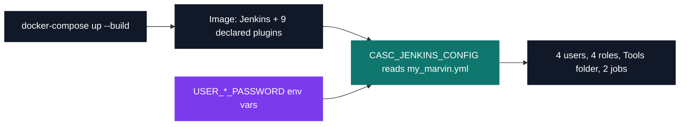
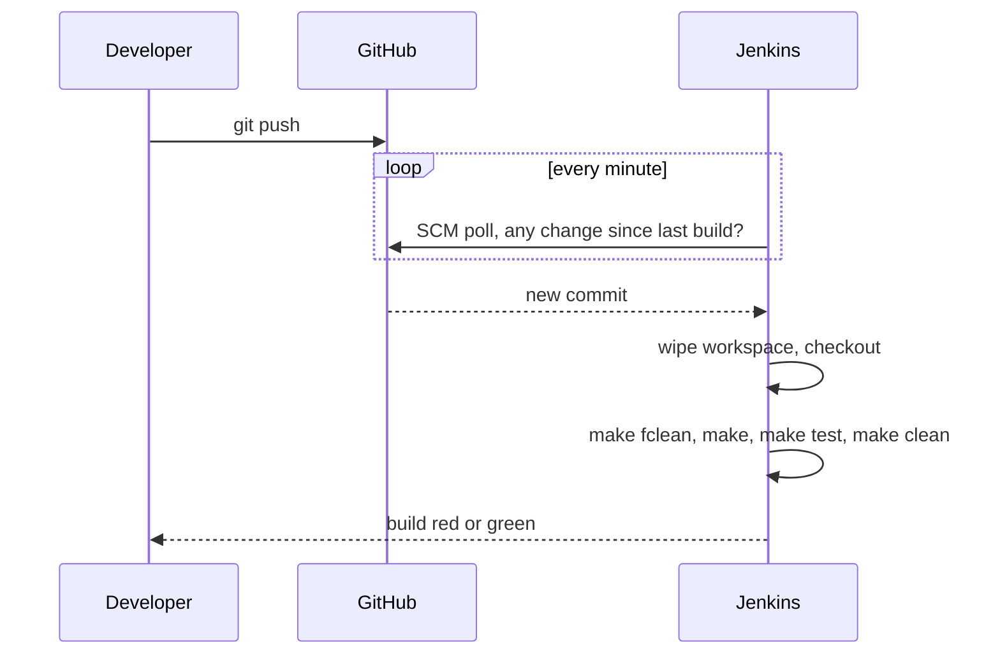

# My Marvin — Jenkins CI/CD pipeline

[](https://antoinepoisson.github.io/Old-School-Projects/projects/dop-my-marvin-2020)

   

[Tek3](../../README.md) / [DevOps](../README.md) / **DOP_my_marvin**

*Epitech project · DevOps (B-DOP-500) · October 2020 · 2 weeks · Grade A*

A Jenkins instance that configures itself. Four users, four roles carrying exactly the right
permissions, a `Tools` folder and two jobs — one of which writes other jobs — all described in a
single YAML file that a blank container reads at boot. Nothing is ever clicked into place.

Clicking would not have helped anyway. The subject is graded entirely by automated tests running
against a virtual Jenkins instance built from the turned-in file, so a fix made in the web UI does
not exist as far as the grade is concerned.

One rule outranks the rest: no password may be hardcoded. Every one of them is read from the
matching environment variable, and the subject states plainly that any violation fails the entire
project.



**Permissions are a puzzle, not a list.** The `admin` role must hold every right, and the naive
answer is to enumerate every Jenkins permission one by one. The correct answer is a single grant:
`Overall/Administer` implies all the others. The three other roles are the opposite exercise —
grant the exact set and nothing more.

| Role | Grants | Can do |
| --- | --- | --- |
| `admin` | 1 | everything, through `Overall/Administer` |
| `ape` | 4 | read jobs, build them, read workspaces |
| `gorilla` | 9 | everything `ape` can, plus create, configure, delete, move, cancel |
| `assist` | 3 | read jobs and workspaces, never build |

The fourth grant on `ape` is `Overall/Read`, which the subject never mentions. It is the escape
hatch in the wording — non-specified permissions must not be granted *unless inherently needed* —
and without it a user cannot reach the dashboard at all, so three of the four roles carry it.

Seventeen grants across four roles, in 126 lines of `my_marvin.yml`. Getting a permission wrong in
either direction — one too many, one missing — is a failed test with no error message beyond a red
cross.

**Two jobs, and one of them writes jobs.** `Tools/clone-repository` is the plain one: a single
`git clone $GIT_REPOSITORY_URL` shell step behind a pre-build cleanup. `Tools/SEED` takes a GitHub
`owner/repo` and a display name, then runs one DSL text step that creates a brand new freestyle job
for that repository — a job whose output is more Jenkins configuration.

```groovy
freeStyleJob(DISPLAY_NAME) {
  wrappers {
    preBuildCleanup()
  }
  scm {
    github(GITHUB_NAME)
  }
  triggers {
    scm('* * * * *')
  }
  steps {
    shell('make fclean')
    shell('make')
    shell('make test')
    shell('make clean')
  }
}
```

*The template `Tools/SEED` writes, quoted from the DSL block in `my_marvin.yml`.*

That `github(GITHUB_NAME)` line does double duty: it sets both the GitHub project property and the
Git SCM checkout URL from one parameter, instead of repeating the repository in two blocks that can
drift apart. The subject hints that such an instruction exists without naming it.

**Why the cron matters.** `scm('* * * * *')` polls the repository every minute. Combined with the
pre-build workspace cleanup, that is the point of the whole project: a broken build is known within
about a minute of the push, not at the next review.



The four `make` commands are separate shell steps rather than one script because the subject
requires it, and the reason shows in the report: Jenkins fails the build at the first non-zero
exit, so the failure names the stage that broke — compile or test — instead of one opaque script.

**Audit note.** `plugins.txt` freezes the plugin *set*: the same nine names, in the same order, the
subject lists as installed on the grading instance, and not one extra, since an unlisted plugin
fails the whole DSL correction. It does not freeze the *versions*, and the base image is
`jenkins/jenkins:latest`, so two builds a month apart are identical in shape and not in bytes. The
reproducibility here is of the configuration, not yet of the artefact.

`globalJobDslSecurityConfiguration.useScriptSecurity` is also set to `false`, which is what lets
the seed script run unapproved Groovy on the controller. Convenient for a two-week instance, and
exactly the setting a shared instance would gate behind script approval.

## Beyond the baseline

The graded artefact is a single YAML file. This repository ships the machine around it, so the
instance can be run and inspected locally rather than only submitted:

- A `Dockerfile` that installs the nine plugins from `plugins.txt` and adds the `make` and `gcc`
  toolchain the seeded jobs need to build anything.
- A `docker-compose.yml` exposing `8080` for the UI and `50000` for agent connections, with the
  setup wizard disabled so the container comes up already configured.
- The four `USER_*_PASSWORD` values supplied by that compose file. The YAML holds the shape of a
  credential and never its value; in production the variable comes from a secret store, here from
  the local environment.

There is no application code in this project at all. Everything lives in configuration, which is
exactly the point of the module.

## Technical stack

YAML, Shell · Docker, docker-compose, Jenkins, Git.

## Build & run

```bash
docker-compose up --build
```

Then open `http://localhost:8080`. The instance greets you with
*"Welcome to the Chocolatine-Powered Marvin Jenkins Instance."* — the exact string the subject asks
for, proof that the file and not a human configured it.

## Original documentation

The [upstream README](./README.upstream.md) is the original repository's single title line, kept as
it was delivered.

---

[Tek3](../../README.md) / [DevOps](../README.md) · [⌂ All projects](../../../README.md)
