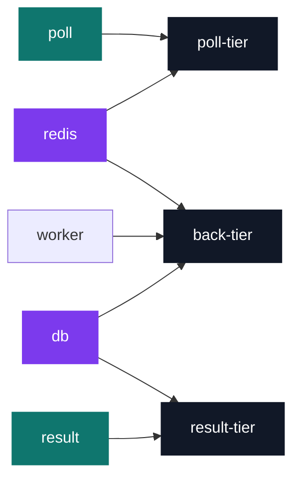

# Popeye — multi-service containerisation

[](https://antoinepoisson.github.io/Old-School-Projects/projects/dop-popeye-2020)

    

[Tek3](../../README.md) / [DevOps](../README.md) / **DOP_popeye**

*Epitech project · DevOps (B-DOP-500) · November 2020 · 2 weeks · Grade A*

Five services, four languages, one command. `docker-compose up --build` has to produce a running
system on a machine with no Python, no JDK, no Maven, no Node and no PostgreSQL installed. Three
build toolchains — pip, Maven, npm — six base images, three networks, and all of it has to agree
on names and ports before the first vote is cast.

The support application is a distributed vote: pick your favourite DevOps tool, watch the tally
move. The vote itself is four buttons. Carrying one from the click to the bar chart crosses three
application processes, a queue, a database and three separate networks.

```mermaid
flowchart LR
    BR["Browser :5000"] --> P["poll<br>Python / Flask"]
    P -->|"RPUSH votes"| R["redis<br>official image"]
    R -->|"BLPOP 0 votes"| W["worker<br>Java / Jedis + JDBC"]
    W -->|"INSERT, else UPDATE"| D["db<br>PostgreSQL"]
    D -->|"GROUP BY, polled at 1 Hz"| S["result<br>Node / Express + Socket.IO"]
    S -->|"scores event"| BR2["Browser :5001"]

    classDef core fill:#0F766E,stroke:#0F766E,color:#ffffff;
    classDef alt fill:#111827,stroke:#111827,color:#ffffff;
    classDef accent fill:#7C3AED,stroke:#7C3AED,color:#ffffff;
    class P,S core
    class R,D alt
    class W accent
```



| Service | Language / image | Role | Port |
| --- | --- | --- | --- |
| `poll` | Python, Flask | Vote form, pushes JSON to Redis | `5000 → 80` |
| `redis` | official `redis` | FIFO queue of pending votes | `6379`, random host port |
| `worker` | Java 8 runtime, Maven build | Drains the queue into Postgres | none |
| `db` | official `postgres` | `votes` table, named volume | `5432`, `expose` only |
| `result` | Node 12, Express | Live tally over Socket.IO | `5001 → 80` |

**Least privilege, applied to the network.** Three networks, and only two containers sit on more
than one. `redis` bridges `poll-tier` to `back-tier`; `db` bridges `back-tier` to `result-tier`.

Everything else follows from that. The voting front cannot reach the database. The results front
cannot reach the queue. The two fronts cannot see each other at all — there is no route between
`poll-tier` and `result-tier`, so a compromise of the public vote page buys an attacker exactly one
Redis list.

That partitioning is container-side only. `redis` also carries a bare `ports: - 6379`, which asks
Compose to publish the queue on a random host port, so the tier boundary that holds between
containers has a door in it from the host.



The database service, in full from `docker-compose.yml` — schema mounted into the image's init
hook, data on a named volume, port reachable from the two networks it joins and never published to
the host:

```yaml
  db:
    image: postgres
    restart: on-failure
    expose:
      - "5432"
    volumes:
      - ./schema.sql:/docker-entrypoint-initdb.d/init.sql
      - db-data:/var/lib/postgresql/
    environment:
      POSTGRES_USER: postgres
      POSTGRES_PASSWORD: password
    networks:
      - result-tier
      - back-tier
```

**There is no `depends_on` in this file, and it would not have helped.** Compose start order only
guarantees that a container has *started*, not that the daemon inside it accepts connections.
Postgres takes seconds to run its init script; a worker that connects at t=0 dies.

Readiness lives in the application instead. The Java worker loops on `conn.keys("*")` until Redis
answers, then on `DriverManager.getConnection` until Postgres does. The Node service wraps its
first connection in `async.retry({times: 1000, interval: 1000})`. `restart: on-failure` on all five
services catches whatever the retry loops miss.

```java
Jedis conn = new Jedis(host);

while (true) {
  try {
    conn.keys("*");
    break;
  } catch (JedisConnectionException e) {
    System.err.println("Waiting for redis");
    sleep(1000);
  }
}
```

**The queue is what makes the front independent of the database.** `poll` does one `RPUSH` and
returns; it never opens a SQL connection. The worker blocks on `blpop(0, "votes")`, so a burst of
votes queues in Redis instead of piling connections onto Postgres.

**One vote per browser, and you can change it.** The front mints a random `voter_id` cookie on
first visit. The worker uses it as the primary key of a two-step upsert: `INSERT`, and on the
resulting `SQLException`, `UPDATE`. Same voter, new choice, one row — no `ON CONFLICT` needed on a
schema whose whole definition is `id text PRIMARY KEY, vote text NOT NULL`.

"Real time" on the results page is a 1 Hz `GROUP BY` broadcast to every connected socket, with the
WebSocket transport disabled on both ends (`transports: ['polling']`). Long-polling only, which is
the transport that survives an arbitrary proxy in front of it.

**Audit note, three findings.** In `poll/app.py`, option D reads its label from `OPTION_B` rather
than `OPTION_D`; the literal defaults hide it, and overriding `OPTION_B` moves two buttons at once.
The same file mints the cookie as `hex(random.getrandbits(64))[2:-1]` — a Python 2 idiom for
trimming the `L` suffix, which on the Python 3 base image silently discards a real hex digit and
leaves 60 bits of the 64 drawn.

The third is the persistence, one path segment away from working. `db-data` mounts on
`/var/lib/postgresql/`, the parent of the `PGDATA` the image writes to, and the postgres image
already declares `/var/lib/postgresql/data` as a volume of its own. Docker applies the deeper mount
last, so the rows land in that anonymous volume while `db-data` holds an empty parent. Nothing
errors, and the declaration reads exactly like working persistence.

Two smaller things sit in plain sight: the Postgres credentials are cleartext in the compose file,
and `result/server.js` hardcodes the whole DSN — `postgres:password@db:5432/postgres` — while the
matching environment variables are passed to it and left unread. Both are where a real deployment
would reach for an env file or a secret store.

## Technical stack

Python, Java, JavaScript, SQL · Flask, Express, Socket.IO, AngularJS · Docker, docker-compose,
Maven, npm, pip, Redis, PostgreSQL, Git.

909 lines of source and configuration across 18 files, plus a vendored 6,988-line Socket.IO browser
client. Three hand-written Dockerfiles, of which one is multi-stage: the worker builds under
`maven:3.5-jdk-8-alpine` and ships under `openjdk:8-jre-alpine`, so Maven and the compiler never
reach the runtime image.

## Build & run

```bash
docker-compose up --build
```

Vote on <http://localhost:5000>, watch the tally on <http://localhost:5001>. `docker-compose down`
stops the stack and `down -v` also drops the declared volume — with the caveat from the audit note
about where the rows actually live.

---

[Tek3](../../README.md) / [DevOps](../README.md) · [⌂ All projects](../../../README.md)
