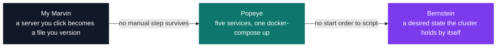

# DevOps — infrastructure & automation

[Tek3](../README.md) / **DevOps**

The three deliverables here are one YAML file, one compose file and nineteen manifests: a CI
server, a five-service application and a Kubernetes cluster, all of them written as text. The hard
part is that configuration fails without saying so — a permission granted one notch too wide, a
selector reading `app:` where the pods are labelled `run:`, and the system comes up looking fine
with nothing in the logs to read.

| Project | What it is | Size | Grade |
| --- | --- | --- | --- |
| [My Marvin](DOP_my_marvin) | A Jenkins instance in 126 lines of YAML, 17 grants across 4 roles | 2 weeks | A |
| [Popeye](DOP_popeye) | A voting app split into 5 services over 3 isolated networks | 2 weeks | A |
| [Bernstein](DOP_bernstein) | The same app as 19 Kubernetes manifests and 21 API objects | 2 weeks | A |

Popeye and Bernstein run the same five components, so the diff between them is the module's real
lesson. Compose keeps `POSTGRES_PASSWORD` in cleartext in the file everyone reads and has no answer
when a host dies; Kubernetes splits that into a ConfigMap and a Secret, and hands a controller a
replica count to defend.

<pre>
DevOps/
├── <a href="DOP_my_marvin">DOP_my_marvin/</a> My Marvin — a Jenkins instance entirely described in configuration     · A
├── <a href="DOP_popeye">DOP_popeye/</a>    Popeye — five services, four languages, one docker-compose command    · A
└── <a href="DOP_bernstein">DOP_bernstein/</a> Bernstein — the same app ported to Kubernetes: deployments, secrets, ingress · A
</pre>

---

[Tek3](../README.md)
