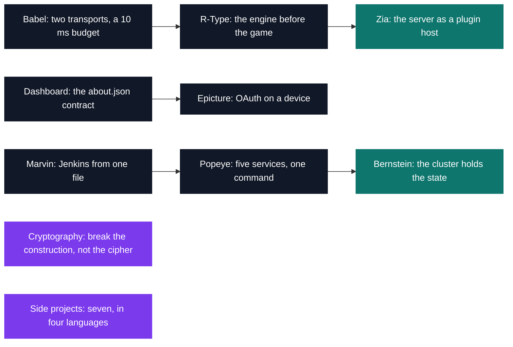

# Tek3 — 2020-2021

[All projects](../README.md) / **Tek3**

Third year is where a subject stops listing functions and starts naming behaviour, and where other
people's code has to run inside yours. Zia's module interface was voted on by every group in the
city and then frozen: the core has to publish its hook points before knowing what will hook into
them, and a `.so` written by another team has to load and serve. Dashboard sets the same trap on
the web side — `/about.json` lets any team's frontend drive any team's backend.

| Project | Track | What it is | Size | Grade |
| --- | --- | --- | --- | --- |
| [Babel](CPP/CPP_babel) | Advanced C++ | Voice over IP: TCP for signalling, one 488-byte Opus datagram every 10 ms straight between clients | 2 weeks · team | B |
| [R-Type](CPP/CPP_rtype) | Advanced C++ | Four-player shoot-'em-up on an ECS engine whose component bitmask doubles as the UDP wire format | 3 weeks · team | B |
| [Zia](CPP/CPP_zia) | Advanced C++ | HTTP/HTTPS server with eleven hot-loaded `.so` modules and no behaviour linked into the binary | 3 weeks · team | A |
| [Dashboard](AppDev/DEV_dashboard) | AppDev | Go API and React client, six services and ten widgets declared by `/about.json` | 2 weeks · team | A |
| [Epicture](AppDev/DEV_epicture) | AppDev | Android Imgur client in Kotlin, the OAuth2 token arriving back through an `epicture://` deep link | 2 weeks | A |
| [My Marvin](DevOps/DOP_my_marvin) | DevOps | Jenkins rebuilt from 126 lines of YAML: four roles, seventeen grants, a job that writes jobs | 2 weeks | A |
| [Popeye](DevOps/DOP_popeye) | DevOps | Five services in four languages across three networks, from one `docker-compose up` | 2 weeks | A |
| [Bernstein](DevOps/DOP_bernstein) | DevOps | That same application restated as 21 Kubernetes objects behind a Traefik ingress | 2 weeks | A |
| [Cryptography](Security/SEC_caesar) | Security | Fourteen challenges in the Cryptopals mould, up to a byte-at-a-time ECB oracle | 2 weeks | A |
| [Discord bot](SideProjects/BotDiscord_JavaScript) | Side project | 46 lines of Node sending each GitHub push to the channel that owns the branch | 2 weeks | — |
| [Brick Breaker](SideProjects/BrickBreaker_Python) | Side project | 212 lines of pygame, where the work is deciding which face of a brick the ball hit | 2 weeks | — |
| [Pong](SideProjects/Pong_Python) | Side project | 173 lines of pygame, three screens chained together by one return value | 2 weeks | — |
| [Game of the Goose](SideProjects/JeuDeOie_Python) | Side project | A 63-square spiral where an opening 9 lands on square 26 as 6+3 and on 53 as 4+5 | 2 weeks | — |
| [Hangman in Java](SideProjects/HangMan_Java) | Side project | 210 lines of Swing without a single `JButton`: keys painted and hit-tested by hand | 2 weeks | — |
| [Hangman in Ruby](SideProjects/HangMan_Ruby) | Side project | The same window and byte-identical assets, in 136 lines of Ruby and Gosu | 2 weeks | — |
| [Rock Paper Scissors](SideProjects/RockPaperScissors_Java) | Side project | Swing sprites hit-tested against hand-written rectangles, window inset included | 2 weeks | — |

<pre>
Tek3/
├── <a href="CPP">CPP/</a>            advanced C++ &amp; networking
│   ├── <a href="CPP/CPP_babel">CPP_babel/</a>   Babel — voice over IP, real-time capture/compress/transmit         · B
│   ├── <a href="CPP/CPP_rtype">CPP_rtype/</a>   R-Type — networked multiplayer shoot-'em-up, engine from scratch  · B
│   └── <a href="CPP/CPP_zia">CPP_zia/</a>     Zia — HTTP/HTTPS server built entirely from hot-loaded modules      · A
├── <a href="AppDev">AppDev/</a>         web &amp; mobile applications
│   ├── <a href="AppDev/DEV_dashboard">DEV_dashboard/</a>  Dashboard — a web administration dashboard               · A
│   └── <a href="AppDev/DEV_epicture">DEV_epicture/</a>   Epicture — mobile photo client on a public image API      · A
├── <a href="DevOps">DevOps/</a>         infrastructure &amp; automation
│   ├── <a href="DevOps/DOP_my_marvin">DOP_my_marvin/</a>  My Marvin — a Jenkins CI/CD build & deploy pipeline      · A
│   ├── <a href="DevOps/DOP_popeye">DOP_popeye/</a>     Popeye — supervisor running several services in containers · A
│   └── <a href="DevOps/DOP_bernstein">DOP_bernstein/</a>  Bernstein — Popeye's app ported to Kubernetes            · A
├── <a href="Security">Security/</a>       applied cryptography
│   └── <a href="Security/SEC_caesar">SEC_caesar/</a>    Implementing and attacking classical & modern ciphers     · A
└── <a href="SideProjects">SideProjects/</a>   self-directed practice
    ├── <a href="SideProjects/BotDiscord_JavaScript">BotDiscord_JavaScript/</a>    Discord bot relaying Git pushes into the right channel
    ├── <a href="SideProjects/BrickBreaker_Python">BrickBreaker_Python/</a>      Brick Breaker, the Atari classic, from scratch
    ├── <a href="SideProjects/Pong_Python">Pong_Python/</a>              Pong, ball physics and paddle collision from scratch
    ├── <a href="SideProjects/JeuDeOie_Python">JeuDeOie_Python/</a>          Game of the Goose, the French board game, in Python
    ├── <a href="SideProjects/HangMan_Java">HangMan_Java/</a>             Hangman, word-guessing game, in Java
    ├── <a href="SideProjects/HangMan_Ruby">HangMan_Ruby/</a>             Hangman again, this time in Ruby
    └── <a href="SideProjects/RockPaperScissors_Java">RockPaperScissors_Java/</a>   Rock Paper Scissors against the computer, in Java
</pre>

---

[← Tek2](../Tek2/README.md) · [⌂ All projects](../README.md) · [Tek5 →](../Tek5/README.md)
