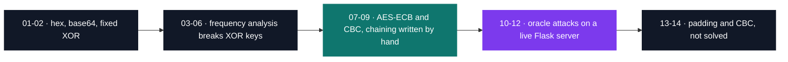

# Security — applied cryptography

[Tek3](../README.md) / **Security**

Fourteen Cryptopals-style challenges, with a change of side halfway through. The early ones hand
you the ciphertext to grind: 256 candidate keys scored against a table of English letter
frequencies, Hamming distance to find a repeating key's length. The late ones hand you an HTTP
endpoint and a server that uses AES correctly — real library, real 16-byte key, never out of the
process — and give up their secret anyway, to ciphertext lengths and repeated blocks. Twelve of
the fourteen are solved.

| Project | What it is | Size | Grade |
| --- | --- | --- | --- |
| [SEC_caesar](SEC_caesar) | Fourteen Python crypto challenges, hex and base64 through to a byte-at-a-time ECB oracle attack | 2 weeks | A |

The hardest exercise is challenge 12. Its oracle prepends bytes the client knows nothing about, so
the attack has to measure that hidden prefix first — growing a run of `A` until two ciphertext
blocks collide — before recovering the secret one byte at a time.

Three results worth opening the project for:

- Challenge 6 recovers a repeating-key XOR key that is correct except for case: the scoring
  function lowercases before counting, so bit 5 of every key byte is invisible to it. The output is
  `r1ch4rd 57411m4n` against a true key of `R1ch4Rd 57411m4N`.
- Challenge 8 detects ECB in eight lines, by finding two identical 16-byte blocks inside one
  message. Challenges 10 and 12 call the same function to confirm the mode before attacking.
- Challenge 11 forges an `admin` profile with two requests and no key at all, reordering ciphertext
  blocks and appending the exact PKCS#7 padding that `admin` would carry at the end of a message.

<pre>
Security/
└── <a href="SEC_caesar">SEC_caesar/</a> Fourteen crypto challenges: encodings to XOR to breaking AES-ECB via oracle attacks  · A
</pre>

---

[Tek3](../README.md)
