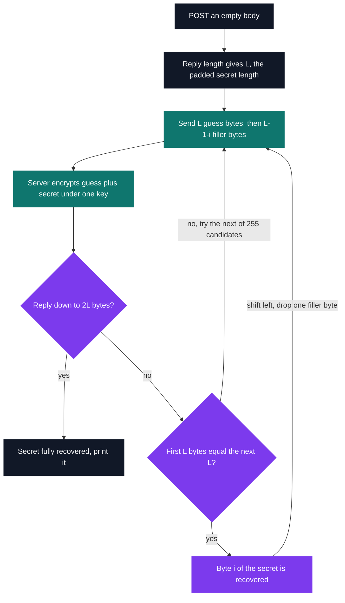
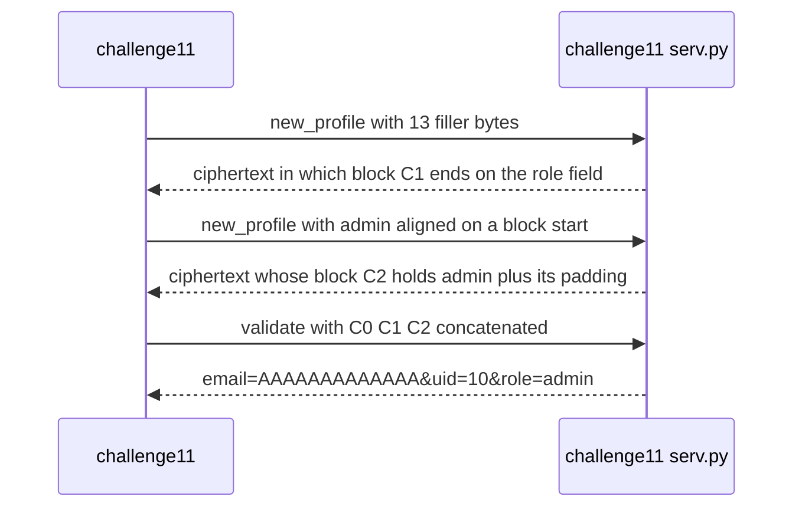

# Cryptography challenges

[](https://antoinepoisson.github.io/Old-School-Projects/projects/sec-crypto-2020)

  

[Tek3](../../README.md) / [Security](../README.md) / **SEC_caesar**

*Epitech project · Security - Cryptography (B-SEC-500) · December 2020 – January 2021 · 2 weeks · Grade A*

Twelve of fourteen challenges, ending with a secret pulled out of a server that never leaks its key.
The oracle runs a real AES library on a real 16-byte key and answers with nothing but ciphertext.
The secret comes out anyway — from the outside, by sending chosen input and watching how the length
and the blocks of the reply move.

That inversion is the module. What breaks is never the primitive, it is the construction wrapped
around it: the last exercises need the **failure mode** of ECB, not its specification.

Nineteen Python files, 1 366 lines — fifteen solver scripts (895 lines), three Flask oracle servers
(341 lines) and one test file (130).

| # | Task | Technique |
| --- | --- | --- |
| 01 | hex → base64, ASCII → hex | `bytes.fromhex`, `b64encode` |
| 02 | XOR two equal-length buffers | fixed XOR, length guard |
| 03 | break a single-byte XOR | letter-frequency score over all 256 keys |
| 04 | find the ciphertext among plaintext lines | same score, highest-scoring line wins |
| 05 | apply a repeating-key XOR | `key[i % len(key)]` |
| 06 | break a repeating-key XOR | Hamming distance → key length → column-wise attack |
| 07 | decrypt AES-ECB, key given | `AES.MODE_ECB`, padding stripped by hand |
| 08 | spot the ECB-encrypted line | duplicate 16-byte blocks |
| 09 | decrypt AES-CBC | raw ECB block primitive, chaining written by hand |
| 10 | recover a server-side secret | byte-at-a-time ECB oracle |
| 11 | forge an `admin` profile | ECB cut-and-paste |
| 12 | same as 10, behind an unknown prefix | prefix alignment found by block collision |
| 13 · 14 | — | not solved |

**Frequency analysis, and the line that bends it.** Challenge 3 XORs a ciphertext against all 256
candidate keys and scores each result on a 26-letter English frequency table plus a weight of
`.13000` for the space. Its test file lowercases 100 sentences, XORs each with a random key and
asks for both the plaintext and the key back: `number of error found = 0`.

Challenge 6 reuses that scorer column by column, after picking the key length with the smallest
normalised Hamming distance over sizes 2 to 42. It also recurses: if the recovered key equals its
own first half repeated, it retries at half the length. On the 697-byte ciphertext of `ex06` it
returns a key that is right except for case, in exactly three positions.

```text
challenge06 output   723163683472642035373431316D346E   ->  "r1ch4rd 57411m4n"
true key             523163683452642035373431316D344E   ->  "R1ch4Rd 57411m4N"
                                                              ^    ^          ^   0x20 apart

decrypted with the recovered key
b"now a\x00recipe is\x00A lot\x00like a coMPuter\x00program. \x00a comPuter progRAm's A lot..."

decrypted with the true key
b"Now a recipe is a lot like a computer program.  A computer program's a lot..."
```

The scorer is not the culprit: feed it the untouched ciphertext and it returns `R1ch4Rd 57411m4N`
byte for byte. The three wrong bytes come from one line in `handleFile`, where the hex input is
decoded and then uppercased as if it were still text:

```python
data = bytes.fromhex(data).upper()
```

`bytes.upper()` rewrites 40 of the 697 ciphertext bytes. In the three columns whose key byte is an
uppercase letter, a plaintext space encrypts to a lowercase letter — `0x20 ^ ord('R') == ord('r')` —
so a dozen bytes per column shift by 0x20, and the column attack compensates by flipping the same
bit in the key.

`get_score` lowercases before counting, so both candidates score identically on the letters, and the
shifted one wins the spaces back on top. Case survives this attack only as long as nothing upstream
treats the ciphertext as text.

**ECB's structural flaw, in one function.** ECB encrypts every 16-byte block independently, so two
identical plaintext blocks give two identical ciphertext blocks. Challenge 8 turns that into a
detector, scanning every pair of blocks in a line:

```python
def check_occurence(b, block_size):
    length = len(b) / block_size
    if round(length) != length:
        raise Exception("That line cannot be split of block_size of 16 bytes")
    length = len(b) // block_size

    for i in range(0, block_size*length, block_size):
        for j in range(i + block_size, block_size*length, block_size):
            if b[i:i + block_size] == b[j:j+block_size]:
                return True
    return False
```

Challenges 10 and 12 still import it, but in the delivered scripts both the mode check and the
`get_size_block` probe sit commented out in `main`: the attacks go straight in with a block size of
16 hard-coded at the call site. The detection was written, verified, then short-circuited once the
answer was known — which is exactly how a working exploit stops being a general tool.

**Byte-at-a-time recovery.** The oracle in `ex10/serv.py` encrypts `attacker_input + secret` under
one key, kept per session in a dict keyed by the `x-access-token` cookie so the secret stays stable
across requests. The client never sees the key; it sees ciphertext length and block equality.



The inner sweep is `for nb in range(255)`, so byte value 255 is never tried — harmless against a
server whose secret is drawn from `string.ascii_lowercase`, and a bug the moment it is not.

**Cut-and-paste, no key needed.** Challenge 11 attacks a profile encoder that builds
`email=<input>&uid=10&role=user` and encrypts it with ECB under a fixed key. Because blocks are
independent they can be reordered, and two encryption requests are enough to assemble a ciphertext
that `/challenge11/validate` decrypts into an admin profile:

```text
POST /challenge11/new_profile   input = "A" x 13
  email=AAAAAAAAAA | AAA&uid=10&role= | user + pad          keep C0 and C1

POST /challenge11/new_profile   input = "A" x 10 + "admin" + \x0b x 11
  email=AAAAAAAAAA | admin\x0b..\x0b   | &uid=10&role=use | r + pad
                     ^ keep this block as C2

POST /challenge11/validate      C0 ‖ C1 ‖ C2
  -> email=AAAAAAAAAAAAA&uid=10&role=admin      padding valid, role escalated
```

The `\x0b x 11` tail is not decoration: it is the PKCS#7 padding that `admin` would carry if it
ended the message, so the forged final block unpads cleanly and `validate` strips exactly 11 bytes.



Challenge 12 is the same byte-at-a-time attack against a harder oracle: `ex12/serv.py` prepends five
fixed bytes, `lolol`, that the client knows nothing about. `get_unknown_string_size` deals with that
first, growing a run of `A` until two ciphertext blocks come out identical.

The run length at the collision gives the eleven filler bytes that push the prefix onto a block
boundary, and the collision's position gives the padded secret length. Every offset in the recovery
loop is then shifted by that whole block.

Challenges 13 and 14 ship as a bare `sys.exit(84)`, so twelve of the fourteen are delivered. The ECB
material is where the set stops.

## Beyond the baseline

Three Flask oracle servers (`ex10`, `ex11`, `ex12`, 341 lines together) reproduce the attack
conditions on `127.0.0.1:5000`, so every client script can be replayed end to end without the
school's infrastructure. Challenge 3 carries its own test file. The Makefile copies the fourteen
exercises into uniform `challengeNN` entry points.

## Technical stack

Python · Flask, requests, PyCryptodome · Makefile, Git.

## Verification

One challenge (03) has a dedicated test file: 100 sentences, each lowercased then XORed with a
random key, all 100 recovered along with their key. Nothing else is covered — the Makefile's
`tests_run` rule copies from `src/` and `tests/functionTest/`, neither of which exists here.

## Build & run

```bash
make                                    # ex01..ex14 -> challenge01..challenge14
python3 ./challenge06 ex06/input06.txt  # 723163683472642035373431316D346E

python3 ex10/serv.py                    # oracle on 127.0.0.1:5000
python3 ./challenge10                   # prints the recovered secret, base64
```

Run everything from the project root: challenge 06 inserts `./ex03/` into `sys.path`, and challenges
10 and 12 insert `./ex08/`, so the imports only resolve from there.

---

[Tek3](../../README.md) / [Security](../README.md) · [⌂ All projects](../../../README.md)
