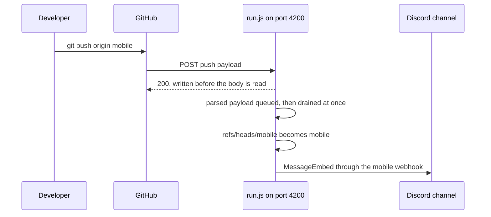
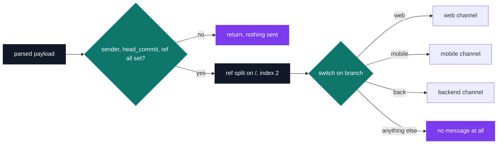

# Discord Git notification bot

[](https://antoinepoisson.github.io/Old-School-Projects/projects/perso-botdiscord-2020)

   

[Tek3](../../README.md) / [SideProjects](../README.md) / **BotDiscord_JavaScript**

*Personal project · December 2020 · 2 weeks*

This bot keeps a team's Git notifications worth reading by routing them: **the branch you pushed
to decides which channel hears about it**. One repository split into three parts — web, mobile and
backend — becomes three Discord channels, and the mobile developer stops scrolling past backend
commits to find their own.

GitHub's own Discord integration has a single destination per hook, so every push from every part
of the project lands in the same channel. What this project adds is the branch-to-channel table
that replaces it.

`run.js` is 46 lines of live code on top of Node's native `http` module — no Express, no
framework. It listens on port `4200` and GitHub posts straight into it.



The `200` is written synchronously, before the request body has even finished arriving. GitHub's
delivery is acknowledged in milliseconds and never waits on Discord's API, so a slow or dead
Discord webhook can never turn into a failed delivery on GitHub's side.

That decoupling has a price worth naming: `JSON.parse` runs unguarded in the `end` handler, so a
body that is not JSON throws, takes the process down — and the delivery still shows green in
GitHub's log, because the response left before the crash.

**The routing rule.** GitHub does not send a branch name, it sends a ref. One `split` turns
`refs/heads/mobile` into `mobile`, and a three-case `switch` picks the webhook.

```js
const branch = obj.ref.split('/')[2]
```



The `switch` has no `default`, which makes the routing table a strict allowlist. That is the noise
filter doing its job — but it also means a push to `main`, or to a branch named `feature/web`
where index `2` reads `feature`, produces silence that looks exactly like no push at all.

**What actually becomes a message.** Everything GitHub sends arrives on the same endpoint, and a
single three-field guard decides its fate:

```js
if (!(obj.sender && obj.head_commit && obj.ref))
    return;
```

| GitHub delivery | Top-level `head_commit` | Result |
| --- | --- | --- |
| `push` with commits | present | embed posted to the branch channel |
| `push` deleting a branch | null | dropped |
| `ping`, sent when the hook is created | absent | dropped |
| `pull_request`, `issues`, `create` | absent | dropped |

There is no event allowlist anywhere in the code. `head_commit` *is* the allowlist: it is a
top-level field of the push payload, and the deliveries that arrive alongside it leave it unset.

**The message.** Five chained setters build the embed, and the one that matters is the description
line — the seven-character hash is rendered as a Markdown link to the commit, so the branch title
tells you where, and one click tells you what.

```js
const embed = new MessageEmbed()
    .setTitle("New Push on " + branch)
    .setColor("#5be6ff")
    .setDescription("[" + "`" + obj.head_commit.id.slice(0, 7) + "`" + "](" + obj.head_commit.url + ") " + obj.head_commit.message + " - " + obj.head_commit.author.name)
    .setURL(obj.head_commit.url)
    .setAuthor(obj.head_commit.author.name, obj.sender.avatar_url);
```

`setAuthor` reuses `sender.avatar_url` from the payload, so each message carries the pusher's
GitHub avatar without the bot ever calling the GitHub API.

## Beyond the baseline

A notification bot is only useful if it is running when you are not. The whole image is six
instructions on `node:lts-alpine`:

```dockerfile
FROM node:lts-alpine

ADD package.json package-lock.json /
RUN npm ci --production
ADD run.js /
RUN chmod +x /run.js

ENTRYPOINT ["node", "/run.js"]
```

`npm ci --production` installs from the lockfile rather than from `package.json`: 15 packages
pinned by integrity hash, identical on every rebuild. One direct dependency, `discord.js@12.5.1`,
pulls the other fourteen.

Four shell scripts, 15 lines between them, handled the deployment to a remote host:

| Script | What it does |
| --- | --- |
| `launch.sh` | `scp` the tree, `npm install`, free the port, start `run.js` |
| `cpy.sh` | the copy step on its own |
| `connect.sh` | opens a shell on the host |
| `clear.sh` | `netstat` → `grep :4200` → `kill` the previous instance |

Three of them reach the host over `sshpass` with the password written inline; `clear.sh` runs on
the host itself, invoked by `launch.sh` over the same SSH command. That inline password is why
every credential in this archive, SSH and Discord alike, is a placeholder today.

## Technical stack

JavaScript on Node's native `http` module, no web framework · discord.js 12.5.1 (`WebhookClient`,
`MessageEmbed`) · Shell · Docker, npm · GitHub push webhooks.

## Build & run

Create three Discord webhooks for the `web`, `mobile` and `back` branches, then replace the
anonymised webhook identifiers and tokens at the top of `run.js`. Start the receiver locally with:

```bash
npm ci
node run.js
```

It listens on port `4200`; point a GitHub push webhook at that endpoint. A containerised run is
available too:

```bash
docker build -t discord-git-bot .
docker run --rm -p 4200:4200 discord-git-bot
```

The historical `launch.sh` targets the original remote host and is kept as an implementation
artifact, not as the current local entry point.

---

[Tek3](../../README.md) / [SideProjects](../README.md) · [⌂ All projects](../../../README.md)
