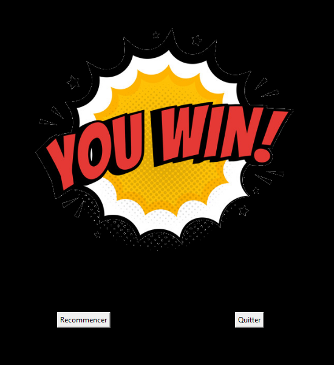
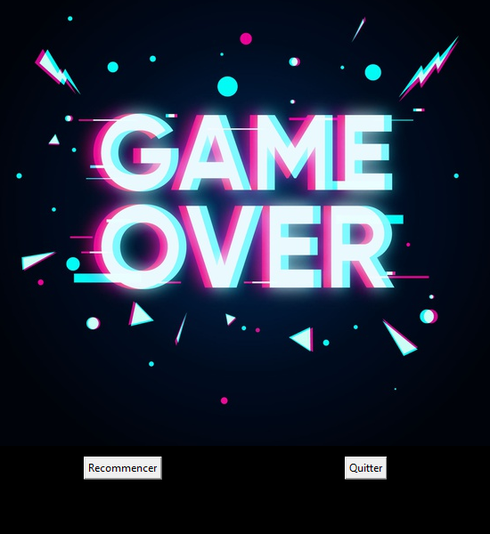
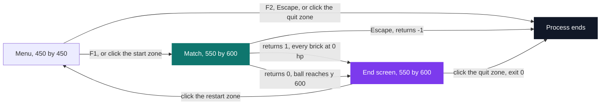
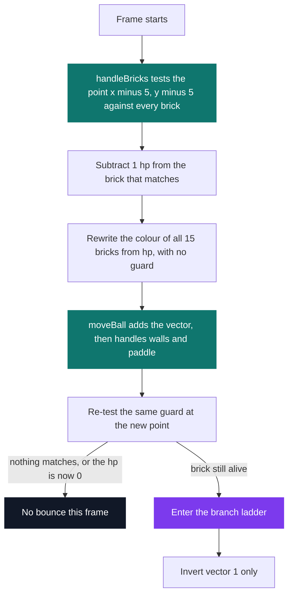

# Brick Breaker

[](https://antoinepoisson.github.io/Old-School-Projects/projects/perso-brickbreaker-2020)

 

[Tek3](../../README.md) / [SideProjects](../README.md) / **BrickBreaker_Python**

*Personal project · February 2021 · 2 weeks*

213 lines of Python across four files take Breakout from a clickable menu to a win or a loss
screen: 15 bricks holding 29 hits between them, recoloured from their remaining hp on every frame,
a paddle, a ball that accelerates as the rally goes on, and arcade music on loop. There is no
engine underneath — pygame draws rectangles and the rest is arithmetic.

The interesting problem is not detecting a brick hit but resolving one. A paddle is a horizontal
segment: whatever reaches it came from above, so flipping the vertical velocity is the entire
physics. A brick is a rectangle with four faces and four corners, and the very same intersection
test now needs five different answers out of a boolean that has already discarded the information
required to choose between them.

<p align="center">
  
  
</p>

*The two end screens, 550×600 like the play field. Nothing on them is drawn by the program: the
buttons are pixels inside the PNG, and the code knows only two `pygame.Rect` click zones tested
against the cursor position.*

**Three screens, two window sizes, no framework between them.** `run.py` is the state machine.
Menu, match and end screen are three `while` loops handing control to each other: `gameLoop`
returns `1`, `0` or `-1`, and that single integer decides both the outcome and whether the process
keeps running. The end screen has no return code worth reading — it either falls back through to
the menu or calls `exit(0)` on the spot.



The menu window is 450×450, the match reopens the display at 550×600, and both end PNGs are
authored at exactly that second size so the blit lands pixel for pixel. Which one gets loaded comes
from indexing a tuple with a boolean: `("images/loose.png", "images/win.png")[player == 1]`.

**One frame, two passes over the same bricks.** `handleBricks` runs first and subtracts hp, then
`moveBall` advances the ball and decides the bounce. Both hold the same four-term guard, written
out twice — and because `moveBall` re-tests it *after* the move while its first term is `hp > 0`,
the hit that destroys a brick never deflects the ball. Replaying all 55 integer opening vectors
against a paddle that never misses: 825 bricks destroyed, 825 of them silent.



**Four of the ladder's five arms are unreachable.** The branch that is meant to pick the face reads:

```python
if (Ball.x < el.get("x")):
    Ball.vector[1] = -Ball.vector[1]
if (Ball.x > el.get("x")):
    Ball.vector[1] = -Ball.vector[1]
elif (Ball.y < el.get("y")):
    Ball.vector[0] = -Ball.vector[0]
elif (Ball.y > el.get("y")):
    Ball.vector[0] = -Ball.vector[0]
else:
    Ball.vector[1] = -Ball.vector[1]
    Ball.vector[0] = -Ball.vector[0]
```

The guard that admits the hit already demands `(Ball.x - Ball.width) > el.get("x")`, so the ball's
centre sits more than one radius past the brick's left edge. The first test is therefore false and
the second true on every hit, and a true `if` short-circuits the whole `elif` chain below it: every
brick contact resolves as a vertical bounce.

The fix is not more branches. `el["x"]` is a corner, and a corner cannot separate a top hit from a
side hit however many comparisons are stacked on it. What separates them is the *depth* of the
overlap on each axis: the shallower one names the face the ball came through, equal depths mean a
corner and both components invert. One subtraction per axis replaces the entire ladder.

**The board is a health bar.** `handleBricks` rewrites every brick's colour from its remaining hp
on every frame, unconditionally — which is why the blue values set in `entities.py` are overwritten
before the first frame is ever drawn.

```text
        x=50   150   250   350   450        hp
y= 50    1      2     2     2     1     ->   8
y=150    2      3     3     3     2     ->  13
y=250    1      2     2     2     1     ->   8
                                  total ->  29
```

| hp branch | RGB | On this board |
| --- | --- | --- |
| `<= 1` | `(159, 252, 72)` | the four corner bricks |
| `<= 2` | `(252, 192, 72)` | eight bricks, spread over all three rows |
| `<= 4` | `(252, 118, 72)` | the three middle bricks of the centre row |
| `<= 6` | `(255, 0, 0)` | never reached — nothing on the board starts above 3 |

Bricks are 50×50 on a 100 px pitch, so four 50 px corridors run the full height of the wall, with a
50 px margin on either side. The ball is 10 px across, but the point the guard tests is
`(Ball.x - Ball.width, Ball.y - Ball.height)` — the top-left of the bounding box, so the hitbox
sits one radius up and to the left of the circle the player is watching.

**Input is discrete, and the paddle is a wall.** Movement happens on `KEYDOWN` events rather than
held keys, so one press is one 35 px step and crossing the 470 px of travel takes 14 of them. The
paddle inverts only the component normal to it, exactly as the sibling Pong inverts only the
horizontal one: geometrically correct, and the reason the player cannot aim.

| Key | Effect |
| --- | --- |
| `Q` / `←` | Paddle left, 35 px, clamped at 0 |
| `D` / `→` | Paddle right, 35 px, clamped at 470 |
| `F1` / `F2` | Start a match / quit, from the menu |
| `Escape` | Leave the match, or the menu |

Both axes gain `0.001` per frame with the sign preserved, so a direction never inverts by accident
and a long rally keeps getting harder to intercept.

## What this project demonstrates

- Reading old code closely enough to prove which branches run: four of the ladder's five arms are unreachable, and every one of 825 simulated brick kills passes through without a bounce
- Collision resolution reframed around per-axis overlap depth instead of a single intersection boolean
- A three-screen state machine written by hand, with control passed through return codes instead of a scene graph
- Destructible state with visual feedback: 15 bricks, 29 hits, colour rewritten from hp every frame
- An immediate-mode UI built from PNGs and hard-coded rectangles, with no toolkit and no text rendering

## Technical stack

Python · pygame · Git.

| File | Lines | Role |
| --- | --- | --- |
| `run.py` | 43 | pygame init, looping music, menu, screen sequencing |
| `game.py` | 101 | Match loop, paddle moves, ball and brick physics |
| `entities.py` | 47 | Paddle, ball, and the 15-brick board |
| `endGame.py` | 22 | End screen and its two buttons |

Line counts are non-blank lines; 213 in total. The same four-file split carries the sibling
[Pong](../Pong_Python/README.md) in this folder, reused on purpose from one game to the next.

## Build & run

```bash
python3 -m pip install pygame
python3 run.py
```

Images and audio are loaded by relative path, so the program has to be started from this directory.
The arcade loop is 2 min 31 s of uncompressed 44.1 kHz stereo, 25 MiB on disk, opened with
`pygame.mixer.Sound` — which decodes the whole file into memory before the menu is drawn, where
`pygame.mixer.music` would have streamed it.

---

[Tek3](../../README.md) / [SideProjects](../README.md) · [⌂ All projects](../../../README.md)
