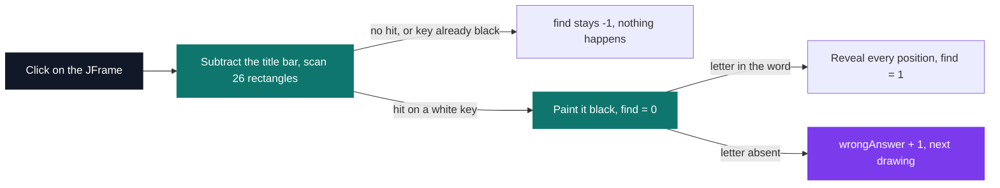
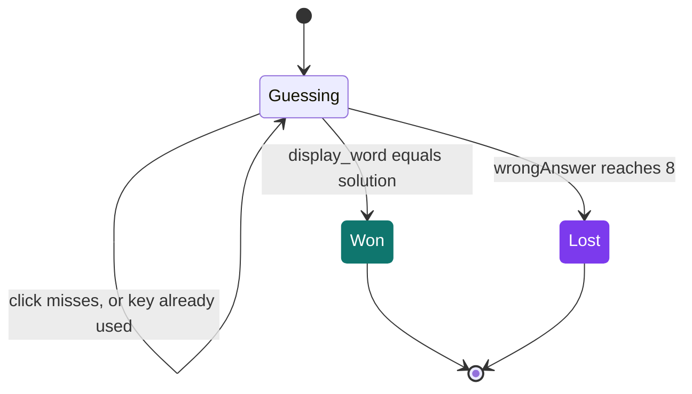

# Hangman in Java

[](https://antoinepoisson.github.io/Old-School-Projects/projects/perso-hangman-java-2020)

 

[Tek3](../../README.md) / [SideProjects](../README.md) / **HangMan_Java**

*Personal project · April 2021 · 2 weeks*

There is not one `JButton` in this window. The twenty-six keys and the hidden word are strokes laid
down by a single `paintComponent` onto a black panel, the gallows is a PNG blitted over them, and
one `MouseAdapter` turns a raw pixel back into a letter.

That is the whole point of the exercise. Hangman is the pretext; the Swing event model, the
coordinate systems and the class decomposition are the subject.

210 lines, four classes in one file, twenty-six keys spelled out one constructor call at a time from
a nine-field model, eight image frames, and a `.config` file holding the word.

**The drawing is an array index.** `wrongAnswer` is never compared against a threshold to pick a
picture — it is handed straight to `listImages.get(wrongAnswer)`. The score and the image are the
same number.

`resources/` holds nine PNGs, eight of them named in the code, each 129 × 196: white strokes on an
opaque black ground. Nothing in them is transparent — the black is baked into the file and matches
the panel fill, which is why the blit at (280, 20) leaves no seam. `cursor.png` is the ninth, and no
code path reads it.

```text
   wrongAnswer = 2       wrongAnswer = 5       wrongAnswer = 7
   post, beam, head      + torso, both arms    + both legs

    ,-------+             ,-------+             ,-------+
    |       |             |       |             |       |
    O       |             O       |             O       |
            |            /|\      |            /|\      |
            |             |       |             |       |
            |             |       |            / \      |
   ==========            ==========            ==========
```

The game opens on index 2, not 0: post, beam and head are already up, which leaves six wrong
guesses before `wrongAnswer` reaches 8. `listImages` holds nine entries for eight files, and index 8
points back at the empty frame — a slot nothing ever paints, because `System.exit(0)` fires inside
the click handler on the same event-dispatch thread, ahead of the next repaint.

**Frame coordinates, panel coordinates.** The listener is attached to the `JFrame`, while the keys
are painted by the `JPanel` inside it. The two origins differ by the height of the title bar, so
every hit test subtracts it by hand:

```java
    public boolean checkClick(Integer x1, Integer _x, Integer _width, Integer y1, Integer _y, Integer _height) {
        return x1 > _x && x1 < (_x + _width) && y1 - 30 > _y && y1 - 30 < (_y + _height);
    }
```

`30` is a stand-in for `getInsets().top`: correct on the window manager it was written against,
wrong on any other. Hitting that offset is what teaches the difference between a frame and its
content pane.

## What this project demonstrates

| Class | Role |
| --- | --- |
| `Character` | One clickable element: bounds, label, label position, fill colour, text colour |
| `myMouseListener` | Turns a pixel into a letter, then applies the rules |
| `Surface` | The single `paintComponent` that draws the entire window |
| `Main` | The `JFrame`, the static game state, `.config` reading, the 26 keys |

**One click, three outcomes.** `find` is a tristate carried in an `int`: `-1` the click landed on no
key, `0` it hit a fresh key whose letter is absent from the word, `1` the letter was there. Only
`0` costs a mistake.



**Used letters have no data structure.** A clicked key is repainted black, and the hit test rejects
any key whose fill is no longer white. The render state *is* the model state, so the same letter
can never be scored twice — one guard instead of a set.



**The render loop feeds itself.** `doDrawing` ends by calling `repaint()`, so every paint schedules
the next one: no `Timer`, no game thread, and the window tracks the static fields the instant the
listener mutates them. Each pass also builds a `new ImageIcon(path)` — a fresh icon and a fresh
`MediaTracker` wait per frame, where eight icons built once at startup would carry the whole game.

**A name clash that works.** The clickable model is a class called `Character`. A type declared in
the same package wins over the implicit `java.lang` import, so `ArrayList<Character>` here holds
rectangles, not boxed chars. `javac 24` takes it without a word; `-Xlint:all` raises three warnings
— two missing `serialVersionUID`, one `this`-escape — and none of them is about the name.

**The keys are drawn transposed.** Each key is painted 22 px wide by 25 px tall, while its hit box
is 25 by 22. `Character` takes `height` before `width`; `Rectangle2D.Double` takes width before
height; the same pair arrives swapped at the second one. The bottom three pixels of every key are
dead, and the three-pixel gap to its right still answers to it.

## Technical stack

Java, Shell · Swing, AWT · javac, Git.

`Example.java` sits beside it as a scratch canvas button: an outer square, two triangles, and
pressed and released states wired to `mousePressed` and `mouseReleased`. It does not compile —
`setDownColor` is declared inside `paintComponent`, whose brace is never closed. `javac *.java`
stops on that error and writes no `.class` file at all, which is exactly what `example.sh` runs;
`run.sh` names `Main.java` alone and is unaffected.

Both scripts then hand the class to an absolute path — a Fedora 32 build of JDK 15 — with
`--enable-preview`, which pins them to the machine they were written on.

## Build & run

```bash
javac Main.java && java Main   # portable: no preview feature is actually used
./run.sh                       # clear, rm *.class, javac Main.java, then that hardcoded JDK 15
```

Run it from the project root: the eight image paths are relative to the working directory, and the
word is read from `./.config`.

```bash
echo "Salut" > .config          # uppercased at load, so the round plays as SALUT
```

The 700 × 450 window has no end screen. The solution is echoed to the terminal at startup by
`getWord()`, and `YOU WIN !` or `You Loose !` lands in the same place, immediately followed by
`System.exit(0)`.

---

[Tek3](../../README.md) / [SideProjects](../README.md) · [⌂ All projects](../../../README.md)
