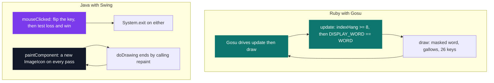
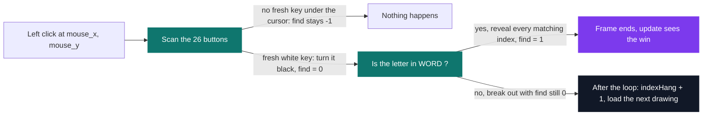

# Hangman in Ruby

[](https://antoinepoisson.github.io/Old-School-Projects/projects/perso-hangman-ruby-2020)

 

[Tek3](../../README.md) / [SideProjects](../README.md) / **HangMan_Ruby**

*Personal project · May 2021 · 2 weeks*

> The same hangman, rewritten in Ruby: the comparison is the deliverable.

Two hangman games. Same declared 700x450 window, same nine PNGs in `resources/` — byte-identical
files in both folders, checked, eight gallows stages and a `cursor.png` neither program ever loads —
the same word in `.config`, the same rules on paper. One in Java with Swing, one in Ruby with Gosu.

Freezing the problem is the whole method. Whatever differs in the code cannot be a difference of
subject, of assets or of scope. It can only be a difference of language.

`run.rb` is 136 lines against 210 for [`Main.java`](../HangMan_Java/README.md). The line count is
not the interesting part — what each language *forces* you to write, and what it lets you get away
with, is.

| Operation | Java + Swing | Ruby + Gosu |
| --- | --- | --- |
| Button model | `class Character` — 9 public fields, explicit constructor, and it shadows `java.lang.Character` | `Button = Struct.new(:_xRect, …)` on one line |
| Read the word | `BufferedReader` in a `try` / `catch` | `File.read(".config").split[0].upcase` |
| Reveal a letter | `display_word.substring(0, index) + c + display_word.substring(index + 1)` | `DISPLAY_WORD[i] = el._text` |
| Iterate the keys | `for (int i = 0; …) Main.listCharacter.get(i)._x` | `for el in Input::LISTBUTTON do el._xRect` |
| Window and loop | `JFrame` + `paintComponent` + `repaint()` | `Gosu::Window` with `update` / `draw` |
| Click routing | a `MouseAdapter` subclass, registered as a listener | override `button_down(id)` |
| Centre the word | `drawString(…, 350 - (5 * display_word.length()), 245)` | `:width => 700, :align => :center` |
| Hit test | `y1 - 30 > _y` — the click subtracts the title bar by hand | `mouse_y > y` — Gosu already reports client coordinates |

**The row that matters is the third one.** A Java `String` is immutable, so revealing a letter means
rebuilding the whole masked word by concatenation. A Ruby `String` is mutable and indexable, so the
same operation is a single assignment — into a *constant*, which Ruby permits without a word of
complaint because the binding never changes, only its contents.

```ruby
WORD = File.read(".config").split[0].upcase   # "salut" in the file, "SALUT" in memory
DISPLAY_WORD = ""

for i in 0...WORD.length do
    DISPLAY_WORD[i] = "_"                     # a constant, grown one character at a time
end
```

That last loop is only legal because Ruby lets `[]=` extend a string at its current end: on an empty
`DISPLAY_WORD`, index `0` appends rather than raising. The last row of the table is the same kind of
tell in reverse — `setSize(700, 450)` on a `JFrame` sizes the *decorated* window, so the Java click
test carries a hand-tuned `- 30` for the title bar that Gosu makes unnecessary.

**Where the win check lives.** Swing has no game loop, so the Java version calls `repaint()` at the
end of its own paint routine to force one, and puts the win/loss test inside the mouse listener —
the state is only ever examined when someone clicks. Gosu supplies the loop, so `update` polls the
condition every frame and the click handler only mutates state.



The two chains in the Java half never touch: nothing in `mouseClicked` asks for a repaint, and the
paint pass never looks at the win condition. The screen refreshes because `doDrawing` schedules
itself, and the game ends because a click happened to test for it.

**The tristate that saves a life.** A click is resolved by scanning the twenty-six buttons and
setting `find` to one of three values, not a boolean. `-1` means the click landed on no key at all,
`0` means it hit a fresh key holding a letter that is not in the word, `1` means a hit that reveals
something.

Only `0` costs a drawing, so clicking the empty background — or a key already turned black — is
free. Both versions carry this logic verbatim: it is one of the parts the port did not have to
touch at all.



**What the second implementation found.** Writing the same game twice is a diff, and the diff is not
empty. Java starts its mistake counter at `2` and loses at `8`, so the very first frame already
draws `hangman_two.png` and the player gets six wrong guesses. Ruby starts at `0` and gets eight.
Same rules on paper, two different games in the hand.

The port also moved the image load. Swing builds `new ImageIcon(...)` inside `paintComponent`, which
its own `repaint()` re-enters continuously, so an icon object is constructed on every pass. The Ruby
version builds one `Gosu::Image` in `initialize` and replaces it only on a wrong guess.

What it did *not* fix is the masked word: `Gosu::Image.from_text` still runs once per `draw`, so the
text texture is rebuilt every frame exactly as Swing rebuilt its icon. The same habit survived the
change of language, which is what a controlled port is for — it separates what the language imposes
from what the author does anyway.

One detail both versions share: the image list holds **nine** entries for **eight** distinct
drawings. The ninth repeats `hangman_none.png`, so the load fired by the losing click has an index
to return before the next frame reaches the exit.

## What this project demonstrates

- A controlled cross-language port: identical assets, window and rules, so every remaining code
  difference is attributable to the language
- Gosu's `update` / `draw` / `button_down` loop set against Swing's listener-plus-`repaint` model
- Mutable Ruby strings and `Struct` against immutable Java strings and a hand-written class
- Twenty-six keyboard keys as twenty-six literal rows in both languages — the port compresses the
  row, not the count: a nine-field class and constructor call become one `Struct` and one `new`

## Beyond the baseline

No subject, no grade, no deadline: the second implementation *is* the deliverable. Rebuilding a
finished program in another language turns "Ruby is more concise" from an opinion into a diff you
can read — event model, object model and UI code included, with the behavioural drift it exposed.

## Technical stack

Ruby · Gosu · Struct · RubyGems, Git.

## Build & run

The secret word is data, not code — edit `.config` and the game changes without touching `run.rb`.
Case does not matter, it is upper-cased on load.

```console
$ cat .config
salut
$ gem install gosu
$ ruby run.rb
# a 700x450 window opens: the gallows at (280, 20), the masked word "_ _ _ _ _ "
# centred at y = 245, and the A-Z keys in a single row along the bottom
# five correct clicks later, on stdout:
YOU WIN !
```

---

[Tek3](../../README.md) / [SideProjects](../README.md) · [⌂ All projects](../../../README.md)
