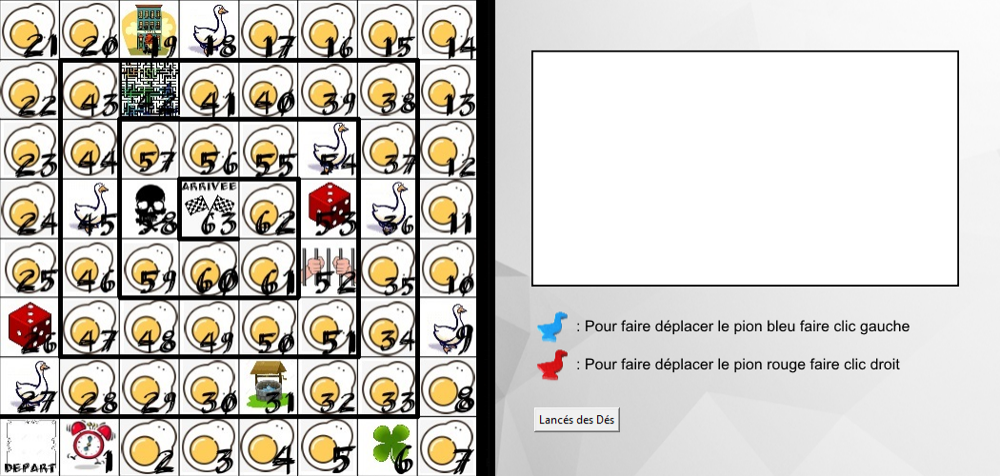
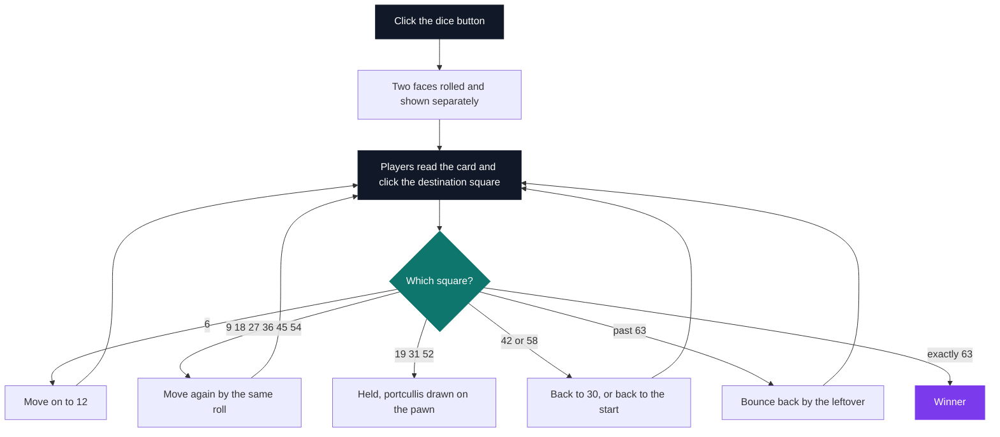
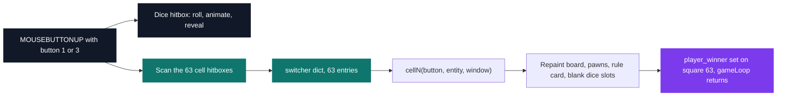
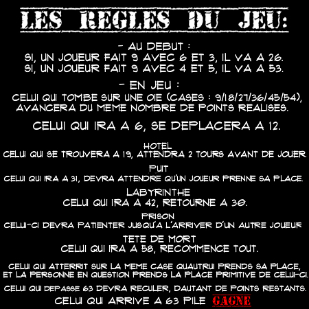

# Game of the Goose

[](https://antoinepoisson.github.io/Old-School-Projects/projects/perso-jeudeoie-2020)

 

[Tek3](../../README.md) / [SideProjects](../README.md) / **JeuDeOie_Python**

*Personal project · March 2021 · 2 weeks*

A complete Game of the Goose in pygame: a 63-square spiral board, two pawns driven by the two
mouse buttons, sixty-two illustrated rule cards, and the whole traditional rule set — geese, inn,
well, maze, prison, skull, and the bounce back off the finish.

Fifteen of the 63 squares refuse the plain "advance by what you rolled" rule. A goose square
re-applies the roll you just made. Square 42 sends you back to 30. Square 58 sends you back to
the start. Overshooting 63 does not win — it bounces you back by the points you had left over.

The rule that breaks a summed-dice engine is the opening one: a first roll of 9 jumps you to
square 26 if it came out as 6 and 3, and to square 53 if it came out as 4 and 5. The sum is the
same. The pair is not. So the dice can never be summed and thrown away.

<p align="center">
  
</p>

`throwDes()` is therefore called twice per click on the dice button and both faces are kept and
displayed separately — `value_first` and `value_second` — which is exactly what the opening rule
needs to distinguish 6+3 from 4+5.

Each of the fifteen special squares layers a second sound on top of the move cue, drawn from eight
distinct clips in the 14-file `musics/` folder: the six goose squares share `sound_oie`, the inn
and the well share `sound_stun`, and the two dice squares share `sound_magic`.

| Squares | Name | Effect |
| --- | --- | --- |
| 6 | Clover | Move on to square 12 |
| 9, 18, 27, 36, 45, 54 | Goose | Move again by the same roll |
| 19 | Inn | Wait 2 turns |
| 26, 53 | Dice | Reached only by an opening 9 rolled as 6+3 or 4+5 |
| 31 | Well | Held until another pawn takes the square |
| 42 | Maze | Back to square 30 |
| 52 | Prison | Held until another pawn takes the square |
| 58 | Skull | Back to the start |
| 63 | Finish | An exact arrival wins |

Chained together, one turn is not a single move but a small resolution loop — a goose can feed
into another goose, and an overshoot can drop you onto a square that moves you again:



**Who resolves the rules.** The engine draws the consequence; it does not compute it. The roll is
displayed but never added to a position — the players click the square the rules send them to, and
the mouse button chooses the pawn: left click moves blue, right click moves red.

That split is why 63 handlers are enough. Each handler answers "pawn X now occupies square N",
which is a rendering question. The chain, the two-turn wait and the bounce-back stay with the two
people at the keyboard, and the rule card printed on the right-hand panel is the referee.



**Where the board lives.** The geometry is data: a 63-entry dispatch dict, a 63-entry hitbox list,
and 315 constants in `config.py` — 252 pawn coordinates plus 63 card-image paths. The handler
bodies are not.

```python
def callCells(selected, player, entity, window):
    switcher = {
        1: cell1,
        2: cell2,
        # ... 60 more entries, one per square ...
        63: cell63,
    }
    funct = switcher.get(selected, lambda: "Invalid Cell")
    funct(player, entity, window)
```

`cells.py` is 1,546 of the project's 2,297 Python lines: 63 functions of 24 to 26 lines each,
differing in five constants — each pawn's X and Y for that square, plus the card image — and, on
the 15 special squares, one extra `pygame.mixer.Sound`.

The dispatch table already exists, so folding the 62 near-identical handlers into one `cell(n)`
reading a 62-row table would change nothing on screen. `cell63` is the real exception: it skips
the rule card, sets `player_winner` and ends the game.

**The flag the engine avoided** is "this pawn is held". A holding square pins the portcullis sprite
onto the pawn; every other square parks it off-screen, so the draw call never needs a condition:

```python
# cell19, cell31, cell52 — the pawn is held
entity.pion_blue_herse_pos = [entity.pion_blue_pos[0], entity.pion_blue_pos[1]]

# the other 60 squares — parked outside the window instead of guarding the draw
entity.pion_blue_herse_pos = [-99, -99]

# so the blit runs unconditionally, on all 63 squares
window.blit(entity.herse_texture,(entity.pion_blue_herse_pos[0], entity.pion_blue_herse_pos[1]))
```

The red pawn is offset by `+26, +5` from the blue one on every square. With 32-pixel pawns in
roughly 62-pixel squares that is a six-pixel overlap — enough for both to stay legible while they
share a square, which they do until the players apply the swap rule, since nothing in the code
enforces it.

The same repaint is where the roll disappears. The rolled faces are local to the game loop, while
every handler blits `entity.des_first_texture`, which is still the blank `fond vide.png`: showing
the dice and clearing them on the move ended up being one decision rather than two.

## Beyond the baseline

Sixty-two rule cards, one for every square from 1 to 62, are rendered as images and blitted into
the panel when a pawn lands — including the ones for squares that do nothing, whose card simply
says that no particular action is attached to this square. Square 63 skips the card and goes
straight to the victory screen.

The full rules screen is reachable from the menu and closes on a click anywhere, on Escape, or on
F2. It is also the only place the whole rule set is stated at once, which matters here: the 63
hitboxes cover squares 1 to 63 and nothing else, so a pawn sent home by the skull is clicked onto
square 1 rather than back onto the DEPART corner it started from.

<p align="center">
  
</p>

In total: 84 images and 14 sound files, 11 of which are ever played — an arcade loop under the
whole session, a dice button that stays depressed for 0.2 s and then waits 1.9 s before the
reveal, and a victory screen with its own restart and quit hitboxes.

## Technical stack

Python · pygame · Git. One window switched between two modes: a 450×450 menu and a 1050×500 board,
the right half of the board window being the rule card, the pawn legend and the dice button.

## Build & run

```bash
python3 run.py
```

`F1` starts a game, `F2` opens the rules, `Escape` quits the menu — the two menu lines are
clickable as well. In game, left click moves the blue pawn and right click the red one.

---

[Tek3](../../README.md) / [SideProjects](../README.md) · [⌂ All projects](../../../README.md)
