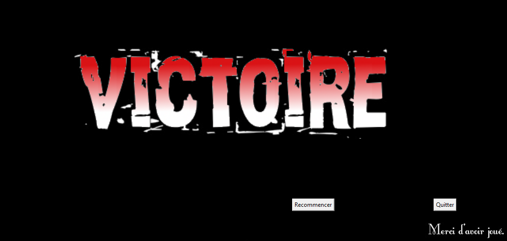
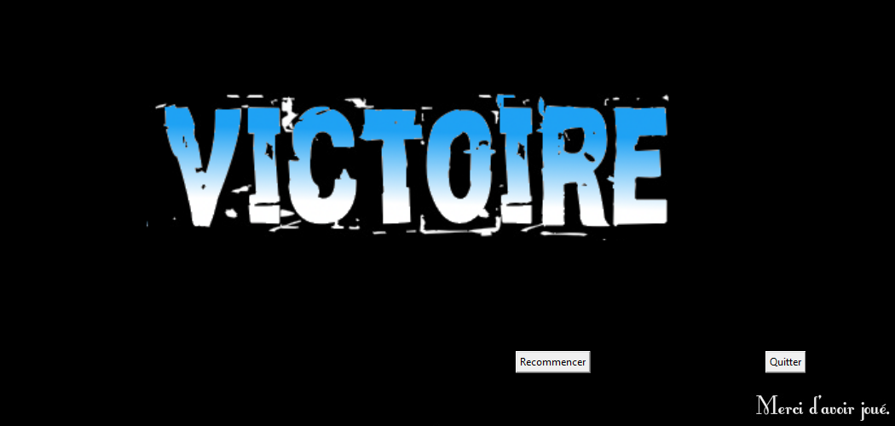
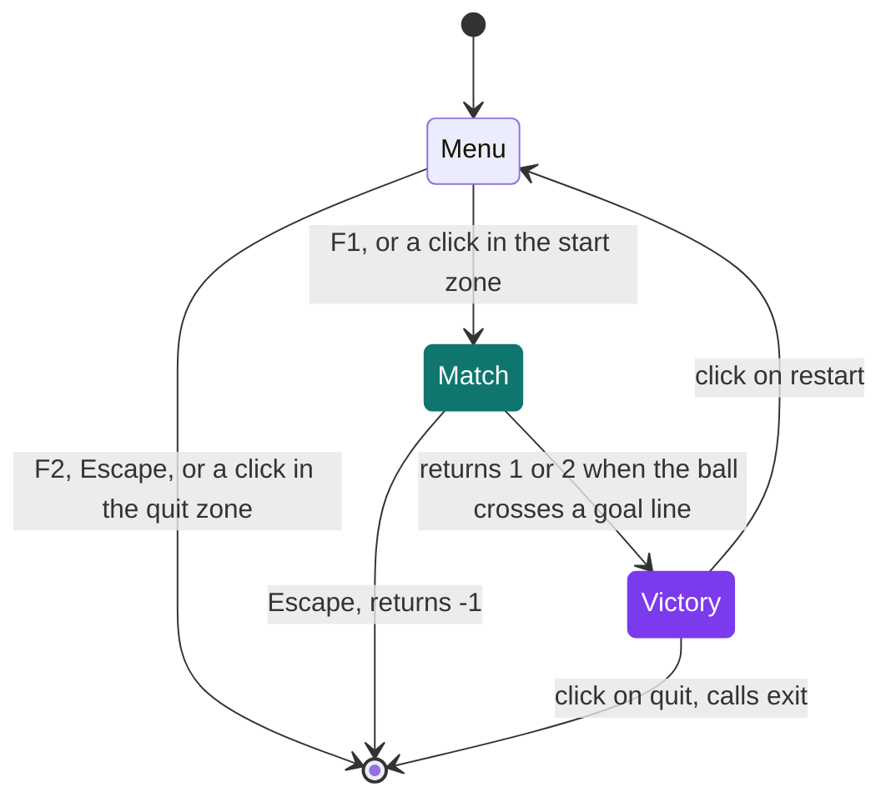
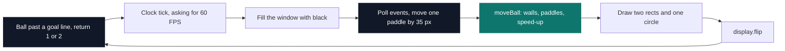

# Pong

[](https://antoinepoisson.github.io/Old-School-Projects/projects/perso-pong-2020)

 

[Tek3](../../README.md) / [SideProjects](../README.md) / **Pong_Python**

*Personal project · February 2021 · 2 weeks*

Two players on one keyboard, a clickable menu, a match that ends on a single point and its own
victory screen for each side. pygame supplies a window, a blitter and a rectangle; the state
machine, the collisions and the win condition are 173 lines of Python across four files.

<p align="center">
  
  
</p>

*The two end screens. Player one is the blue paddle on the left, player two the red one on the right.*

**Three screens, no framework between them.** `run.py` is the state machine. Menu, match and
victory screen are three `while` loops, and control moves between them by returning: `gameLoop`
hands back `1`, `2` or `-1`, and that single integer decides both who won and whether the program
keeps running.



A rally decides the match. The moment the ball's `x` leaves the 0–1050 window, `gameLoop` returns
and the victory screen is up. There is no sudden-death timer and no second chance — the whole match
is one point.

**The frame.** Inside the match, one iteration is these seven steps and nothing else. The goal test
comes first, so the ball is checked where it was left by the previous frame.



The whole of the ball physics is 21 lines in `game.py`: six `if` blocks, two for the walls, two for
the paddles, two for the acceleration. Two of them carry the design of the game.

```python
# game.py — the left paddle bounce, then the X speed-up (Y has an identical pair)
if (Ball.x + Ball.vector[0] <= 5 and Ball.x >= 0):
    if (Ball.y >= PlayerOne.y and Ball.y <= PlayerOne.y + PlayerOne.height):
        Ball.vector[0] = -Ball.vector[0]

if (Ball.vector[0] <= 0):
    Ball.vector[0] -= 0.001
else:
    Ball.vector[0] += 0.001
```

**The bounce is the honest kind, and that is the lesson.** Only the X component is flipped; Y is
left untouched, so the ball leaves the paddle at exactly the angle it arrived. That is the
geometrically correct reflection, and it is the one that makes Pong flat: the paddle is a wall, and
the player has no way to aim. The version everyone remembers derives the return angle from *where*
on the paddle the ball landed. It is one line of arithmetic, and it is the entire distance between
a correct simulation and a game worth playing.

The acceleration is unconditional. `0.001` is added to each component every frame with the sign
preserved, so a direction never inverts by accident. Ten seconds of rally is about 600 frames, so
0.6 px/frame on each axis — a fifth on top of the 3 px/frame a non-zero serve averages. And
`randint(-5, 5)` includes zero: one serve in eleven starts with no horizontal speed, and the
increment alone needs a thousand frames to drag the ball to a goal.

**Input is discrete.** Paddles move on `KEYDOWN` events, not on held keys, and key repeat is never
enabled — one press is one 35 px step, so crossing the 450 px of travel takes 13 presses.

| Key | Effect |
| --- | --- |
| `Z` / `S` | Blue paddle up / down, left side |
| `↑` / `↓` | Red paddle up / down, right side |
| `F1` / `F2` | Start a match / quit, from the menu |
| `Escape` | Leave the match, or quit from the menu |

**There is no widget toolkit and no font rendering.** Both interactive screens are a single PNG,
and every button is a hard-coded `pygame.Rect` tested against the click position — the labels the
player reads are pixels in the image, not objects the code knows about.

| Screen | Image | Click zones |
| --- | --- | --- |
| Menu, 450×450 | `background_home_menu.png` | start `(25,347) 399×33`, quit `(25,389) 313×33` |
| Victory, 1050×500 | `Victoire final R.png` / `B.png` | restart `(606,412) 88×26`, quit `(899,412) 47×26` |

Which of the two PNGs gets blitted is decided by indexing a tuple with a boolean, so player one's
win maps to the blue screen and player two's to the red one:

```python
win = pygame.image.load(("images/Victoire final R.png", "images/Victoire final B.png")[player == 1])
```

**One Python trap sits in `entities.py`.** `PlayerOne`, `PlayerTwo` and `Ball` are nested classes,
and `__init__` writes to `self.PlayerOne.x` — which resolves to the class object, not to the
instance. The game state therefore lives on the classes and is shared by every `Entities()` ever
built. A rematch only starts clean because `__init__` overwrites those class attributes each time.

## What this project demonstrates

- A three-screen state machine written by hand, with control passed through return codes rather than a scene graph
- Ball physics — wall reflection, paddle interception, continuous acceleration — in 21 lines
- An immediate-mode UI built from PNGs and click rectangles, with no toolkit and no text drawing
- Two paddles driven from one keyboard, both clamped to the 450 px of travel a 50 px paddle leaves in a 500 px court
- The same four-file split as Brick Breaker in this folder, reused on purpose from one game to the next

## Technical stack

Python · pygame · Git.

| File | Lines | Role |
| --- | --- | --- |
| `run.py` | 43 | pygame init, looping music, menu, screen sequencing |
| `game.py` | 70 | Match loop, paddle moves, ball physics |
| `entities.py` | 38 | Paddle and ball state |
| `endGame.py` | 22 | Victory screen and its two buttons |

Line counts are non-blank lines; 173 in total.

## Build & run

```bash
python3 -m pip install pygame
python3 run.py
```

Assets are loaded by relative path, so the program has to be started from this directory.

One thing to know before cloning: the arcade loop is a 25 MiB uncompressed WAV — 44.1 kHz, 16-bit
stereo, two and a half minutes — opened with `pygame.mixer.Sound`, which decodes the whole file into
memory before the menu is drawn. `pygame.mixer.music` would have streamed it instead.

---

[Tek3](../../README.md) / [SideProjects](../README.md) · [⌂ All projects](../../../README.md)
