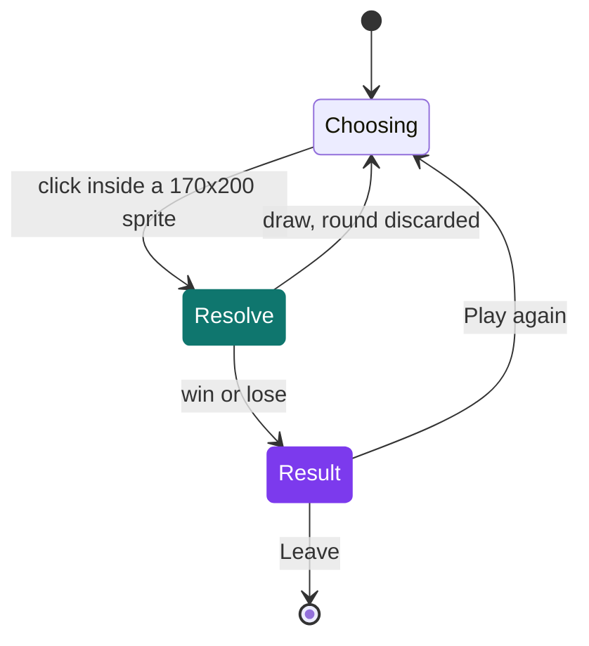

# Rock Paper Scissors

[](https://antoinepoisson.github.io/Old-School-Projects/projects/perso-rps-java-2020)

 

[Tek3](../../README.md) / [SideProjects](../README.md) / **RockPaperScissors_Java**

*Personal project · June 2021 · 2 weeks*

Rock paper scissors against the machine, played entirely with the mouse: pick one of three sprites,
the opponent draws its own, and a result screen offers a replay or an exit. The whole interface is
seven PNGs painted onto a single `JPanel` — no `JButton`, no `ActionListener`, not one `setLayout`
call in the 193 lines of `Main.java`.

A click becomes a move only because the code compares the cursor against rectangles it holds itself.
That turns the entire interface into arithmetic, and the arithmetic is where the project gets
interesting. The listener is attached to the `JFrame`, not to the `Surface` panel that draws — so
every incoming `y` is measured from the top of the window decoration, not from the drawing origin.

```java
public boolean checkClick(Integer x1, Integer _x, Integer _width, Integer y1, Integer _y, Integer _height) {
    return x1 > _x && x1 < (_x + _width) && y1 - 30 > _y && y1 - 30 < (_y + _height);
}
```

The `- 30` is the frame's top inset, subtracted by hand. It is the single line the whole UI depends
on: drop it and every sprite becomes clickable 30 pixels above where it is painted. Asking the frame
for `getInsets().top` instead of hard-coding the number is what would carry that line across a
change of window theme.

**The click map.** Five zones, and each one is a pair of literals written twice — once in the
`drawImage` call inside `Surface`, once in the `checkClick` call inside `myMouseListener`.

| Zone | Drawn at | Hit box | PNG size |
| --- | --- | --- | --- |
| Rock | 50, 120 | 170 × 200 | 170 × 200 |
| Paper | 250, 122 | 170 × 200 | 170 × 200 |
| Scissor | 475, 120 | 170 × 200 | 170 × 200 |
| Play again | 150, 370 | 117 × 30 | 117 × 33 |
| Leave | 420, 370 | 117 × 30 | 117 × 33 |

The three moves line up: the hit box is the image. The two end-screen buttons do not — the rectangle
is 30 tall against a 33-pixel PNG, so the bottom three rows of each button look clickable and are
not. Sizing the box from the loaded `ImageIcon` would delete the duplicated number and the drift
along with it.

**The rules.** Nine pairs, three outcomes, resolved in `checkWin(player, ia)`, where the opponent —
labelled `IA` on screen — plays whatever `(int)(Math.random() * 3)` returns.

| Your move ↓ · IA → | Rock | Paper | Scissor |
| --- | --- | --- | --- |
| **Rock** | draw | lose | **win** |
| **Paper** | **win** | draw | lose |
| **Scissor** | lose | **win** | draw |

`fillList()` loads the sprites in the order rock, paper, scissor — and that order is the cycle
itself, each move losing to the one after it around the ring. So the three-case `switch` and its
nine branches collapse into one expression: `(player - ia + 3) % 3` gives 0 for a draw, 1 for a win
and 2 for a loss, and it agrees with the hand-written version on all nine pairs.

**A draw is not an outcome.** `checkWin` sets `isChoosing` back to `true`, then returns `-1`: the
round is discarded and the board is on the picker again before anything is drawn. That is why
`resources/` holds a `win.png` and a `lose.png` and no `draw.png` — by the time the result screen
paints, `stateGame` can only be 1 or 0.



Four of `Main`'s five static fields carry that whole state machine: `isChoosing`, `playerChoose`,
`iaChoose` and `stateGame`. The listener writes them, the panel reads them, and the fifth holds only
the three sprite paths — which is why the loop is closed rather than a demo: choose, see the result,
replay or exit.

**Rendering.** `doDrawing` ends with `repaint()`, so every paint schedules the next: the panel
redraws continuously on the event dispatch thread instead of on a `Timer`. At 700 × 450 with at most
five sprites on screen the cost never shows, but each `drawImage` is handed a fresh
`new ImageIcon(...)`, so an open window allocates up to five of them per frame. Seven icons built
once in the constructor and a `Timer` give the same picture for far less work.

| File | Lines | Role |
| --- | --- | --- |
| `Main.java` | 193 | Frame, panel, listener and rules — the entire game |
| `Example.java` | 213 | The hangman this one was built from |
| `run.sh` | 7 | Clear `*.class`, `javac Main.java`, then run |
| `clear.sh` | 3 | `rm *.class -f` |

`Example.java` is the previous Java project, kept beside this one as the template it started from.
It is not in the build, and it could not be: the class was renamed to `Example`, its constructor was
not, and it still declares its own `myMouseListener` and `Surface` alongside this one's.

```console
$ javac Example.java
Example.java:134: error: invalid method declaration; return type required
    public Main() {
           ^
1 error
```

Because `run.sh` names `Main.java` alone and nothing in `Main.java` refers to `Example`, javac never
opens that file — so a broken sibling sits in the directory and `javac Main.java` still finishes
clean.

## What this project demonstrates

- Event-driven desktop UI built on hand-written coordinate hit testing rather than Swing widgets
- A three-move rule set whose sprite ordering is chosen so the cycle becomes plain modular arithmetic
- A finished interaction loop — draw handling, replay and exit paths, not only the core mechanic
- Reading a frame's coordinate space correctly: listener on the `JFrame`, drawing in the content pane

## Technical stack

Java, Shell · Swing, AWT · javac, Git.

`Graphics2D` for every pixel, `MouseAdapter` for input, `java.lang.Math` for the opponent's draw.
`Main.java` still compiles without a single warning on JDK 24, nine major releases after the
OpenJDK 15 that `run.sh` was written against.

## Build & run

```bash
./run.sh
```

Two things the script assumes: it hard-codes an absolute path to a Fedora 32 OpenJDK 15 install, so
elsewhere plain `javac Main.java && java Main` is the equivalent; and sprite paths are relative
(`resources/rock.png`), so it has to be launched from the project root.

---

[Tek3](../../README.md) / [SideProjects](../README.md) · [⌂ All projects](../../../README.md)
