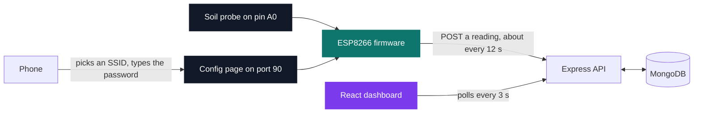
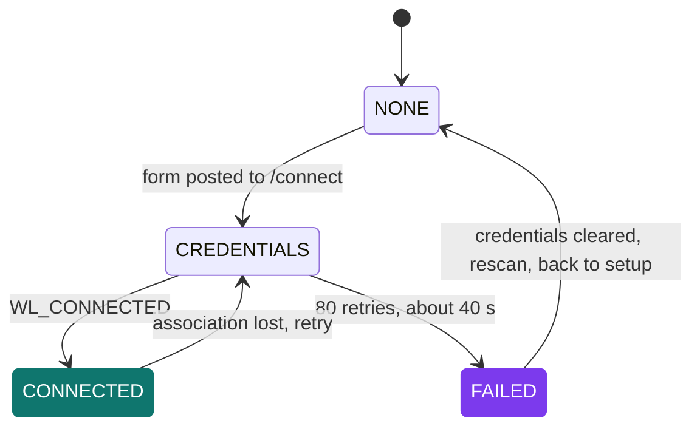
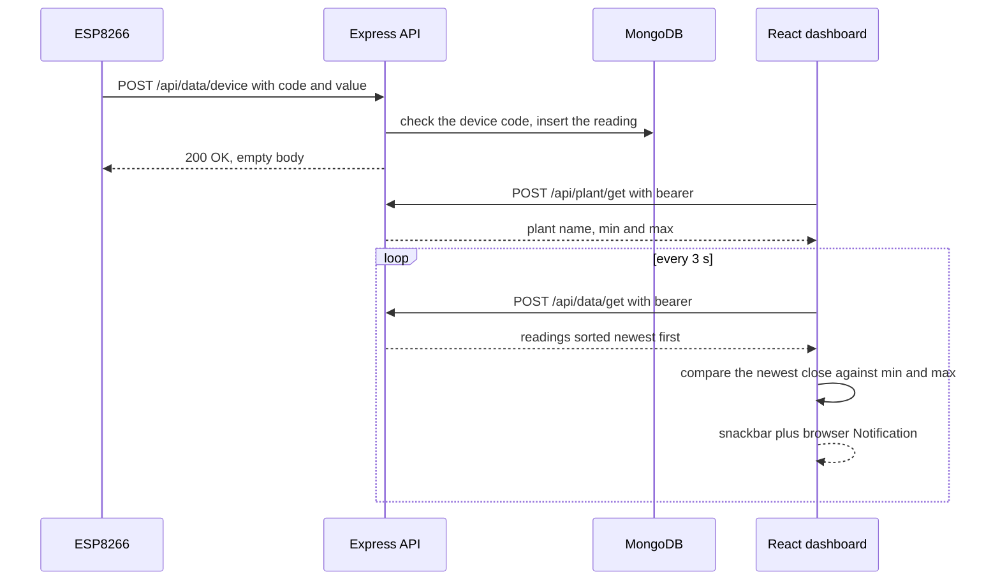

# CarePlant — connected plant

[](https://antoinepoisson.github.io/Old-School-Projects/projects/iot-careplant-2022)

    

**Epitech project** · IoT (`M-IOT-200`) · Tek5 · 2022-2023 · 2 weeks · Grade D

> A probe in the soil, a browser notification when the plant gets thirsty, and four runtimes in between.

## Overview

Getting the object onto a network never requires a computer. It powers up, your phone finds a Wi-Fi network called `ESP8266-Access-Point`, and a page served by the microcontroller itself lists every network the board can see. You pick one by number, type the password, and the board joins it — keeping its own access point up alongside, because `WiFi.begin` from `WIFI_AP` mode adds the station interface instead of replacing it.

Between the probe and the notification sit four runtimes that share nothing: Arduino C++ on an ESP8266, an Express API, MongoDB, and a React dashboard. Each one only ever talks to its neighbour.

That is the difficulty this project is really about. When the chart stops moving, the cause is a dry contact on the probe, a lost Wi-Fi association, a device code the API refuses, a dropped Mongo connection or a stalled poll — and from the browser all five look exactly the same.



2,230 lines across 41 source files: 443 of Arduino C++, 483 of Express and Mongoose, 962 of React, 178 of its stylesheets, and 164 for the standalone configuration page.

## How it works

**The configuration page.** The board boots in `WIFI_AP` mode, runs `WiFi.scanNetworks`, and serves five routes from an `ESPAsyncWebServer`: `/`, `/info`, `/scan`, `/switch-status` and `/connect`. Both pages — markup, CSS and their `fetch` calls — live in `PROGMEM` string literals, so they sit in flash instead of the ESP8266's small RAM. A template callback rewrites the placeholders as the bytes go out: `processor` fills `%WIFILIST%` on the setup page, `status_processor` fills `%STATUS%` and `%USERSTATUS%` on `/info`.

You never type an SSID. The scan fills a 30-slot array, the page renders it as a numbered `<ol>` behind an `<input type="number">`, and you send back the index — which removes every accent, space and emoji a phone keyboard would otherwise have to reproduce exactly. The server answers on port 90, so the page is reached at the board's access-point address with `:90` spelled out; a true captive portal would also have to intercept the operating system's connectivity probe on port 80.

The `wifi/` folder keeps the browser prototype of that page — the same markup and stylesheet, a stub list of three SSIDs — from before it was folded into the firmware's flash literal.

**Staying up unattended.** `checkConnection` re-derives one of four states at the top of every `loop` pass, and the pass idles two seconds before it starts. A failed association is not fatal: after 80 retries at 500 ms the board clears the stored credentials and rescans, which drops the next pass back to `NONE` and the setup page, so a plant left on a windowsill can be reconfigured without a reflash.



**Reading the soil.** A resistive probe is noisy: a poor contact produces a spike that is indistinguishable from a real drop. The firmware answers with ten samples 100 ms apart, clamped and folded into one number.

```cpp
int avg = 0;
for (int i = 0; i < 10; i++) {
  delay(100);
  int res = getSensorValue();
  if (res > 1000)
    res = 1000;
  avg = (avg + (res / 10)) / 2;
}
int httpCode = http.POST("{\"code\": \"B1234\",\"data\": " + String(avg) + "}");
```

The clamp bounds the 10-bit ADC so `res / 10` lands in 0–100. The last line is not the arithmetic mean it looks like: every iteration halves whatever came before, so the freshest sample carries half the weight and an outlier decays away instead of dragging the window with it. The device code is compiled in — that constant is what binds one board to one user account.

**From the probe to the alert.** The API sorts readings newest-first before returning them, and the dashboard reads `data[0]`. That ordering is a contract between two layers that never see each other: drop the `sort` and the browser silently compares the oldest reading to the thresholds.



**The dashboard.** The API does not return `{ data, time }`. It returns `{ close, date }` — the exact accessor names visx's stock-chart example expects, so a financial brush chart plots soil moisture with no adapter layer at all. The example's own series stayed wired in as the fallback: below three readings the chart draws visx's bundled Apple stock data, which is why the demo seed earns its place.

One audit note on the API: the bearer is an unsalted MD5 with no expiry, kept in `localStorage` under `sessionCarePlant`. `Bearer(email, password)` declares two parameters, but both call sites pass one already-joined string, so the digest is really taken over `email + password + "undefined"` — stable, and identical between login and register, yet still a password equivalent rather than a session token.

## What this project demonstrates

- A complete chain from the physical sensor to the online dashboard
- A Wi-Fi setup page served by the board itself in AP mode, like on commercial connected objects
- A containerised and deployed backend, not merely run locally

## Key features

| Layer | What it owns |
| --- | --- |
| Probe on `A0` | one analogue value, clamped and filtered into 0–100 |
| ESP8266 firmware | AP mode, network scan, credential capture, HTTP POST |
| Express API | 8 POST routes plus a GET `/status`, device-code check, bearer issuing |
| MongoDB via Mongoose | four collections: user, device, plant, data |
| React dashboard | visx brush chart, plant profiles, threshold alerts |

A plant profile is a min/max moisture band. The dashboard compares the newest reading to the band of the profile the user selected and raises a snackbar plus a browser `Notification` when it falls outside. A latch is meant to hold that to one alert per direction, but both branches stamp the same `+` marker, so only the too-wet side is really de-duplicated: a plant sitting under its floor alerts again on the first poll after the six-second snackbar times out.

## Technical stack

- **Languages** — C++, JavaScript, HTML, CSS
- **Frameworks / libraries** — React, Material-UI, Express
- **Tools** — Arduino IDE, Docker, docker-compose, MongoDB, npm, Heroku, Git, Mongoose, Node.js
- **Concepts** — analogue sensor reading, access point mode and in-firmware setup portal, REST API, cloud deployment

## Engineering constraints

- Wi-Fi configuration in access point mode imposed
- physical sensor mandatory
- web or mobile interface mandatory
- justification of the hardware choices expected

## Beyond the baseline

- A containerised (Dockerfile and docker-compose) and documented (doc.md) backend, beyond a simple local run
- The Heroku deployment procedure documented in the README
- Demonstration data preloading (preload.js) to show the dashboard without waiting for real readings

`server.js` calls the four `preload.js` upserts at boot: three device codes, 36 dated readings for `C1234`, one demo user bound to that code, and six plant profiles — the reference bands the alert logic is checked against:

| Profile | Min | Max |
| --- | --- | --- |
| Cactus | 30 | 45 |
| Eucalyptus | 25 | 66 |
| Passiflora | 35 | 45 |
| Tulipe | 40 | 55 |
| Crocus | 1 | 99 |
| Vigne | 49 | 51 |

Joining a network through the microcontroller's own AP mode is what the subject required explicitly, and it is the mechanism most commercial connected objects use.

## Verification

`web/src/setupTests.js` is the only test file in the repository, and it is the one Create React App generates; the backend's `npm test` is still the `exit 1` stub.

Checking was done along the chain instead. The firmware's serial log prints the scanned SSIDs, the chosen one, the exact JSON body and the HTTP status of every cycle, which is what makes a failure attributable to one hop rather than to the system as a whole. On the other end, the preloaded dataset drives the chart and the too-wet alert without waiting on a real plant: the newest seeded reading for `C1234` is 91%, against the demo user's Cactus ceiling of 45%.

## Build & run

```bash
docker-compose up --build   # in backend/ — builds the API image, published on 8080
npm install && npm start    # in web/ — Create React App dev server
```

Three entry points: `backend/`, `web/`, and `wifi/` for the standalone page. The compose file builds only the API image — MongoDB itself is a hosted Atlas cluster reached through the connection string, not a container.

The backend reads `MONGODB_URI_CONNECTION` and `PORT` from its `.env`; the React app reads the API address from `REACT_APP_URL_BACK`, which is what lets the same build point at localhost or at the deployed API.

The firmware is uploaded separately from the Arduino IDE.

## Original documentation

The [upstream README](./README.upstream.md) preserves the original deployment and hardware notes.

---

[← IoT — connected devices](../README.md) · [↑ Tek5](../../README.md) · [⌂ All projects](../../../README.md)
