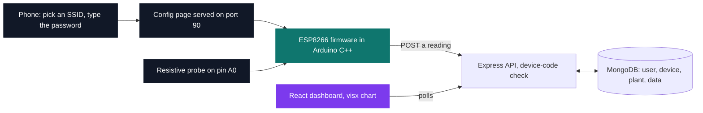

# IoT — connected devices

[← Tek5](../README.md) · [⌂ All projects](../../README.md)

One object, five layers that never see each other: a soil probe, an ESP8266 running Arduino C++, an
Express API, MongoDB, and a React dashboard. The hard part is not any single hop — it is that a dry
contact on the probe, a lost Wi-Fi association, a device code the API rejects and a stalled poll all
look identical from the browser.

The object is also never plugged into a computer. It boots as its own access point, serves a page
listing the networks it can see, and joins the one you pick from a phone.

| Project | What it is | Size | Grade |
| --- | --- | --- | --- |
| [CarePlant](CarePlant) | Soil-moisture monitor, from the probe to a browser notification, configured over Wi-Fi from a phone | 2 weeks | D |

The firmware carries the whole configuration page — markup, CSS and its `fetch` call — in a
`PROGMEM` string literal so it lives in flash rather than in the ESP8266's small RAM, and it wipes
its credentials and reopens the access point after 80 failed association retries, so a plant on a
windowsill can be reconfigured without a reflash. On the other end, the API sorts readings
newest-first and the dashboard reads element zero: an ordering contract between two layers that
never meet.

## Projects (1)

- **[CarePlant — connected plant](CarePlant)** — *2 weeks · Grade D*
  A soil probe, a self-configuring Wi-Fi board, an API and a dashboard that warns you when the plant needs watering.
