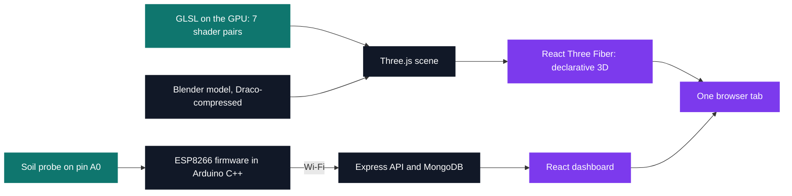

# Tek5 — 2022-2023

[⌂ All projects](../README.md)

Two projects, both end-to-end, starting from opposite ends of the stack. Three.js Journey reaches
down to the GPU: seven hand-written vertex/fragment shader pairs whose code runs once per vertex and
once per pixel instead of once per frame. CarePlant starts on an analogue pin and crosses four
runtimes that share nothing — a dry probe contact, a lost Wi-Fi association and a stalled poll all
look identical from the dashboard.

The Master's phase, resumed after Tek4 — Epitech's standard gap year, not represented here.
The course was followed independently, outside the curriculum, from September 2022 to June
2023; CarePlant's two weeks fall inside that window, in the autumn term.

| Module | Project | What it is | Size | Grade |
| --- | --- | --- | --- | --- |
| [Web3](Web3) | [Three.js Journey](Web3/ThreeJsJourney) | Real-time 3D in the browser, from a first scene to a Rapier physics game | 2 months | — |
| [IOT](IOT) | [CarePlant](IOT/CarePlant) | Soil probe to browser notification, across four runtimes | 2 weeks | D |

The portal scene is the thread running through Web3: modelled in Blender at lesson 36, exported and
Draco-compressed at 38, lit with hand-written firefly and portal shaders at 39, then rebuilt
declaratively with React Three Fiber at 49 — the same scene built twice, imperative then declarative.
CarePlant's counterpart is its configuration page: markup, CSS and its `fetch` call held in a
`PROGMEM` string literal so the page lives in flash rather than in the ESP8266's small RAM, and
served from the board's own access point before it ever joins yours.

<pre>
Tek5/
├── <a href="Web3">Web3/</a>                         real-time 3D on the web
│   └── <a href="Web3/ThreeJsJourney">ThreeJsJourney/</a>           42 experiments: Three.js, GLSL, Blender and React Three Fiber
└── <a href="IOT">IOT/</a>                          connected devices
    └── <a href="IOT/CarePlant">CarePlant/</a>                sensor-to-dashboard plant monitoring                         · D
</pre>

- **[Web3/](Web3)** — 42 of the course's 54 lessons, 40 of them runnable on their own: the basics,
  the GLSL block, the Blender-to-web chain, then React Three Fiber up to a Rapier physics game.
- **[IOT/](IOT)** — a soil probe, a board that serves its own Wi-Fi setup page, an Express/MongoDB
  API, and a dashboard that notifies you when the reading leaves the plant's min/max band.

---

[← Tek3](../Tek3/README.md) · [⌂ All projects](../README.md)
