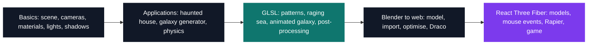

# Web3 — real-time 3D on the web

[← Tek5](../README.md) · [⌂ All projects](../../README.md)

Forty-two lessons of the Three.js Journey course, each kept as its own project. The hard block is
the shaders: fourteen hand-written GLSL files — procedural patterns, a raging sea, an animated
galaxy — where the program runs once per vertex and once per pixel on the GPU instead of once per
frame on the CPU.

The Blender portal scene is the other thread through the module: modelled in lesson 36, exported
and Draco-compressed in 38, detailed with custom shaders in 39, then rebuilt declaratively with
React Three Fiber in 49. Each lesson stands alone — 40 of the 42 folders carry their own
`package.json` and Vite config, so any one of them runs without the others.

| Project | What it is | Size | Kept |
| --- | --- | --- | --- |
| [Three.js Journey](ThreeJsJourney) | Real-time 3D in the browser, from a first scene to a Rapier physics game | 2 months | 42 of 54 lessons |

## Projects (1)

- **[Three.js Journey](ThreeJsJourney)** — *2 months*
  A complete real-time 3D course for the browser, from a first scene to hand-written GLSL and a React Three Fiber game.

---

[← Tek5](../README.md) · [⌂ All projects](../../README.md)
