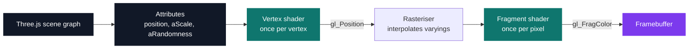
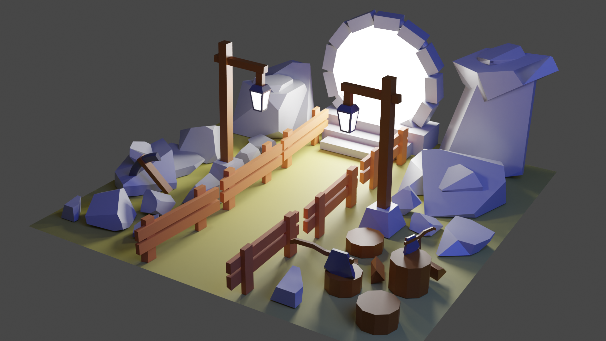
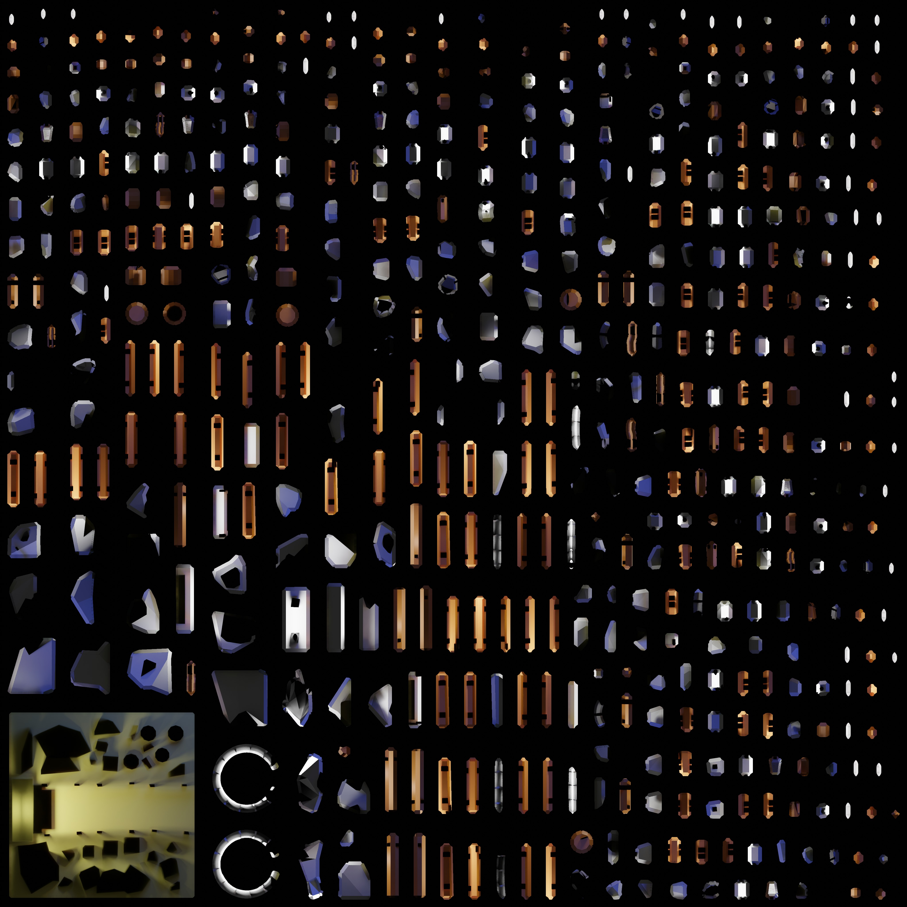
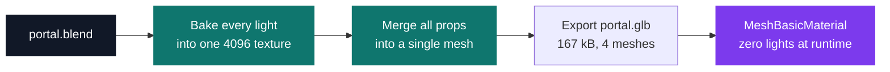

# Three.js Journey

[](https://antoinepoisson.github.io/Old-School-Projects/projects/perso-threejs-journey-2022)

    

**Self-directed training** · Tek5 · 2022-2023 · 2 months

> A complete real-time 3D course for the browser, followed from the basics to hand-written GPU shaders.

Forty-two standalone experiments, **9,838 lines** of project JavaScript, JSX and GLSL once the
vendored Draco decoders are set aside, from a first red cube drawn once into a canvas to a physics
game and a portal disc whose every pixel comes out of a fragment shader.

One block changes the programming model entirely. Up to lesson 26 you write JavaScript that
describes a scene and the renderer does the rest. From lesson 27 on you write two functions the GPU
runs itself: one per vertex, one per pixel.

There is no loop over the scene, no reading the neighbouring vertex, no `console.log`. When the
screen comes up black, the only debugging instrument is the colour you decide to output.

## Overview

Each lesson is kept as its own project, with its own dependencies and build, so any single example
still starts years later. Three.js moves fast — the folders span `0.148` to `0.153` — and freezing
each lesson at the version it was written against is what keeps them running.

| Block | Lessons | Count |
| --- | --- | --- |
| Fundamentals — scene, cameras, materials, lights, shadows, 3D text | `03`–`16` | 7 |
| Scene projects — haunted house, particles, galaxy, scroll, physics, raycaster | `17`–`26` | 10 |
| GLSL shaders — patterns, raging sea, animated galaxy, material patching, post-processing | `27`–`33` | 7 |
| Blender to web — modelling, baking, import, optimisation | `34`–`39` | 5 |
| React Three Fiber — drei, environment, models, portal, mouse, physics, game | `42`–`54` | 13 |

Lessons 01, 02, 05, 06, 08 to 11, 14, 37, 40 and 41 of the course are not kept here.

## How it works

WebGL gives you two programmable stages and nothing in between. The vertex shader is called once
per vertex and must write `gl_Position`; the fragment shader is called once per pixel and must
write `gl_FragColor`. Everything crossing between them is interpolated by the rasteriser.



The sea in lesson 29 is one flat `PlaneGeometry(10, 10, 512, 512)`. Its shape exists only inside the
vertex shader: two crossed sine waves for the swell, then a Perlin noise loop for the chop, then the
elevation is handed to the fragment shader through a `varying` so the colour can follow the wave
height.

```glsl
// from 29-raging-sea/src/shaders/vertex.glsl — this body runs once per vertex, in parallel
void main()
{
    vec4 modelPosition = modelMatrix * vec4(position, 1.0);

    float elevation = sin(modelPosition.x * uBigWavesFrequency.x + uTime* uBigWavesSpeed) *
        sin(modelPosition.z * uBigWavesFrequency.y + uTime* uBigWavesSpeed) *
        uBigWavesElevation;
    for(float i = 1.0; i <= uSmallIterations; i++) {
        elevation -= abs(cnoise(vec3(modelPosition.xz * uSmallWavesFrequency * i, uTime * uSmallWavesSpeed)) * uSmallWavesElevation / i);
    }
    modelPosition.y += elevation;

    vElevation = elevation;

    vec4 viewPosition = viewMatrix * modelPosition;
    vec4 projectedPosition = projectionMatrix * viewPosition;
    gl_Position = projectedPosition;
}
```

**Why it goes on the GPU.** The animated galaxy in lesson 30 spins **200,000 particles** around its
centre. On the CPU that is 200,000 `atan`/`cos`/`sin` calls plus a full re-upload of a 2.4 MB
position buffer, every frame. In the vertex shader the rotation is six lines, the buffer never
moves, and only a `uTime` float crosses the bus.

**The trap in lesson 31.** Three.js materials can be patched at compile time: `onBeforeCompile`
hands you the generated GLSL and you splice your own code into named chunks such as
`#include <begin_vertex>`. Twisting the Lee Perry-Smith head that way works on screen — and its
shadow stays perfectly straight, because the shadow pass renders the object again through a
separate depth material.

The fix is a `MeshDepthMaterial` carrying the same `begin_vertex` replacement and assigned to
`mesh.customDepthMaterial`. Its shader also rotates `objectNormal` in `beginnormal_vertex`, a chunk
the lit material never receives here — so the shadow now follows the twist while the shading still
hugs the untwisted surface.

## What this project demonstrates

- Programming the graphics processor directly in GLSL — 14 shader files, 614 lines
- A complete production chain, from Blender modelling to an optimised online scene
- Culminating in React Three Fiber: a Rapier physics game, a portfolio scene and mouse picking

<p align="center">
  
  
</p>

*Left: the scene modelled and rendered in Blender. Right: its whole lighting baked into one
4096×4096 atlas — the single texture that carries every shadow and bounce in the browser scene.*

The browser version contains **no light at all**. Every shadow and bounce is painted into the atlas
and applied through a `MeshBasicMaterial`, which skips lighting maths entirely. Only the portal disc
and the 30 fireflies get a real `ShaderMaterial`.



## Key features

- 42 lessons kept as standalone folders, 40 of them independent Vite projects runnable on their own
- Real-time basics: scene, cameras, materials, lights, shadows, 3D text, particles
- Application scenes: haunted house, galaxy generator, scroll-driven animation, Cannon physics
- Hand-written GLSL: procedural patterns, raging sea, animated galaxy, patched materials, post-processing
- The Blender-to-web chain: modelling, light baking, glTF import, optimisation
- A marble race built on React Three Fiber: kinematic obstacles driven by Rapier, a level assembled
  from three block types at random, and a Zustand store holding a `ready → playing → ended` phase machine

## Technical stack

- **Languages** — JavaScript, GLSL, HTML, CSS
- **Frameworks / libraries** — Three.js `0.148`–`0.153`, React 18.2, React Three Fiber `8.13`, Drei, Rapier
- **Tools** — Vite 4, npm, Blender, Git
- **Concepts** — real-time WebGL rendering, vertex and fragment shaders, Blender-to-web import chain, declarative 3D, performance budget

## Engineering constraints

- Course followed independently, outside the curriculum — no deadline and no grader, so the only
  measure of correctness is whether the frame looks right and holds its budget
- One independent project per lesson: dependencies, build config and assets are duplicated across
  the 40 Vite folders rather than shared, which is what makes each example survive on its own

## Beyond the baseline

Twelve lessons carry the Draco decoder in their own asset folder rather than fetching it from a CDN,
and four of them — `22`, `24`, `38`, `39` — actually wire it up: `setDecoderPath` points at that
local copy, and the loader is handed to `GLTFLoader`, so the decoder ships with the page. The
compression pays for itself: `hamburger.glb` weighs 92.7 kB, `hamburger-draco.glb` weighs 19.0 kB —
a 4.9× reduction on the same model, and lesson 47 loads the compressed one.

Forty of the 42 folders carry their own `package.json` and Vite config. The two exceptions are
readable: `03-basic-scene` predates the tooling — one `main.js` and two `<script>` tags, one of them
`three.min.js` — and `36-creating-a-scene-in-blender` holds the `.blend` file and its renders, not a
web app.

## Verification

No test suite: each lesson is a runnable example, checked visually against the reference. What
stands in for assertions is `lil-gui`, wired straight to live shader uniforms — the raging sea alone
exposes twelve controls, from `uBigWavesElevation` to `uSmallIterations`, so a wave frequency is
tuned in the running frame instead of guessed and recompiled. The folders named `test` under
`27-shaders` and `28-shader-patterns` hold shaders, not tests.

## Build & run

```bash
npm install
npm run dev
```

Run it from inside a lesson folder: the 40 Vite projects each carry their own `package.json`.
`03-basic-scene` needs no build at all — serve its `index.html`.

---

[← Web3 — real-time 3D on the web](../README.md) · [↑ Tek5](../../README.md) · [⌂ All projects](../../../README.md)
